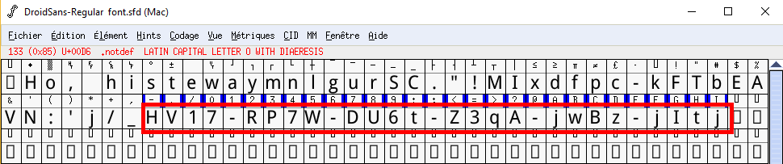

Day 04: HoHoHo
==============
> *NOTE: New easyfied attachment available*
> 
> Santa has hidden something for you 

This time we have a PDF file, `HoHoHo.pdf`... or actually two. The original one was too hard for a "medium" challenge so a second file `HoHoHo_medium.pdf` was released. When comparing the files we can see that several things don't change (the embedded pictures in particular).

I used PDFStreamDumper from <http://sandsprite.com> to extract the content of the streams from the PDF file. When checking the file type using `file` one is listed as
```
TrueType Font data, 12 tables, 1st "cmap", 30 names, Macintosh, Digitized data copyright \251 2007, Google Corporation.Droid Sans RegularRegularFontForge 2.0 :
```

I don't know much about those font files. So I downloaded the first font editor that came at hand, FontForge. This allowed me to open the file and directly see the flag in the interface:


So the flag is:
```
HV17-RP7W-DU6t-Z3qA-jwBz-jItj
```
