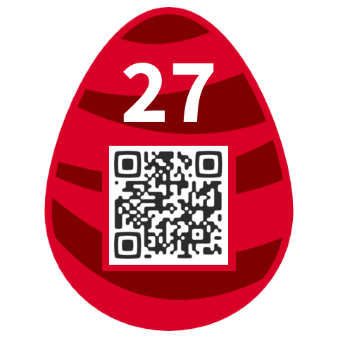

Bonus flag 04
=============
On the web server, several directories have directory listing enabled. This allows to see unexpected content. For instance, in <https://hackvent.hacking-lab.com/css/>, we can find a file named `egg.png` that obviously does not belong to the CSS direcotry. Open it, it looks like a Hacky Easter flag:


And when decoding the QR code we get the following flag:
```
HE17-W3ll-T00E-arly-forT-his!
```
