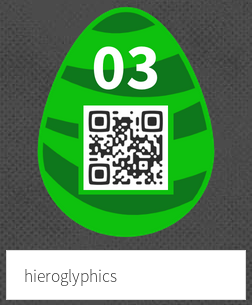

01 - Puzzle this!
-----------------
One gets this puzzle but it is of course not necessary to solve it online. Just grab the image at <https://hackyeaster.hacking-lab.com/hackyeaster/images/challenge/egg01_shuffled.png> and slice it into pieces with imagemagick command `convert egg01_shuffled.png -crop 60x60 tiles_%02d.png`. Then using your favorite image manipulation program, reconstruct the QR-code.

In the end we get the code of the egg:  


02 - Lots of Dots
-----------------
The dots picture looks a lot like those colorblind tests. When loading it into Stegsolve, see [1], we use the random color map function to color it an immediately notice the numbers:


When entering the numbers into the egg-o-matic one can get the egg:


\[1\]: A Challengers Handbook, <http://www.caesum.com/handbook/stego.htm>


03 - Favourite Letters
----------------------
The list of names contains exactly 26 entries and each name starts with a different alphabet number. Copying the names in a file and sorting them gives the answer:
```
$ cat letters.txt | sort | grep -o '.$'
t
h
e
p
a
s
s
w
o
r
d
i
s
h
i
e
r
o
g
l
y
p
h
i
c
s
```

When putting this password into the egg-o-matic we get the egg:



04 - Cool Car
-------------
In this challenge we need to install a chick magnet (got it from the Borat film scene). One could also look at the code of the mobile application and see mentions of the magnetometer sensor. When you know that, using a simple magnet and moving it close enough to the phone is sufficient to make the bar full green and get the flag:  


05 - Key Strokes
----------------
The key strokes should be entered in vim, the best text editor in the world. By the way, this write-up is written using vim

When entering the precise key stroke sequence, at the end the file contains only one line with this string: `magicwandfrankfoxy`.

When entering this string in the egg-o-matic we get the egg:


06 - Message to Ken
-------------------
There exist a Barbie typewriter that has builtin "crypto" capabilities. One can find some details about that in [1]. The hint gives the exact subsitution to use (although it's wrong and gives code 2 where code 1 is used).

This is actually a simple substitution cipher with the following substitution table:
```
Clear:  abcdefghijklmnopqrstuvwxyz ABCDEFGHIJKLMNOPQRSTUVWXYZ 0123456789
Cipher: icolapxstvybjeruknfhqg;dzw >FAUTCYOLVJDZINQKSEHG<.1PB 523406789-

Clear:  - ' ! " # % & ( ) * , . ¨ / : ; ? @ ^ _ + < = > ¢ £ § €
Cipher: ¨ _ & m @ : " * ( # W M § ^ , ¢ / ? ! ) % X ' R + € £ =
```

When applying the substitution backward one get the following:
```
Fabrgal JaeM Hsa faonah uiff;rnl tf btuxbrffuinhzoroyhitbM Fincta dd
Beloved Ken. The secret password is lipglosspartycocktail. Barbie xx
```

When entering th password inthe egg-o-matic we get the egg:


\[1\]: Barbie™ Typewriter, <http://www.cryptomuseum.com/crypto/mehano/barbie/>


07 - Crypto for Rookie
----------------------
Each line in the picture is a known code, transposition or encoding method, in the same order we have:

- Sherlock Holmes dancing men
- Base 64
- Alphabet position
- ROT13
- Pig pen
- Reverse string
- Cesar cipher
- Ascii

And when decoded we get the following texts:
```
BONTBBOK
BONTEAOK
BONTEBRK
BANTEBOK
CONTEBOK
BONTEBOA
BOPTEBOK
BONYEBOK
```

We see with this display that in each column, exactly one letter is different, concatenation of the letters gives the word CAPYBARA. When entering this word in the egg-o-matic we get the egg:


08 - Snd Mny
------------
In this challenge we need to exploit an activity of the Android application. After decompiling the APK file we can read the details of the activity in the AndroidManifest.xml:
```xml
<activity android:label="@string/title_activity_snd" android:name="ps.hacking.hackyeaster.android.SndActivity">
    <intent-filter>
        <action android:name="android.intent.action.SEND" />
        <category android:name="android.intent.category.DEFAULT" />
        <data android:mimeType="text/*" />
    </intent-filter>
</activity>
```

We see the activity name and the intent filters. When looking at the code we see the following method:
```java
protected void onCreate(Bundle savedInstanceState) {
    super.onCreate(savedInstanceState);
    requestWindowFeature(1);
    getWindow().setFlags(1024, 1024);
    setContentView(R.layout.activity_snd);
    Intent intent = getIntent();
    String action = intent.getAction();
    String type = intent.getType();
    if ("android.intent.action.SEND".equals(action) && type != null && HTTP.PLAIN_TEXT_TYPE.equals(type)) {
        String text = intent.getStringExtra("android.intent.extra.TEXT");
        if (text != null && "c95259de1fd719814daef8f1dc4bd64f9d885ff0".equals(sha1(text.toLowerCase()))) {
            ((TextView) findViewById(R.id.sndTextView)).setText("Thank you!!");
            ImageView image = (ImageView) findViewById(R.id.sndImageView);
            byte[] decodedString = Base64.decode(new StringBuilder(getString(R.string.e) + "ROBVi").reverse().toString(), 0);
            image.setImageBitmap(BitmapFactory.decodeByteArray(decodedString, 0, decodedString.length));
        }
    }
}
```

So we need to send our action with mime type `text/plain` and with an extra string that when hashed using SHA1 will give the hash `c95259de1fd719814daef8f1dc4bd64f9d885ff0`. Given the name of the activity we guess that the value might be money and this can be checked via:
```bash
$ echo -n 'money' | sha1sum
c95259de1fd719814daef8f1dc4bd64f9d885ff0  -
```

Then we can use drozer (one useful example is given in [1]) to start the activity with the following command that includes all the parameters retrieved previously:
```
dz> run app.activity.start --component ps.hacking.hackyeaster.android ps.hacking.hackyeaster.android.SndActivity --action android.intent.action.SEND --category android.intent.category.BROWSABLE --mimetype text/plain --extra string android.intent.extra.TEXT "money"
```

This will display the egg in the application on the phone:


\[1\]: Mobile penetration testing on Android using Drozer, <https://securitycafe.ro/2015/07/08/mobile-penetration-testing-using-drozer/>


09 - Microscope
---------------
In this mobile challenge, the displayed picture is too small to read the QR-code of the egg. Even when using Android accessibility tools (magnifier) it remains unreadable. However, when proxying the application Internet connection through Burp we directly see the HTTP request made to get the file `https://hackyeaster.hacking-lab.com/hackyeaster/images/challenge/egg09_fs0sYle2SN.png` downloading this file in a browser gives the egg:  


10 - An egg or not ...
----------------------
The egg displayed on the challenge page is a SVG file. When looking at it we notice that it is composed of 2 parts, the background yellow egg is an embedded png file and the QR-code is a list of black or white "points" (6x6 pixels squares). There is more points than needed to form a QR-code (739 vs 625 required for a QR-code).

One can look at the duplicates, in the picture below, the duplicates are colored in red to show them clearly:  


We can then choose to keep only the first points appearing in the file (because afterwards they will get covered by the new points and give the wrong QR-code). This can be done using the following python script:
```python
#!/usr/bin/python3

f = open('points.txt', 'r')

points = []
result = []

for line in f:
        line = line.rstrip()
        (x, y, color) = line.split(' ')
        if (x, y) not in points:
                points.append((x, y))
                result.append((x, y, color))
f.close()

for (x, y, color) in result:
        print('<use x="' + x + '" y="' + y + '" xlink:href="' + color + '"/>')
```

And we get the egg:  


11 - Tweaked Tweet
------------------
In this mobile activity we can click on a button and a the twitter application is opened to tweet something. When looking at the application code we see that this is done by opening the following URL:
```
https://twitter.com/intent/tweet?text=%23%EF%BC%A8a%EF%BD%83%EF%BD%8By%CE%95\
%EF%BD%81ste%EF%BD%92%E2%80%A9201%EF%BC%97%E2%80%A9%E2%85%B0%EF%BD%93%E2%80%80\
a%E2%80%84l%EF%BD%8F%EF%BD%94%E2%80%80%CE%BFf%E2%80%89%EF%BD%86un%EF%BC%81%E2\
%80%A8%23%D1%81tf%E2%80%88%23%EF%BD%88%EF%BD%81%CF%B2king-lab
```

After looking during hours for ways to reveal hidden information inside the URL I googled "twitter steganography" and solved the challenge in 30 seconds using [1]. Entering the tweet in the tool you get the password `st3g4isfunyo`.

When entering this in the egg-o-matic the egg is shown:  


\[1\]: Twitter Secret Messages, <http://holloway.co.nz/steg/>


12 - Once Upon a File
---------------------
In this challenge a weird file is provided that looks like a disk image. I tried to mount it and found nothing interesting in the NTFS partition. I tried to find data inside using TestDisk and Autopsy without success. Finally I tried with binwalk and this worked like a charm. The process is as follows, first, extract the original zip:
```
$ unzip onceupon.zip
Archive:  onceupon.zip
  inflating: file
```

Then binwalk on the "file" extracted with automatic extraction of known files:
```
$ binwalk -e file

DECIMAL       HEXADECIMAL     DESCRIPTION
--------------------------------------------------------------------------------
36447         0x8E5F          Unix path: /0/1/2/3/4/5/6/7/8/9/:/;/</=/>/?/@/A/B/C/D/E/F/G/H/I/J/K/L/M/N/O/P/Q/R/S/T/U/V/W/X/Y/Z/[/\/]/^/_/`/a/b/c/d/e/f/g/h/i/j/k/l/m/n/o
184320        0x2D000         Zip archive data, at least v2.0 to extract, compressed size: 439156, uncompressed size: 5242880, name: file
623596        0x983EC         End of Zip archive
```

So it extracted a zip file out of which another "file" was extracted. Let's run binwalk again on this new "file":
```
$ binwalk -e file

DECIMAL       HEXADECIMAL     DESCRIPTION
--------------------------------------------------------------------------------
36447         0x8E5F          Unix path: /0/1/2/3/4/5/6/7/8/9/:/;/</=/>/?/@/A/B/C/D/E/F/G/H/I/J/K/L/M/N/O/P/Q/R/S/T/U/V/W/X/Y/Z/[/\/]/^/_/`/a/b/c/d/e/f/g/h/i/j/k/l/m/n/o
1093632       0x10B000        Microsoft Cabinet archive data, 17834 bytes, 1 file
2832320       0x2B37C0        Microsoft Cabinet archive data, 17834 bytes, 1 file
3116030       0x2F8BFE        Microsoft executable, MS-DOS
3788479       0x39CEBF        mcrypt 2.2 encrypted data, algorithm: blowfish-448, mode: CBC, keymode: 8bit
3793983       0x39E43F        mcrypt 2.2 encrypted data, algorithm: blowfish-448, mode: CBC, keymode: 8bit
4477995       0x44542B        mcrypt 2.2 encrypted data, algorithm: blowfish-448, mode: CBC, keymode: SHA-1 hash
5073287       0x4D6987        mcrypt 2.2 encrypted data, algorithm: blowfish-448, mode: CBC, keymode: 8bit
5075359       0x4D719F        mcrypt 2.2 encrypted data, algorithm: blowfish-448, mode: CBC, keymode: 8bit
5173248       0x4EF000        PNG image, 480 x 480, 8-bit colormap, non-interlaced
5173767       0x4EF207        Zlib compressed data, best compression
```

As we can see lots of files were extracted but when listing the directory only one looks important, `egg12.png` and indeed, this is the egg:  


13 - Lost the Thread
--------------------
The provided file is a picture of 3x14500 pixels. When looking at it one can see that only the middle line contains color, the rest is only transparent. I wrote a python script that would extract the pixels from the middle line and rearrange them as lines of 17 pixels, giving an image of 17x852 pixels. The value of 17 was obtaind by trial and error, I kept this value because we get two nice columns that looks like they contain more data in the first and third columns.

Using the same script and the same process I extracted the first column as columns or 29 pixels. This gives a final image of 29x29 pixels that is actually a QR-code:  


When scanning the code, we get the password "kiwisarekewl" and when entering this into the egg-o-matic we get the egg:  


The python script I used is as follows:
```python
#!/usr/bin/python

from PIL import Image

im = Image.open('thread.png')
pix = im.load()

width = 17
height = 14500 / width

im2 = Image.new('RGBA', (width, height), 'white')
pix2 = im2.load()

for x in range(width):
        for y in range(height):
                pix2[x,y] = pix[width*y + x, 1]

im2.save('step2.png')

w3 = 29
h3 = height / w3

im3 = Image.new('RGBA', (w3, h3), 'white')
pix3 = im3.load()

for x in range(w3):
        for y in range(h3):
                pix3[x,y] = pix2[0, w3*y + x]

im3.save('step3.png')
```


14 - Shards
-----------
We are given 1600 small image files with weird names. When looking closer we see that the names always contain a letter from a to N and a number from 0 to 39. Seeing this we can assume that these are x and y coordinates to place the shards in a bigger picture. It fits nicely since it would be 40*40 = 1600 pictures. To make sure of that I renamed the files using the following python script:
```python
#!/usr/bin/python3

import glob
import os
import re

os.chdir('shards')
for filename in glob.glob('*.png'):
        (foo, bar, x, sugus, y) = re.split('_', filename)
        y = y[:-4]
        os.rename(filename, x + '_' + y + '.png')
```

From there we can see in a file browser that the small pictures are fitting because of the new listing order. I then wrote a second python script to construct the bigger picture from all the small ones. It will simply iterate over the numbers from 0 to 39 and the letters from a to N and copy the corresponding picture in a bigger one:
```python
#!/usr/bin/python3

import os
from PIL import Image

os.chdir('shards')
width = range(40)
height = ['a','b','c','d','e','f','g','h','i','j','k','l','m','n','o','p','q','r','s','t','u','v','w','x','y','z','A','B','C','D','E','F','G','H','I','J','K','L','M','N']


result = Image.new("RGB", (480, 480), "white")

for x in width:
        yi = 0
        for y in height:
                im = Image.open(y + '_' + str(x) + '.png')
                result.paste(im, (x*12, yi*12))
                yi += 1

result.save('../egg14.png')
```

In the end we get the flag:  


15 - P Cap
----------
We were given a traffic dump. When analyzing it with Wireshark we can see a big chunk of data due to SMB communication. Wireshark has a nice tool to extract data from SMB exchanges "File -> Export Objects -> SMB...". Using this we can extract a picture, `R05h4L.jpg`.

This picture shows a stickman with "challenge denied" text. However when looking at the file data we see at the end of the file more data that is not part of the picture. It contains the string "imnothere.txt" and the data chunk starts with the bytes `50 4b` or `PK` which are the magic bytes for zip archives. Knowing that we can unzip the file as follows:
```
$ unzip R05h4L.jpg
Archive:  R05h4L.jpg
warning [R05h4L.jpg]:  100447 extra bytes at beginning or within zipfile
  (attempting to process anyway)
  inflating: imnothere.txt
```

Then we look at `imnothere.txt` and see that it is actually not a text file but a picture: 

The picture gives a PHP page that we can access on the hacky easter server at `https://hackyeaster.hacking-lab.com/hackyeaster/7061n.php` and get the egg:


16 - Pathfinder
---------------
This time we have to find a path, each time we get a page we receive a message that either directs us to go on and try one more step or to turn around because this leads nowhere. It looks like we have to find our way through a maze. To do that I chose to use DFS algorithm, following the graph in depth first. This was done using the following python script:
```python
#!/usr/bin/python3

import urllib.request
import json

def check_path(req):
        resp = json.loads(urllib.request.urlopen(req).read().decode('utf-8'))
        print(req.full_url + ' : ' + str(resp))
        if resp['Answer'] == 'This leads to nowhere, so turn around!':
                return False
        elif resp['Answer'] == 'Go on! Follow one of the possible paths' or resp['Answer'] == 'Follow one of the possible paths':
                return resp['paths']
        else:
                print(resp)
                return False

def dfs(req):
        nodes = check_path(req)
        print(nodes)
        if nodes:
                for n in nodes:
                        new_req = urllib.request.Request(req.full_url + str(n), None, {'User-Agent': 'PathFinder'})
                        dfs(new_req)

req = urllib.request.Request('http://hackyeaster.hacking-lab.com:9999/', None, {'User-Agent': 'PathFinder'})
dfs(req)
```

I ran it as `python3 pathfinder.py | tee log.txt` then I searched in the log to find the answer that is different:
```bash
$ cat log.txt | grep -v '^\[.*\]' | grep -v 'This leads to nowhere, so turn around' | grep -v 'Follow one of the possible paths' | grep -v '^False$'
http://hackyeaster.hacking-lab.com:9999/157294683269358174843716529496583712528971346731642895972135468685427931314869257 : {'Answer': 'Thanks PathFinder you saved my life by giving me the solution to this sudoku!', 'Secret': 'https://hackyeaster.hacking-lab.com/hackyeaster/images/challenge/egg16_UYgXzJqpfc.png', 'your_solution': [[1, 5, 7, 2, 9, 4, 6, 8, 3], [2, 6, 9, 3, 5, 8, 1, 7, 4], [8, 4, 3, 7, 1, 6, 5, 2, 9], [4, 9, 6, 5, 8, 3, 7, 1, 2], [5, 2, 8, 9, 7, 1, 3, 4, 6], [7, 3, 1, 6, 4, 2, 8, 9, 5], [9, 7, 2, 1, 3, 5, 4, 6, 8], [6, 8, 5, 4, 2, 7, 9, 3, 1], [3, 1, 4, 8, 6, 9, 2, 5, 7]], 'sudoku': [[0, 0, 0, 2, 0, 4, 6, 0, 0], [2, 0, 9, 0, 0, 0, 0, 0, 0], [0, 0, 0, 0, 0, 6, 5, 0, 0], [0, 0, 6, 5, 0, 0, 7, 1, 0], [0, 0, 0, 9, 0, 0, 0, 4, 0], [7, 3, 1, 0, 0, 0, 0, 0, 0], [0, 7, 0, 0, 3, 0, 0, 0, 8], [0, 8, 0, 0, 2, 7, 0, 3, 1], [0, 1, 4, 0, 6, 0, 0, 0, 0]]}
{'Answer': 'Thanks PathFinder you saved my life by giving me the solution to this sudoku!', 'Secret': 'https://hackyeaster.hacking-lab.com/hackyeaster/images/challenge/egg16_UYgXzJqpfc.png', 'your_solution': [[1, 5, 7, 2, 9, 4, 6, 8, 3], [2, 6, 9, 3, 5, 8, 1, 7, 4], [8, 4, 3, 7, 1, 6, 5, 2, 9], [4, 9, 6, 5, 8, 3, 7, 1, 2], [5, 2, 8, 9, 7, 1, 3, 4, 6], [7, 3, 1, 6, 4, 2, 8, 9, 5], [9, 7, 2, 1, 3, 5, 4, 6, 8], [6, 8, 5, 4, 2, 7, 9, 3, 1], [3, 1, 4, 8, 6, 9, 2, 5, 7]], 'sudoku': [[0, 0, 0, 2, 0, 4, 6, 0, 0], [2, 0, 9, 0, 0, 0, 0, 0, 0], [0, 0, 0, 0, 0, 6, 5, 0, 0], [0, 0, 6, 5, 0, 0, 7, 1, 0], [0, 0, 0, 9, 0, 0, 0, 4, 0], [7, 3, 1, 0, 0, 0, 0, 0, 0], [0, 7, 0, 0, 3, 0, 0, 0, 8], [0, 8, 0, 0, 2, 7, 0, 3, 1], [0, 1, 4, 0, 6, 0, 0, 0, 0]]}
```

In there we see the URL to the egg and here it is:  


17 - Monster Party
------------------
In this challenge a 27*27 grid of monsters with 6 different colors is displayed along with jump patterns for each monster color. To cut a long story short, I programmed the jump patterns, parsed the grid and made the monsters jump. I also assumed that we were looking for a QR-code with an empty square border (without any monster in any cell in the border). Two small points took me a lot of time to figure out:

1. The monsters jump in partial jumps and it is important
2. The partial jumps are done in another order than 1, 2, 3 (namely 2, 3, 1). Or we could see this as if the starting grid is a snapshot taken after partial jump 1.

Knowing that it is only a matter of making the monsters jump and checking between each jump if our condition of an empty border is met. I did it using the following python code:
```python
#!/usr/bin/python

# Grid size
width = 27
height = 27

# Colors
RED = 1
GRE = 2
BLU = 3
YEL = 4
PIN = 5
BRO = 6

class Monster():
    def __init__(self, color, x, y):
        self.color = color
        self.x = x
        self.y = y

    def __str__(self):
        return '{0} @ ({1}, {2})'.format(COLORS[self.color], str(self.x), str(self.y))

# Displays the grid as text (only cells were >= 1 monsters are present in black, the rest in white)
def display(monster_list):
    grid = [[False for x in range(width)] for y in range(height)]
    for m in monster_list:
        grid[m.y][m.x] = True
    for row in grid:
        line = ''
        for col in row:
            if col:
                line += ' '
            else:
                line += u"\u2588"
        print(line)
    print('-' * 27)

# Partial jump 1
def jump1(monster_list):
    for m in monster_list:
        if m.color == RED:
            m.x = (m.x + 1 + width) % width
            m.y = (m.y - 2 + height) % height
        if m.color == GRE:
            m.x = (m.x + 1 + width) % width
            m.y = (m.y - 2 + height) % height
        if m.color == BLU:
            m.x = (m.x - 1 + width) % width
            m.y = (m.y + 2 + height) % height
        if m.color == YEL:
            m.x = (m.x - 1 + width) % width
            m.y = (m.y - 1 + height) % height
        if m.color == PIN:
            m.x = (m.x - 1 + width) % width
            m.y = (m.y - 1 + height) % height
        if m.color == BRO:
            m.x = (m.x - 1 + width) % width
            m.y = (m.y - 1 + height) % height

# Partial jump 2
def jump2(monster_list):
    for m in monster_list:
        if m.color == RED:
            m.x = (m.x + 1) % width
            m.y = (m.y + 2) % height
        if m.color == GRE:
            m.x = (m.x + 1) % width
            m.y = (m.y + 1) % height
        if m.color == BLU:
            m.x = (m.x + 3) % width
            m.y = (m.y - 1 + height) % height
        if m.color == YEL:
            m.x = (m.x - 1 + width) % width
            m.y = (m.y + 2) % height
        if m.color == PIN:
            m.y = (m.y + 3) % height
        if m.color == BRO:
            m.x = (m.x - 1 + width) % width
            m.y = (m.y + 2) % height

# Partial jump 3
def jump3(monster_list):
    for m in monster_list:
        if m.color == RED:
            m.x = (m.x + 1 + width) % width
        if m.color == GRE:
            m.x = (m.x + 1 + width) % width
            m.y = (m.y - 2 + height) % height
        if m.color == BLU:
            m.x = (m.x - 1 + width) % width
            m.y = (m.y + 1 + height) % height
        if m.color == YEL:
            m.x = (m.x - 1 + width) % width
            m.y = (m.y - 3 + height) % height
        if m.color == PIN:
            m.x = (m.x - 1 + width) % width
            m.y = (m.y - 1 + height) % height
        if m.color == BRO:
            m.x = (m.x - 1 + width) % width
            m.y = (m.y - 1 + height) % height

# Check if final condition is met (looking for QR-code so no monster on the border)
def check_final(monster_list):
    for m in monster_list:
        if m.x == 0:
            return False
        if m.y == 0:
            return False
        if m.x == 26:
            return False
        if m.y == 26:
            return False
    return True

# Build the monster starting position by parsing the table from the web page
f = open('starting_grid.txt', 'r')
row = 0
monsters = []
for line in f:
    cells = line.split('</td><td>')
    col = 0
    for cell in cells:
        if str(RED) in cell:
            monsters.append(Monster(RED, col, row))
        if str(GRE) in cell:
            monsters.append(Monster(GRE, col, row))
        if str(BLU) in cell:
            monsters.append(Monster(BLU, col, row))
        if str(YEL) in cell:
            monsters.append(Monster(YEL, col, row))
        if str(PIN) in cell:
            monsters.append(Monster(PIN, col, row))
        if str(BRO) in cell:
            monsters.append(Monster(BRO, col, row))
        col += 1
    row += 1

# Jumps in the right order and check final condition between each partial jump
for i in range(27): 
    jump2(monsters)
    if check_final(monsters):
        display(monsters)
    jump3(monsters)
    if check_final(monsters):
        display(monsters)
    jump1(monsters)
    if check_final(monsters):
        display(monsters)
```

When running this in I had the following output in ZSH:  


And after resizing the picture, cropping and applying a threshold we have a nice QR-code that is actually the egg:  


18 - Nitwit's Doormat Key
-------------------------
This was a "simple" JavaScript de-obfuscation challenge. After trying for some time to reverse the obfuscation by hand I turned to Firefox and was able to see some of the obfuscated code directly in a readable form. I then tried with Chrome and it turns out that the obfuscation can be reversed in a handful of clicks, here is how:

1. Open the challenge page
2. Press F12 to open the debugger
3. Go to the elements tab and expand the HTML code up to the login button and select this tag
4. On the right panel go to the 'Event listeners' tab
5. Expand the 'click' listener up to the handler function called `LogMeInScotty()`
6. Right-click on the function and choose 'Show function definition'

Bingo, the code is de-obfuscated. The steps 3-6 are shown in the screenshot below:  


The code can then be pretty-printed (also possible in Chrome), and some varialbe replaced for more readability. The result is as follows:
```javascript
(function() {
    window.addEventuserstener("load", init, false);
    function init() {
        document.getElementById("sub").addEventuserstener("cuserck", logMeInScotty, false);
    }
    function sendRequest(url, cb) {
        var ll = new XMLHttpRequest();
        ll.onreadystatechange = function() {
            if (ll.readyState == 4 && ll.status == 200) {
                var l1 = ll.responseText;
                cb(l1);
            }
        }
        ;
        ll.open("GET", url, true);
        ll.send();
    }
    function logMeInScotty() {
        var user = document.getElementById("uzr").value;
        var pass = document.getElementById("puzzwerd").value;
        if (user.length == 12 && (user[0] == "b") && (user.charCodeAt(0) == user.charCodeAt(1) - 19) && (String.fromCharCode(user.charCodeAt(3) & 0x7F) == "n") && (user[3] == user[2]) && (user.charCodeAt(4) == user.charCodeAt(1) + user[7] * 1) && (user[5] == "X!&)="[0]) && (user[6] == String.fromCharCode(109)) && (user[7] == (1 << 2)) && (user[8] == "s") && (user.charCodeAt(8) == user.charCodeAt(9) - 1) && (user[10] == user[7] - 1) && (user[11] == String.fromCharCode(114))) {
            if (pass == magic(user)) {
                dataUrl = 'https:' + String.fromCharCode(47, 47) + 'hackyeaster.hacking-lab.com/hackyeaster/files/' + user + pass + '.txt';
                sendRequest(dataUrl, function(userl) {
                    document.getElementById("egg").src = "data:image/png;base64," + userl;
                });
            } else {
                alert("Haha wrong password!");
            }
        } else {
            alert("Haha wrong username!");
        }
    }
    function magic(str) {
        var finalPass = "";
        for (var i = str.length - 1; i >= 0; i--) {
            if (i > 5) {
                finalPass += moreMagic(str[i]);
            } else {
                finalPass = moreMagic(str[i]) + finalPass;
            }
        }
        return finalPass;
    }
    function moreMagic(c) {
        return String.fromCharCode(c.charCodeAt(0) + 1);
    }
}
)
```

Then it is only a matter of minutes to retrieve the username 'bunnyXm4st3r' and the password can be found by calling the `magic()` function with the username as argument to find 'cvoozYs4ut5n'.

When entering thes two values in the login page, the egg is displayed:  


19 - Disco Time
---------------
Here we have 3 nice GIF pictures, the two cats are nice but one can easily see that the important file is the `disco2.gif` because it has 4172 frames of 2x2 pixels which is suspicious.

I started by extracting the frames using a python script found here [1]. Then after several unsuccessful attempts at extracting data from the pixel color values I tried to apply a similar method than for challenges 13 and 14, reconstruct a bigger image using those frames. I used the following script to do that:
```python
#!/usr/bin/python

import os
from PIL import Image

os.chdir('frames')
width = 28
height = 4172 / width

result = Image.new('RGB', (width*2, height*2), 'white')

for i in range(4172):
    x = i % width
    y = (i - x) / width
    im = Image.open('disco2-' + str(i) + '.png')
    result.paste(im, (x*2, y*2))

result.save('../result.png')
```

I guessed the width because of the number of frames, 4172 = 2x2x7x149 so i tried with 28. The result of the script is a picture that need to be rotated then flipped horizontally to provide a readable flag:  


And when putting this flag in the egg-o-matic the egg is displayed:


\[1\]: Extract frames from GIF in python, <https://gist.github.com/BigglesZX/4016539>


20 - Spaghetti Hash
-------------------
To compute spaghetti hashes ourselves, we first map which sha512 char is mapped to which custom hash char:
```
sha512[65] -> custom[0]
sha512[17] -> custom[1]
sha512[115] -> custom[2]
sha512[31] -> custom[3]
sha512[45] -> custom[4]
sha512[11] -> custom[5]
sha512[67] -> custom[6]
sha512[92] -> custom[7]
sha512[0] -> custom[8]
sha512[7] -> custom[9]
sha512[123] -> custom[10]
sha512[37] -> custom[11]
sha512[5] -> custom[12]
sha512[22] -> custom[13]
sha512[87] -> custom[14]
sha512[124] -> custom[15]
sha512[25] -> custom[16]
sha512[89] -> custom[17]
sha512[38] -> custom[18]
sha512[61] -> custom[19]
sha512[90] -> custom[20]
sha512[109] -> custom[21]
sha512[63] -> custom[22]
sha512[28] -> custom[23]
sha512[102] -> custom[24]
sha512[12] -> custom[25]
sha512[47] -> custom[26]
sha512[59] -> custom[27]
sha512[110] -> custom[28]
sha512[86] -> custom[29]
sha512[24] -> custom[30]
sha512[18] -> custom[31]
```

This was done by manually comparing the output for same value column by column. For example, for custom hash column 0 we must find a corresponding column with chars (2,5,d,a) in the sha512 hashes. Indeed, it appears at column 65:
```
custom hash:
a -> 2552d46012e2cee9c48f2238b10ec560
b -> 580b7ef5583b650e55788477165ecbcf
c -> da1b8782a23ed2c5d041cc218b952631
d -> ad50cdc041f4001d08766c78548a54bc

sha512:
a -> 1f40fc92da241694750979ee6cf582f2d5d7d28e18335de05abc54d0560e0f5302860c652bf08d560252aa5e74210546f369fbbbce8c12cfc7957b2652fe9a75
b -> 5267768822ee624d48fce15ec5ca79cbd602cb7f4c2157a516556991f22ef8c7b5ef7b18d1ff41c59370efb0858651d44a936c11b7b144c48fe04df3c6a3e8da
c -> acc28db2beb7b42baa1cb0243d401ccb4e3fce44d7b02879a52799aadff541522d8822598b2fa664f9d5156c00c924805d75c3868bd56c2acb81d37e98e35adc
d -> 48fb10b15f3d44a09dc82d02b06581e0c0c69478c9fd2cf8f9093659019a1687baecdbb38c9e72b12169dc4148690f87467f9154f5931c5df665c6496cbfd5f5
```

Now we can reproduce the spaghetti hashing algorithm, I used a not so efficient python implementation with the crackstation-human-only wordlist. This ran for some hours and gave me the following results:

- hash 1: 87017a3ffc7bdd5dc5d5c9c348ca21c5 = Prodigy
- hash 2: ff17891414f7d15aa4719689c44ea039 = Cleveland
- hash 3: 5b9ea4569ad68b85c7230321ecda3780 = benchmark
- hash 4: 6ad211c3f933df6e5569adf21d261637 = 12345678

When entering these 4 passwords in the egg-o-matic we get the egg:  


21 - MonKey
-----------
This time an iOS app is given, `Monkey.ipa`. The first thing is to unzip the file using `unzip Monkey.ipa`. Then we want to have a look at the code of the application. I used the free demo version of hopper disassembler to do that [1]. It is limited in time usage per session so Id did the challenge in several sessions of 30 minutes.

First I noticed a function called `onBtnPressed`, this is hopper pseudo-code for this function:  


It could be summarized as follows:

- A user input is retrieved as text
- The length of the input must be 16 characters otherwise we stop
- The user input is modified using a function called `sub_a75c`
- A string is formed out of concatenation of 3 other strings `makybk`, `omo` and `oaenklo` to give `makybkomooaenklo`
- The modified input must be equal to `makybkomooaenklo` otherwise we stop
- At this point, the original input is retrieved and used as a key in the `Util aesDecrypt` function to decrypt some base64 encoded data
- Eventually, the decoded data is displayed as a PNG picture

What is now left to do is to find an input that is 16 characters long and that, when modified through the `sub_a75c`function, is equal to `makybkomooaenklo`. We should now examine this `sub_a75c` function. Here is hopper's pseudo-code:  


A side note here, this 32 bit (ARMv7) pseudo-code generated by hopper is wrong, it states `0x27fbc + r2 * 0x2`. In reality it should read `0x27fbc + r2 * 0x4`. This can be found in the 64 bit version of the disassembly or directly in the assembly code.

Now that this precision is made, what does the function do? It is looping 16 times and each time copies one character (8 bits) from `arg0` plus an offset into the memory space starting at `arg1`. From the previous function, we know that `arg0` is our user input and `arg1` is a free memory space. Let's have a look at the offsets defined at `0x27fbc`, they look like this:  


When taking one value out of four (increasing the counter by one in each loop of `sub_a75c`), we get the following offsets: `790f851a246ecd3b`. Knowing that the resulting string must be `makybkomooaenklo` we can construct a lookup table as follows:
```
7 m
9 a
0 k 
f y
8 b
5 k
1 o
a m
2 o
4 o
6 a
e e
c n
d k
3 l
b o
```

Now when putting this in the order from 0 to f we get the decryption key, `koolokambamonkey`. What is left to do is seeing how the decryption is made in the `aesDecrypt` function:  


We can compare the `CCCrypt` function call with the documentation (header file) at [2] to see that AES is used in ECB mode with PKCS7 padding. Then it is only a matter of a simple python script to get the egg:
```python
#!/usr/bin/python

import base64
from Crypto.Cipher import AES

b64_string = 'uG4+[CUT BY TROLLI101]vMav'

key = 'koolokambamonkey'
decryptor = AES.new(key, AES.MODE_ECB)
print(base64.b64encode(decryptor.decrypt(base64.b64decode(b64_string))))
```

The script is then called as follows:
```bash
$ python decrypt.py | base64 -d > egg21.png
```

And the egg is revealed:  


\[1\]: Hopper, <https://www.hopperapp.com/>  
\[2\]: CommonCryptor.h - Apple open Source, <https://opensource.apple.com/source/CommonCrypto/CommonCrypto-36064/CommonCrypto/CommonCryptor.h>


22 - Game, Set and Hash
-----------------------
In this challenge we have only a host and a port to connect to. When doing so we have the following behavior:
```
$ nc hackyeaster.hacking-lab.com 8888
Ready for the game?
y
Let's go!
1c8bfe8f801d79745c4631d09fff36c82aa37fc4cce4fc946683d7b336b63032
foo
Wrong! Point for me.
----------------------
Player > 0 0
Master   0 15
----------------------
61ea0803f8853523b777d414ace3130cd4d3f92de2cd7ff8695c337d79c2eeee
```

We start some tennis game where we have to crack a SHA256 hash in less than 10 seconds otherwise we receive a timeout error. If the hash is correctly cracked we get a point, otherwise the "Master" gets a point. To solve this I used a python script using pwntools to interact with the service and hashcat with rockyou wordlist to crack the hashes. The script is as follows:
```python
#!/usr/bin/python2

import re
from pwn import *

r = remote('hackyeaster.hacking-lab.com', 8888)

r.recvline()
r.sendline('y')
r.recvline()
while True:
        h = r.recvline().strip()
        print('Hash is ' + h)
        print('Starting hashcat')
        try:
                hashcat = process('hashcat --force --potfile-disable --weak=0 -m 1400 ' + h + ' rockyou.txt', shell=True)
                print('Going to sleep for 9.5s')
                sleep(9.5)
                line = hashcat.recvline_regex('[0-9a-f]{64}:(.*)').strip()
                m = re.search(r'[0-9a-f]{64}:(.*)$', line)
                if m:
                        pwd = m.group(1)
                        print('Hash cracked: ' + pwd)
                        r.sendline(pwd)
                else:
                        print('FAIL')
                        r.sendline('fail')
        except EOFError:
                r.sendline('fail')

        print(r.recvline().strip())
        print(r.recvline().strip())
        print(r.recvline().strip())
        print(r.recvline().strip())
        print(r.recvline().strip())
```

The inner working is not so complex:

- start the game
- loop infinitely on
  * get the hash
  * launch hascat
  * wait 9.5 seconds (and leave 500ms for the processing/connection)
  * get the cracked hash and send it or send fail if none found

The run I made went like this:
```
python play.py                                                                                          ⏎
[+] Opening connection to hackyeaster.hacking-lab.com on port 8888: Done
Hash is d7697570462f7562b83e81258de0f1e41832e98072e44c36ec8efec46786e24e
Starting hashcat
[+] Starting local process None: Done
Going to sleep for 9.5s
[*] Process None stopped with exit code 0
Hash cracked: 6666
Correct! Point for you.
----------------------
Player > 0 15
Master   0 0
----------------------
Hash is 4ea5ee68fea05586106890ded5733820bb77d919cda27bc4b8139b7cd33b8889
[CUT BY NICOLAS]
Hash is 57fac8572eeab5fc599c760c659f587e76af9a5fa35b560723772df5f33004bf
Starting hashcat
[+] Starting local process None: Done
Going to sleep for 9.5s
[*] Process None stopped with exit code 0
Hash cracked: firebird
Correct! Point for you.
----------------------
Player   6 6 6
Master > 0 1 2
----------------------
Hash is You win! Solution is: !stan-the_marth0n$m4n
```

Then when entering the solution into egg-o-mati we get the egg:  


23 - Lovely Vase
----------------
In this challenge we are given what looks like 3 ciphertexts. I noticed in a previous challenge that PS seems to know the site dcode.fr that provides lots of tools to encode/decode messages using known ciphers. I tried some of the most well-known on the ciphertexts. After some tries I found out that the second ciphertext is not encoded, it is only transposed using Railfence. The plaintext for the second part is then `the second part is susannabob`.

Seeing the form of the plaintext we can now try to find other transposition scheme to attack the first and third parts. For the third part, we start with the text `hacektpsrnediiahrtartirlf`.

Write the text in 5 columns starting top left and going down first:

| 1 | 2 | 3 | 4 | 5 |
| - | - | - | - | - |
| h | t | e | h | t |
| a | p | d | r | i |
| c | s | i | t | r |
| e | r | i | a | l |
| k | n | a | r | f |

Reorder the columns in the opposite order:

| 5 | 4 | 3 | 2 | 1 |
| - | - | - | - | - |
| t | h | e | t | h |
| i | r | d | p | a |
| r | t | i | s | c |
| l | a | i | r | e |
| f | r | a | n | k |

Read then from left to right and from top to bottom to have `the third part is clairefrank`.

For the first part, we start with the ciphertext `trickhesitenadrfairairstp`.

Write it in 5 lines as follows:

| 5 | 4 | 3 | 2 | 1 |
| - | - | - | - | - |
| t | r | i | c | k |
| h | e | s | i | t |
| e | n | a | d | r |
| f | a | i | r | a |
| i | r | s | t | p |

And then read it as the pattern shown on top of the vase (kind of a spiral) to have the plaintext `the first part is adrianerick`.

When entering those 3 parts in the right order and without any typo we are given the egg:  


24 - Your Passport, please
--------------------------
I'm not really sure what was more challenging here, installing Eclipse and make it work with Maven, dependencies and all the classpath issues or the challenge itself... In the end, for me the challenge is summarized as pick some code on existing open source projects on GitHub, paste it in the main Java method, correct the errors and ... done already.

I hereby gratefully thank projects [1] and [2] for their code, I borrowed a bit of each to get mine working. The final `JMRTDMain.java` file is as follows:
```java
package ch.he17.epassclient;

import java.io.DataInputStream;
import java.io.IOException;

import java.util.ArrayList;
import java.util.List;

import javax.smartcardio.CardException;
import javax.smartcardio.CardTerminal;

import org.apache.commons.codec.binary.Base64;
import org.jmrtd.BACKeySpec;
import org.jmrtd.PassportService;
import org.jmrtd.lds.icao.DG2File;
import org.jmrtd.lds.icao.LDS;
import org.jmrtd.lds.iso19794.FaceImageInfo;
import org.jmrtd.lds.iso19794.FaceInfo;

import ch.he17.epassclient.terminal.HE17Terminal;
import net.sf.scuba.smartcards.CardFileInputStream;
import net.sf.scuba.smartcards.CardService;
import net.sf.scuba.smartcards.CardServiceException;

public class JMRTDMain {

    public static void main(String[] args) throws CardServiceException, CardException, IOException {
        CardTerminal cardTerminal = new HE17Terminal();
        CardService cService = CardService.getInstance(cardTerminal);
        PassportService passService = new PassportService(cService);
        cardTerminal.waitForCardPresent(1000);

        passService.open();
        passService.sendSelectApplet(false);

        // "Authentication" using BAC
        BACKeySpec bacKey = new BACKeySpec() {

            public String getDocumentNumber() {
                return "P01234567";
            }

            public String getDateOfBirth() {
                return "770707";
            }

            public String getDateOfExpiry() {
                return "210101";
            }
        };

        passService.doBAC(bacKey);
        
        // Now get the DG2 File for the picture
        LDS lds = new LDS();
        DG2File dg2File;
        CardFileInputStream dg2In = passService.getInputStream(PassportService.EF_DG2);
        lds.add(PassportService.EF_DG2, dg2In, dg2In.getLength());
        dg2File = lds.getDG2File();
        
        List<FaceImageInfo> allFaceImageInfos = new ArrayList<>();
        List<FaceInfo> faceInfos = dg2File.getFaceInfos();
        for (FaceInfo faceInfo : faceInfos) {
            allFaceImageInfos.addAll(faceInfo.getFaceImageInfos());
        }

        if (!allFaceImageInfos.isEmpty()) {
            FaceImageInfo faceImageInfo = allFaceImageInfos.iterator().next();

            int imageLength = faceImageInfo.getImageLength();
            DataInputStream dataInputStream = new DataInputStream(faceImageInfo.getImageInputStream());
            byte[] buffer = new byte[imageLength];
            dataInputStream.readFully(buffer, 0, imageLength);

            // Output a base64 encoded string to the console
            System.out.println(Base64.encodeBase64String(buffer));
        }
        
        passService.close();
    }
}

```

A small modification must also be done in `HE17Terminal.java`, line 21 must be changed to:
```java
            return new HE17Card(new Socket("hackyeaster.hacking-lab.com", 7777));
```

When running this code in Eclipse, lots of debug info is displayed and at the end our Base64 encoded string. The final step is to decode the Base64 to get the actual picture using:
```bash
$ echo -n 'BASE64DATA' | base64 -d > egg24.png
```

And I got the last egg:  


\[1\]: A sample android app that reads e-passports, <https://github.com/Glamdring/epassport-reader>
\[2\]: e-Passport NFC Reader Android app, <https://github.com/tananaev/passport-reader>


