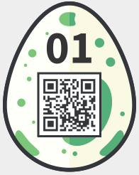

01 - Prison Break
=================
> *Your fellow inmate secretly passed you an old cell phone and a weird origami. The only thing on the phone are two stored numbers.*
> 
> `555-7747663 Link`
> `555-7475464 Sara`
> Find the password and enter it in the Egg-o-Matic below. lowercase only, no spaces!

In this challenge we are given a picture on top of the description


Googling a bit tells us that this code comes from the "Prison break" serie and we can find descriptions on how to decode online, for example <http://www.wonderlandblog.com/wonderland/2006/08/prison_break_se.html>. Using this method we decode the message as follows using the number of dots on the picture and the phone numbers:
```
1 3 3 4 3 2 2 3 3 4 2 3 2 1
7 7 4 7 6 6 3 7 4 7 5 4 6 4
p r i s o n e r i s k i n g
```

Our password is `prisonerisking` and when entering it we get the egg:

