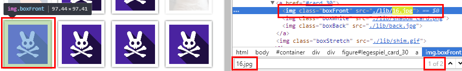

04 - Memeory
============
Here we have a memory game. Since it is written in JavaScript/HTML we can see the code. I did it the dumb way, no reversing. Just looking at the code in Chrome developer tools shows where the two identical pictures are:

The it's only a matter of clicking all the 50 pairs right to get the egg:

