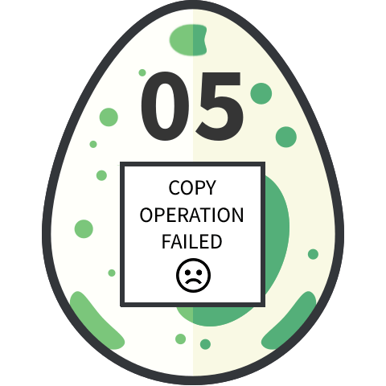

05 - Sloppy & Paste
===================
In the mobile application, when copying the text, sending it to a computer and decoding it using base64 we get a fake egg:


I assume that the copy paste has been modified in the application. So I downloaded the Android apk from the application and decompiled it using jadx. Once here, in the resources, there is a file named `challenge05.html` that contains the challenge itself. And in here is the original base64 code that we need to decrypt. Whe doing so:
```bash
$ cat 05_base64-from-source.txt | base64 -d > 05_egg.png
```

We then get the real flag:

