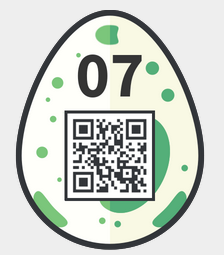

07 - Jigsaw
===========
> Thumper was probably under time pressure and jumped around a bit too wild. As a result, his picture has broken. Can you write a program to put it back together?

For this one we are provided with a picture containing a lot of squares in what seems to be a jigsaw puzzle made of square pieces. I did not want to do it by hand and used a tool found online, <https://github.com/nemanja-m/gaps>. The tool is very impressive, it detects the piece size and solves the puzzle all on its own using the following command:
```bash
$ gaps --image=jigsaw.png --generations=20 --population=600

=== Population:  600
=== Generations: 20
=== Piece size:  40 px
=== Pieces:      576

=== Analyzing image: ██████████████████████████████████████████████████ 100.0% 
=== Solving puzzle:  █████████████████████████████████████████████----- 89.5% 

=== GA terminated
=== There was no improvement for 10 generations

=== Done in 866.651 s
=== Close figure to exit
```

In the end we get this as a result. It's not perfect but more than sufficient to get the password, i.e. goodsheepdontalwayswearwhite:


And entering it gives us the egg:

