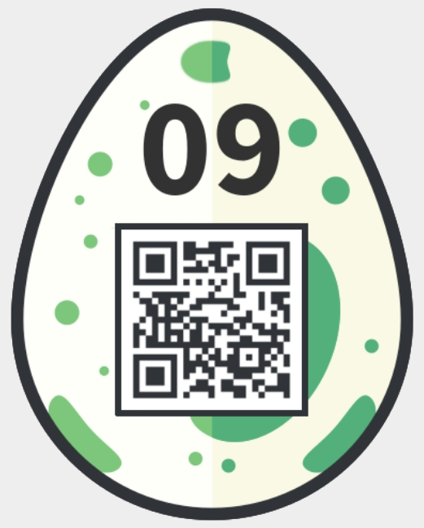

09 - Dial Trial
===============
> *Dial the phone*

This one was easy for me since I created it :p So I just submitted the password and got the egg:


However, if you want to know a bit more how this was created here are some notes. The full phrase to be encoded was:
```
snakeonnokia is the answer you are looking for
```

It was coded using mobile phone keyboard, spaces are to differentiate letters (two spaces) and words (six spaces):
```
7 7 7 7  6 6  2  5 5  3 3  6 6 6  6 6  6 6  6 6 6  5 5  4 4 4  2      4 4 4  7 7 7 7      8  4 4  3 3      2  6 6  7 7 7 7  9  3 3  7 7 7      9 9 9  6 6 6  8 8      2  7 7 7  3 3      5 5 5  6 6 6  6 6 6  5 5  4 4 4  6 6  4      3 3 3  6 6 6  7 7 7
```

DTMF tones were generated using <https://raw.githubusercontent.com/mpenkov/dtmf-cpp/master/scripts/tonegen.py> as:
```bash
$ python tonegen.py -d 30 "7 7 7 7  6 6  2  5 5  3 3  6 6 6  6 6  6 6  6 6 6  5 5  4 4 4  2      4 4 4  7 7 7 7      8  4 4  3 3      2  6 6  7 7 7 7  9  3 3  7 7 7      9 9 9  6 6 6  8 8      2  7 7 7  3 3      5 5 5  6 6 6  6 6 6  5 5  4 4 4  6 6  4      3 3 3  6 6 6  7 7 7" challenge.au
```
