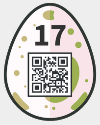

17 - Space Invaders
===================
> Alien space invaders left a secret message. Luckily, you know that they used codemoji.org for the encryption.
> 
> Decrypt the message, and save the planet!!

We are given a message consisting of emojis. The codemoji website has no easy tool to decrypt a message directly. To break the message, I downloaded the code from GitHub, <https://github.com/mozilla/codemoji> and ran it locally to make my tests. When reading the code we see that the cipher used is a simple cesar cipher. It should not be too hard to bruteforce.

I started by extracting the lost of all emojis that are allowed on the site, this can be done from the index page, it is part of the HTML DOM when encrypting messages. It then took me a long time until I understood that I needed to generate a new emoji list before decoding the message. Otherwise, most of the emojis are not used in the substitution and most thus don't decode correctly or don't decode at all. In the end the solution was as simple as the following JavaScript snippet to be run in the console on the codemoji website (or locally):
```javascript
var emoji_list = ['😀','😁','😂','😃','😄','😅','😆','😉','😊','😋','😎','😍','😘','😗','😙','😚','☺','😇','😐','😑','😶','😏','😣','😥','😮','😯','😪','😫','😴','😌','😛','😜','😝','😒','😓','😔','😕','😖','😷','😲','😞','😟','😤','😢','😭','😦','😧','😨','😩','😬','😰','😱','😳','😵','😠','👿','😈','👦','👧','👨','👩','👴','👵','👶','👱','👮','👲','👳','👷','👸','💂','🎅','👼','👯','💆','💇','👰','🙍','🙅','🙆','💁','🙋','🙇','🙌','🚶','🏃','💃','💏','💑','👫','👬','👭','💪','👈','👉','☝','👆','👇','✌','✊','✋','👊','👌','👍','👎','👋','👏','👐','💅','👣','👀','👂','👃','👅','👄','💋','💘','❤','💓','💔','💕','💖','💗','💙','💚','💛','💜','💝','💞','💌','💧','💤','💢','💥','💦','💨','💫','💬','💭','👔','👕','👖','👗','👘','👙','👚','👛','👜','👝','🎒','👟','👠','👡','👢','👑','👒','💄','💍','💎','👹','👺','👻','💀','👽','👾','💩','🐵','🙈','🙉','🙊','🐒','🐶','🐕','🐩','🐺','🐱','😸','😹','😺','😻','😼','😽','😾','😿','🙀','🐈','🐯','🐅','🐆','🐴','🐎','🐮','🐂','🐄','🐷','🐖','🐗','🐽','🐏','🐑','🐐','🐪','🐘','🐭','🐁','🐀','🐹','🐰','🐇','🐻','🐨','🐼','🐾','🐔','🐓','🐣','🐤','🐥','🐦','🐧','🐸','🐊','🐢','🐍','🐲','🐉','🐳','🐋','🐬','🐟','🐠','🐡','🐙','🐚','🐌','🐛','🐝','🐞','💐','🌸','💮','🌹','🌺','🌻','🌼','🌷','🌱','🌲','🌳','🌴','🌵','🌾','🌿','🍀','🍁','🍂','🍃','🍇','🍈','🍉','🍊','🍋','🍌','🍍','🍎','🍏','🍐','🍑','🍒','🍓','🍅','🍆','🌽','🍄','🌰','🍞','🍖','🍗','🍔','🍟','🍕','🍲','🍱','🍘','🍙','🍚','🍛','🍜','🍝','🍠','🍢','🍣','🍤','🍥','🍡','🍦','🍧','🍨','🍩','🍪','🎂','🍰','🍫','🍬','🍭','🍮','🍯','🍼','☕','🍵','🍶','🍷','🍸','🍹','🍺','🍻','🍴','🍳','🌍','🌐','🌋','🗻','🏠','🏡','⛪','🏢','🏣','🏤','🏥','🏦','🏨','🏩','🏪','🏫','🏬','🏭','🏯','🏰','💒','🗼','🗽','🗾','⛲','⛺','🌁','🌃','🌄','🌅','🌆','🌇','🌉','🌊','♨','🌌','🎠','🎡','🎢','💈','🎪','🎭','🎨','🎰','🚂','🚃','🚄','🚅','🚆','🚇','🚈','🚉','🚊','🚝','🚞','🚋','🚌','🚍','🚎','🚏','🚐','🚑','🚒','🚓','🚔','🚕','🚖','🚗','🚘','🚙','🚚','🚛','🚜','🚲','⛽','🚨','⚓','⛵','🚣','🚤','🚢','✈','💺','🚁','🚟','🚠','🚡','🚀','🚥','🚦','🚧','🚪','🚽','🚿','🛀','🛁','⌛','⌚','⏰','🌚','☀','🌝','🌞','☁','⛅','🌀','🌈','🌂','☔','❄','⛄','🌟','🌠','🔥','🎃','🎄','🎆','🎇','✨','🎈','🎉','🎊','🎋','🎌','🎍','🎎','🎏','🎐','🎑','🎯','🎴','🎀','🎁','🎫','⚽','⚾','🏀','🏈','🏉','🎾','🎳','⛳','🎣','🎽','🎿','🏂','🏄','🏇','🏊','🚴','🚵','🏆','🎲','🃏','🀄','🔇','📢','📣','📯','🔔','🔕','🎼','🎵','🎶','🎤','🎷','🎸','🎹','🎺','📻','📱','📲','☎','📟','📠','🔋','💻','💽','💾','💿','📀','🎬','🔍','🔬','🔭','📡','💡','🔦','🏮','📔','📕','📖','📗','📘','📙','📚','📓','📒','📃','📜','📰','📑','🔖','💰','💴','💵','💶','💷','💸','💳','💹','✉','📧','📨','📩','📤','📥','📦','📫','📪','📬','📭','📮','✏','✒','📝','💼','⚡','⭐'];
for (var i=0; i<547;i++){
    CryptoLib.generateEmojiSubsetFrom(emoji_list[i]);
    console.log(CryptoLib.decrypt(msg, emoji_list[i]))
}
```

This generates 547 decoded messages, most of them with emojis remaining in there. The only one that is full text is our password:
```
invad3rsmustd13
```

Entering it in the egg-o-matic gives the egg:

