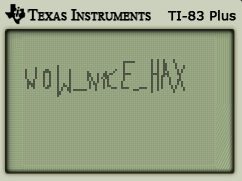

18 - Egg Factory
================
> Make the egg factory write a secret word!
> 
> Then enter it into the Egg-o-Matic below, uppercase and underscores only.

We got a file containing a program for a TI-83 calculator. The code of the program is here:
```
ClrHome
""->UNAME
""->PW
Disp "EggFactory v0.3"
Disp "Status: Dev"
Disp "ENTER CREDENTIALS:"
Disp "   1. USERNAME"
Disp "   2. PASSWORD"
Disp "------------------"
Input "> ",Str0

If Str0="1":Then
	"ABCDEFGHIJKLMNOPQRSTUVWXYZ"
	Ans+Ans->Str1
	Disp "ENTER USERNAME"
	Input "",Str2
	":"->Str3
	For(P,1,length(Str2))
		inString(Str1,sub(Str2,P,1))->A
		If A:Then
			Str3+sub(Str1,A+13,1)->Str3
		Else:
			Str3+sub(Str2,P,1)->Str3
		End
	End
	sub(Str3,2,length(Str2))->Str4
	If Str4="OHAALNQZVA_12128290":Then
		Disp "USERNAME SUCCESSFUL"
		
	Else:
		Disp "WRONG USERNAME, NOOB!"
	End
	Str4->UNAME
Else:
	If Str0="2":Then
		Disp "ENTER PASSWORD"
		Input "",Str5
		DelVar E1->C
		8956->N
		expr(Str5)->M
		While N>0 or M>0
			.5int(N->N
			.5int(M->M
			E+C(fPart(N) xor fPart(M->E
			C2->C
		End
		If E=9191:Then
			Disp "Successful :)"
			
		Else:
			Disp "WRONG PASSWORD!"
		End
	Else:
		If Str0="3":Then
			Disp "Seeeeecret ;)"
		Else:
			Disp "BAD INPUT DETECTED!"
		End
		
		ClrDraw:AxesOff:expr(Str5)*0.01->A:Line(~1.7067137809187278*A,1.1201413427561837*A,~1.6042402826855124*A,0.7667844522968198*A):Line(~4.54,2.17,~4.08,2.57):Line(~1.441696113074205*A,0.9081272084805653*A,~1.2720848056537102*A,0.7526501766784451*A):Line(~3.6,2.13,~3.36,3.35):Circle(~1.96,2.67,0.5):Line(~0.56,3.41,~0.48,1.77):Line(~0.16961130742049468*A,0.6254416961130742*A,0.13427561837455831*A,0.8586572438162544*A):Line(0.38,2.43,1,2):Line(0.35335689045936397*A,0.7067137809187279*A,0.3886925795053004*A,1.1413427561837455*A):Line(0.5653710247349824*A,0.7455830388692579*A,1.1307420494699647*A,0.724381625441696*A):Line(1.2932862190812722*A,0.7526501766784451*A,1.2650176678445229*A,1.0848056537102473*A):Line(3.58,3.07,4.66,2.21):Line(1.646643109540636*A,0.7420494699646644*A,1.7102473498233215*A,1.049469964664311*A):Line(5.28,2.75,5.82,3.13):Line(2.056537102473498*A,1.106007067137809*A,2.035335689045936*A,0.7879858657243816*A):Line(7.12,3.17,6.28,2.85):Line(2.219081272084806*A,1.0070671378091873*A,2.204946996466431*A,0.8091872791519434*A):Line(6.24,2.29,7.18,2.15):Line(9.5,3.69,8.3,3.61):Line(2.932862190812721*A,1.2756183745583038*A,2.904593639575972*A,1.0353356890459364*A):Line(8.22,2.93,9,3):Line(8.22,2.93,8.12,2.15):Line(2.869257950530035*A,0.7597173144876325*A,3.095406360424028*A,0.773851590106007*A):Line(9.74,2.11,11.34,2.13):Line(11.98,3.81,12,3):Line(4.240282685512367*A,1.0600706713780919*A,4.240282685512367*A,0.7067137809187279*A):Line(4.240282685512367*A,1.0600706713780919*A,4.515901060070671*A,1.0636042402826855*A):Line(12.76,3.75,12.78,3.01):Line(12.78,3.01,12.78,2.07):Line(13.36,2.13,13.68,3.79):Line(13.68,3.79,14.6,2.19):Line(4.7773851590106*A,1.0141342756183747*A,4.946996466431095*A,1.0600706713780919*A):Line(5.300353356890459*A,0.7067137809187279*A,5.795053003533568*A,1.226148409893993*A):Line(15,3.81,16.4,2.07)
```

I used <https://www.cemetech.net/sc/> to emulate the TI-83 and instrumented the program to understand it better. The interesting part is the drawing at the end. we need the correct password, `Str5`to draw it correctly so we need to have the right password, the username however is useless. By printing some variables and looking at the code we understand that all it does is a XOR between `Str5` and the value in `N`, 8956. Thus, it is easy to get the password, 283.

One can then take only the drawing part, hardcode 283 in place of `eval(Str5)` and get a first result:


This does not validate in any way, believe me I try hard! During the drawing, however, we can see on the right part of the screen something that is drawn. After some trial and error I came up with the following window settings:


Then when running the graph again we get the correct password, `WOW_NICE_HAX`:


This validates and gives the egg:

