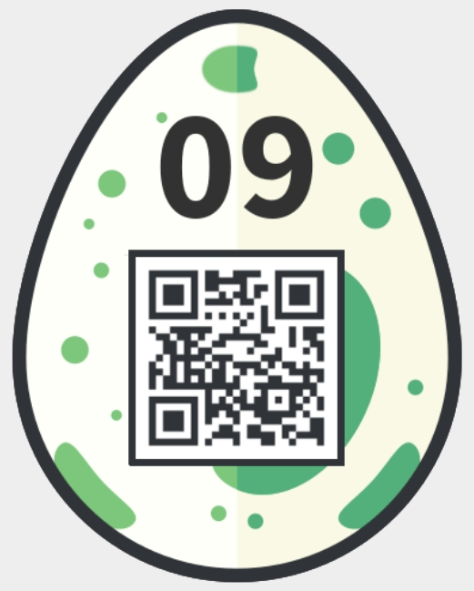

01 - Prison Break
=================
> *Your fellow inmate secretly passed you an old cell phone and a weird origami. The only thing on the phone are two stored numbers.*
> 
> `555-7747663 Link`
> `555-7475464 Sara`
> Find the password and enter it in the Egg-o-Matic below. lowercase only, no spaces!

In this challenge we are given a picture on top of the description


Googling a bit tells us that this code comes from the "Prison break" serie and we can find descriptions on how to decode online, for example <http://www.wonderlandblog.com/wonderland/2006/08/prison_break_se.html>. Using this method we decode the message as follows using the number of dots on the picture and the phone numbers:
```
1 3 3 4 3 2 2 3 3 4 2 3 2 1
7 7 4 7 6 6 3 7 4 7 5 4 6 4
p r i s o n e r i s k i n g
```

Our password is `prisonerisking` and when entering it we get the egg:


02 - Babylon
============
> The tower is not the only thing in Babylon which has walls and shelves.
> 
> `4 - 4 - 28 - 355`

We were given a text file containing a long string of numbers and letters:
```
2hd04vwksv96d2ij58kr4x49lgvckeoub1m8u2zpss9wwyiwpvq7vkz89iiv198n0k99qih4s18v713uksdkpsz4wfo6su0zl0uvw23icgf0n175gryfepsidc8yumvam1hjfs2mzsfqzycapk46wf6erucoun3hm1teokgyqjpqghqshghzf71tsjup7j7qp57sbdcntz0k1vv2iurfx8z96miyi6t9a8ahhj1yruajetvlm2doe1dluy9yk8fylnhyjrot1v7i1u1e9gnmpguwrvqyj3hm7wp4iit9lo8rqnscyozzb12ya60o4z9uz2l1y8oei3pl0kwzzzspg74sb3yooid26fuuq9y9tca4d3oh8nsf3mbliwws4o5l78w2n4uuzrnh6u4ynnwyvk8e5wszmqmpnwbvey4h7s18c9uprc8j2ovradt051trqnh48xg7wc1wtzqo0gfyn0pqx7hjnifycl7z9tm8vscj8e6x3xhcbi6cj5sel12010p6rwssftmvy5szjxcpzmb63t33xs6lxtx0oh33ukajz0cx5ltbl8eyr1tzzyb4x6irt91mzwdcv7zoz7hfszzkzj6yi63isqpb9yo6iizr1caktzpxhp9ebdyfrgdil3p6fpt1gjj6bmo116i7rs0ctam10rhf4jzw4dd5j5hayn2igo69umgssncg8yogu7fy802qy02qth95mfks4pn2y5lk3mmt9b6crdbytwvbev1fub8l7tzbpsdh6rld5hs2il35deqcjrdusrfz10i7ga3qfn1nxf7ntf27qi2xn5r1s8y52o0q2gxg6fugt1kwe1f62j3bywee7d8dsq33mpmuorjab9ywr1sz1i0r6ih16vfuje3bwti1sbbsltrwtichfsoalis3daw6u76gwf90owzbh75hg2ktmohif074250fly91hf8qgfxz31nfqi0n8o0w82jy1nfomlhzc5qjgml9dax8xlwayenhl748m5zqgzaz0d64kswphbs8fl8spp5vn97kw4p3jdygnz329645sw52maj2ybafczpnozsfwxob5448vxab7q4t2re4tvoe6xle5dt2n3q98z1jamdix94gpf6skds07hijddt5pyul8yzaanw376wwaby6pli9hmjpwpt2j4jzbbagpf1pgfmpe9d5phmj8aef38lw18eng5xu6k5soogvv1sl8gc5yga9lzpzdq97rm73qzg0nz2qb3s67bbf79etfhzzrgcs1kkvhzmxz8u7ddcf9ukxmn7f3d7yr0qw8113nno5qhxgsr1ym7x8v9t9tq6umkrv2e0wpr3n25nskk2ixrajv8fhgx5wqnd40kff4q9v50v9nxh5063v9eusz765qt8rwhe15mm8ttsd1kca3nqqszzrkfpr5e0tlkiajtz2zicoe6ppng7p86kwsxjhct6yifvz0fowrnffpqlxuzyg5kivlerbtw50apxj9id51otjo142ni7ir502y44t20nv4icx6x5t4zxaihzkwu33stjswp10d395vb07pkqhrwhiik7yr4lq2bxnad152iomi8f1e45mlk422895b0tj9cvr05ae86x2mhdfcd1i9mph3gp874orfrof2ooph25mcvbjhfu4rgtelpzh3n6tqop30e3jjy22rllqtc3v9wlk3zf28a1b3kkw9xnxi7yaz22q2e8jy9gcmn2skfy4x4tjcd038sk85oi6u8pjurqdwgc28f02301xx6bnc8b01lfkvpf7r9vufpoxa7991rl5u53an9nnv63tgkayu05sd6vj14ri03fsu6pyfusfsmsagfvgag7pxrjeaad6in4dktpms8vssp06golf523o7a206rqcm7bwdilni6kcz0ncxurgleefuz5d0a299i6ws2y30pipk7sg4tqi28hhzib997xc0lkqmibmgaalapnq4ogsbilvfmbao5o4u782rsmzko53qbmn9vhsy49nph5xks9nppy7r7jwkrdhtmudofudh5vetovw579l0ytpzd0im5j5593xwccinx2y9u1i5w9bdfhlvwjkza8jxpo0ffmgjoxl7951aym0r0sybfx19tx8baozfbkpsadjnbu9m0udvef7dxswamsqkz0q9lj2isyrr04qx3xlgtbx0kp9ldmpf58ivziori03jowd7nq4l5i6xtr2c9o0lie64pzmzzx10jroho9vl0u1waam6iguxudj0wby1qst3hgdogux0xo2ytkeqqyxvb9lhsosvxfyb4hgp1e7tas0jhlkptgyy6arp05a485u8ewqzzwmrarmenpfok9tlnpwcel74vbkzsei8hhi3y8evcilrtb9xjiqvqryb333sg7ax5l411hj0d6i3d4y8d3rb4px47gw6xrnvo1lt0rn130okqo9ijk1hi4dwa79lhtylazqg2ma6bjsvvi03obedaj70ej25pau0iliavcbpw0vj8rs7nwr3h85wo136zwlrxjt2xk82vifum2jyw15fxigmeb4790xff3iisg781ep7vfza53wupuuzlynpvujilzqjx1a0ewmzm9527th2c84bt3il8nwvalwafn9iajekizfpn1f1sbkwatuufezd9v9hwqlyokvdl62fh1acxv8fmpffbjm0s6q0qghlbzq0eoghhjoladv6bzl2lwrowj5l05xfo3hvab0kc8djiha4qwnlnevo22yxfo97q1irohidipypccuiwx8vjty4zt8qlvefe68kf51pex4b99dqqnn2zdsswg2u3wkz5iv65jc94o5b40yrbr992996wuu441jy87xvde0bb61lczqfnbg0ss2jnzcm3nsoo8rrtpnh0bphpd7yrpfvlz63uj6tn0ptxne63yvziis84kxuwzfs6fw696tuyjwx0pbpsvtx0ky8fcgtj92ej0xosvqkkehmdly0q1cqaydepbqsmqmxfzhgb4dwcxszwhr5n8zt4eifhr1yjbouejpiwesdi0rzph15z0cwth06s30blffqwwyuhhyu1vn1mdgsa2hvqhagpafmumeix9ppcgraou49l9r4vzzm5vg325ilt3nduqrtg73zbuwvou379vyd8crg6b27rvq05h2pgy9vwatxl88cm7ba9p7407hgblci42a78xrhprtai2
```

After searching on Google one find that a book was written called "The library of Babel" which corresponds to the hints. And then a website comes into play, <https://libraryofbabel.info> The site recreates a version of the complete library mechanism described in the book. It also allows you to search for books. When using the block of text and the numbers as some kind of coordinates to navigate through the library you can visit this URL: <https://libraryofbabel.info/book.cgi?2hd04vwksv96d2ij58kr4x49lgvckeoub1m8u2zpss9wwyiwpvq7vkz89iiv198n0k99qih4s18v713uksdkpsz4wfo6su0zl0uvw23icgf0n175gryfepsidc8yumvam1hjfs2mzsfqzycapk46wf6erucoun3hm1teokgyqjpqghqshghzf71tsjup7j7qp57sbdcntz0k1vv2iurfx8z96miyi6t9a8ahhj1yruajetvlm2doe1dluy9yk8fylnhyjrot1v7i1u1e9gnmpguwrvqyj3hm7wp4iit9lo8rqnscyozzb12ya60o4z9uz2l1y8oei3pl0kwzzzspg74sb3yooid26fuuq9y9tca4d3oh8nsf3mbliwws4o5l78w2n4uuzrnh6u4ynnwyvk8e5wszmqmpnwbvey4h7s18c9uprc8j2ovradt051trqnh48xg7wc1wtzqo0gfyn0pqx7hjnifycl7z9tm8vscj8e6x3xhcbi6cj5sel12010p6rwssftmvy5szjxcpzmb63t33xs6lxtx0oh33ukajz0cx5ltbl8eyr1tzzyb4x6irt91mzwdcv7zoz7hfszzkzj6yi63isqpb9yo6iizr1caktzpxhp9ebdyfrgdil3p6fpt1gjj6bmo116i7rs0ctam10rhf4jzw4dd5j5hayn2igo69umgssncg8yogu7fy802qy02qth95mfks4pn2y5lk3mmt9b6crdbytwvbev1fub8l7tzbpsdh6rld5hs2il35deqcjrdusrfz10i7ga3qfn1nxf7ntf27qi2xn5r1s8y52o0q2gxg6fugt1kwe1f62j3bywee7d8dsq33mpmuorjab9ywr1sz1i0r6ih16vfuje3bwti1sbbsltrwtichfsoalis3daw6u76gwf90owzbh75hg2ktmohif074250fly91hf8qgfxz31nfqi0n8o0w82jy1nfomlhzc5qjgml9dax8xlwayenhl748m5zqgzaz0d64kswphbs8fl8spp5vn97kw4p3jdygnz329645sw52maj2ybafczpnozsfwxob5448vxab7q4t2re4tvoe6xle5dt2n3q98z1jamdix94gpf6skds07hijddt5pyul8yzaanw376wwaby6pli9hmjpwpt2j4jzbbagpf1pgfmpe9d5phmj8aef38lw18eng5xu6k5soogvv1sl8gc5yga9lzpzdq97rm73qzg0nz2qb3s67bbf79etfhzzrgcs1kkvhzmxz8u7ddcf9ukxmn7f3d7yr0qw8113nno5qhxgsr1ym7x8v9t9tq6umkrv2e0wpr3n25nskk2ixrajv8fhgx5wqnd40kff4q9v50v9nxh5063v9eusz765qt8rwhe15mm8ttsd1kca3nqqszzrkfpr5e0tlkiajtz2zicoe6ppng7p86kwsxjhct6yifvz0fowrnffpqlxuzyg5kivlerbtw50apxj9id51otjo142ni7ir502y44t20nv4icx6x5t4zxaihzkwu33stjswp10d395vb07pkqhrwhiik7yr4lq2bxnad152iomi8f1e45mlk422895b0tj9cvr05ae86x2mhdfcd1i9mph3gp874orfrof2ooph25mcvbjhfu4rgtelpzh3n6tqop30e3jjy22rllqtc3v9wlk3zf28a1b3kkw9xnxi7yaz22q2e8jy9gcmn2skfy4x4tjcd038sk85oi6u8pjurqdwgc28f02301xx6bnc8b01lfkvpf7r9vufpoxa7991rl5u53an9nnv63tgkayu05sd6vj14ri03fsu6pyfusfsmsagfvgag7pxrjeaad6in4dktpms8vssp06golf523o7a206rqcm7bwdilni6kcz0ncxurgleefuz5d0a299i6ws2y30pipk7sg4tqi28hhzib997xc0lkqmibmgaalapnq4ogsbilvfmbao5o4u782rsmzko53qbmn9vhsy49nph5xks9nppy7r7jwkrdhtmudofudh5vetovw579l0ytpzd0im5j5593xwccinx2y9u1i5w9bdfhlvwjkza8jxpo0ffmgjoxl7951aym0r0sybfx19tx8baozfbkpsadjnbu9m0udvef7dxswamsqkz0q9lj2isyrr04qx3xlgtbx0kp9ldmpf58ivziori03jowd7nq4l5i6xtr2c9o0lie64pzmzzx10jroho9vl0u1waam6iguxudj0wby1qst3hgdogux0xo2ytkeqqyxvb9lhsosvxfyb4hgp1e7tas0jhlkptgyy6arp05a485u8ewqzzwmrarmenpfok9tlnpwcel74vbkzsei8hhi3y8evcilrtb9xjiqvqryb333sg7ax5l411hj0d6i3d4y8d3rb4px47gw6xrnvo1lt0rn130okqo9ijk1hi4dwa79lhtylazqg2ma6bjsvvi03obedaj70ej25pau0iliavcbpw0vj8rs7nwr3h85wo136zwlrxjt2xk82vifum2jyw15fxigmeb4790xff3iisg781ep7vfza53wupuuzlynpvujilzqjx1a0ewmzm9527th2c84bt3il8nwvalwafn9iajekizfpn1f1sbkwatuufezd9v9hwqlyokvdl62fh1acxv8fmpffbjm0s6q0qghlbzq0eoghhjoladv6bzl2lwrowj5l05xfo3hvab0kc8djiha4qwnlnevo22yxfo97q1irohidipypccuiwx8vjty4zt8qlvefe68kf51pex4b99dqqnn2zdsswg2u3wkz5iv65jc94o5b40yrbr992996wuu441jy87xvde0bb61lczqfnbg0ss2jnzcm3nsoo8rrtpnh0bphpd7yrpfvlz63uj6tn0ptxne63yvziis84kxuwzfs6fw696tuyjwx0pbpsvtx0ky8fcgtj92ej0xosvqkkehmdly0q1cqaydepbqsmqmxfzhgb4dwcxszwhr5n8zt4eifhr1yjbouejpiwesdi0rzph15z0cwth06s30blffqwwyuhhyu1vn1mdgsa2hvqhagpafmumeix9ppcgraou49l9r4vzzm5vg325ilt3nduqrtg73zbuwvou379vyd8crg6b27rvq05h2pgy9vwatxl88cm7ba9p7407hgblci42a78xrhprtai2rinq0xsly9c69ypnko73nqpumnjkwqb4sw4-w4-s4-v28:355> and this leads yo uto a text page where is written:
```
the super secret hackyeaster password is checkthedatayo
```

Once fed to the egg-o-matic, we get the egg:


03 - Pony Coder
===============
> Tony the pony has encoded something for you. Decode his message and enter it in the egg-o-matic below! Lowercase and spaces only, and special characters!
> 
> gn tn-gha87be4e

Using this string and trying to decode it using punycode I finally found an online service that decoded it more or less, <https://www.motobit.com/util/punycode-decoder-encoder.asp> When decoding it I got:
```
gìn tônì©
```

And when submitting `gin tonic` to the egg-o-matic I got the egg:


04 - Memeory
============
Here we have a memory game. Since it is written in JavaScript/HTML we can see the code. I did it the dumb way, no reversing. Just looking at the code in Chrome developer tools shows where the two identical pictures are:


The it's only a matter of clicking all the 50 pairs right to get the egg:


05 - Sloppy & Paste
===================
In the mobile application, when copying the text, sending it to a computer and decoding it using base64 we get a fake egg:


I assume that the copy paste has been modified in the application. So I downloaded the Android apk from the application and decompiled it using jadx. Once here, in the resources, there is a file named `challenge05.html` that contains the challenge itself. And in here is the original base64 code that we need to decrypt. Whe doing so:
```bash
$ cat 05_base64-from-source.txt | base64 -d > 05_egg.png
```

We then get the real flag:


06 - Cooking for Hackers
========================
> You've found this recipe online:
> 
> 1 pinch: c2FsdA==
> 
> 2 tablesspoons: b2ls
> 
> 1 teaspoon: dDd3Mmc=
> 
> 50g: bnRkby4=
> 
> 2 medium, chopped: b25pb24=
> 
> But you need one more secret ingredient! Find it!

Decoding the ingredient from base64 gives:
```
1 pinch: salt
2 tablespoons: oil
1 teaspoon: t7w2g
50g: ntdo.
2 medium, chopped: onion
```

This could be a .onion URL: <http://saltoilt7w2gntdo.onion> and indeed when visiting this page using the Tor browser we get a page that gives us the flag:


07 - Jigsaw
===========
> Thumper was probably under time pressure and jumped around a bit too wild. As a result, his picture has broken. Can you write a program to put it back together?

For this one we are provided with a picture containing a lot of squares in what seems to be a jigsaw puzzle made of square pieces. I did not want to do it by hand and used a tool found online, <https://github.com/nemanja-m/gaps>. The tool is very impressive, it detects the piece size and solves the puzzle all on its own using the following command:
```bash
$ gaps --image=jigsaw.png --generations=20 --population=600

=== Population:  600
=== Generations: 20
=== Piece size:  40 px
=== Pieces:      576

=== Analyzing image: ██████████████████████████████████████████████████ 100.0% 
=== Solving puzzle:  █████████████████████████████████████████████----- 89.5% 

=== GA terminated
=== There was no improvement for 10 generations

=== Done in 866.651 s
=== Close figure to exit
```

In the end we get this as a result. It's not perfect but more than sufficient to get the password, i.e. goodsheepdontalwayswearwhite:


And entering it gives us the egg:


08 - Disco Egg
==============
>
>    Make things as simple as possible but no simpler.
>
> -- Albert Einstein

After this quote we are given a link to a web page. On this web page is an egg blinking like a disco ball. This was done in JavaScript using jQuery. To prevent the blinking, one can remove the whole JavaScript from the page after saving it locally.

Then, to get the egg itself, it was sufficient to remove all color classes from the table forming the QR-code except for the black and white and apply the background color accordingly. So now we have a table with cells that are either white or black, i.e.:
```html
<td class="white" style="background-color: rgb(255,255,255);"/>
<td class="black" style="background-color: rgb(0,0,0);"/>
```

One can then simply open the html page in a browser to see the egg displayed:
![(./08_egg.png)


09 - Dial Trial
===============
> *Dial the phone*

This one was easy for me since I created it :p So I just submitted the password and got the egg:


However, if you want to know a bit more how this was created here are some notes. The full phrase to be encoded was:
```
snakeonnokia is the answer you are looking for
```

It was coded using mobile phone keyboard, spaces are to differentiate letters (two spaces) and words (six spaces):
```
7 7 7 7  6 6  2  5 5  3 3  6 6 6  6 6  6 6  6 6 6  5 5  4 4 4  2      4 4 4  7 7 7 7      8  4 4  3 3      2  6 6  7 7 7 7  9  3 3  7 7 7      9 9 9  6 6 6  8 8      2  7 7 7  3 3      5 5 5  6 6 6  6 6 6  5 5  4 4 4  6 6  4      3 3 3  6 6 6  7 7 7
```

DTMF tones were generated using <https://raw.githubusercontent.com/mpenkov/dtmf-cpp/master/scripts/tonegen.py> as:
```bash
$ python tonegen.py -d 30 "7 7 7 7  6 6  2  5 5  3 3  6 6 6  6 6  6 6  6 6 6  5 5  4 4 4  2      4 4 4  7 7 7 7      8  4 4  3 3      2  6 6  7 7 7 7  9  3 3  7 7 7      9 9 9  6 6 6  8 8      2  7 7 7  3 3      5 5 5  6 6 6  6 6 6  5 5  4 4 4  6 6  4      3 3 3  6 6 6  7 7 7" challenge.au
```


10 - Level Two
==============
> So you managed to beat the boss in the teaser game? This one won't be that easy!
> 
> You'll need RPG Maker Run Time Packages to run the game.
> 
> Hints: there are several parts to be found. Combine them, and enter the final flag in the egg-o-matic below, without spaces! Saving the game from time to time certainly helps.

Here we get the follow-up of the teaser challenge. The solution is not fundamentally different. I used 2 tools, first one to edit the game save files called RPGMakerSaveEdit and available from <http://www.ulmf.org/bbs/showthread.php?t=28936> and one tool to search and edit the memory of the game process in real time called Cheat Engine <http://www.cheatengine.org>.

I started by editing the save file to level up to level 99 and get every items (including the final egg and the key). This already gave me one part of the flag, namely:
```
7034353577307264355f3472335f6330306c
```

Then I used Cheat Engine to make easy movements even where it was not allowed to due to game mechanics. This allowed me to pass through the levels easily. Along the way I found a seond flag on a sign just after escaping the prison:
```
7034353577307264355f052d066b15035433
```

One more was one level 1 (green level with rain):
```
70343535773072105d6c6b05032d0f546f4c
```

And the last one was on level 3, after a barred door:
```
7034353577307264355f3406033b5749114c
```

The challenge description says that we need to combine the parts so I XORed each 3 "level" flags with the egg flag to get the following:
```
1_54v3d_
t0d4y!
th3_w0rld_
```

Which is combined to `1_54v3d_th3_w0rld_t0d4y!`. When entering this as password, the egg is revealed:


12 - Patience
=============
> All you need is a little patience...
> 
> Countdown:
> 100000

Here we could simply wait for much too long or bypass this wait :) When looking at the code of the challenge in the decompiled sources of the mobile application we see the following script managing the countdown:
```javascript
hash = 'genesis';
count = 100000;
setTimeout( function() { document.location.href = 'ps://count?h=' + hash + '&c=' + count; } , 1000);
function countFeedback(jsonString) {
    var json = JSON.parse(jsonString);
      if (json) {
        hash = json.h;
        count = json.c;
        $('#count').text(count);
        if (count == 0) {
   	        document.getElementById('flag').setAttribute('src', 'https://hackyeaster.hacking-lab.com/hackyeaster/images/eggs/'+hash+'.png');
        } else if (count > 0) {
            setTimeout( function() { document.location.href = 'ps://count?h=' + hash + '&c=' + count; } , 3000);
        }
      }
  }
```

Looking at the URL handler for the `ps://` we see the following:
```java
if (url.startsWith(Activity.URL_COUNT)) {
    uri = Uri.parse(url);
    final String h = uri.getQueryParameter("h");
    final String c = uri.getQueryParameter("c");
    final WebView fView = view;
    new Handler().postDelayed(new Runnable() {
        public void run() {
            String json = Activity.this.handleCount(h, c);
            if (json != null) {
                fView.loadUrl("javascript:countFeedback('" + json + "');");
            }
        }
    }, 7000);
    return true;
}
```

The `h` and `c` parameter are passed to the `handleCount` function:
```java
private String handleCount(String h, String c) {
    if (!(c == null || h == null)) {
        try {
            Integer count = Integer.valueOf(Integer.parseInt(c));
            String hash = sha1(h + c);
            if (count.intValue() >= 0) {
                return "{ \"h\":\"" + hash + "\", \"c\":\"" + (count.intValue() - 1) + "\" }";
            }
        } catch (Exception e) {
        }
    }
    return null;
}
```

Basically, a sha1 hash of the previous hash concatenated with the current counter is done. Then this new hash is returned with the decremented counter. When the counter reach 0 a URL is fetched with the last hash on the hacky easter website. To get the egg we need to fetch this URL and, thus, first compute the hash. This can be done using the following python script:
```python
!/usr/bin/python3

import hashlib
value = 'genesis'

for i in range(100000, 0, -1):
    concat = (value + str(i)).encode()
    value = hashlib.sha1(concat).hexdigest()

print(value)
```

Running the script:
```bash
$ python 12_hash.py
dd6f1596ab39b463ebecc2158e3a0a2ceed76ec8
```

Then we get the egg at the corresponding URL <https://hackyeaster.hacking-lab.com/hackyeaster/images/eggs/dd6f1596ab39b463ebecc2158e3a0a2ceed76ec8.png>:


13 - Sagittarius...
===================
> ... is playing with his pila again.
> 
> Can you find the Easter egg QR code he has hidden from you?

Here we are given a `pila.kmz` file that can be opened in google earth. When doing so one sees a circle of points represented. It already looks a bit like a QR-code. My guess was that I had to map this from a circle or a sphere to a square to get the original QR-code.

Doing so was a matter of mathematics and took several tries until I found the right approach to map a circle to a square. In the end I did it as follows. First open the KMZ file to extract all points from the XML data. Each point is represented as a `<Placemark>` element:
```xml
<Placemark>
<styleUrl>#yc10</styleUrl><Point><coordinates>120.70710678118655,-44.792893218813454,0</coordinates></Point></Placemark>
            <Placemark>
<styleUrl>#b10</styleUrl><Point><coordinates>120.67572462851734,-44.762845859799256,0</coordinates></Point></Placemark>
```

On can extract the coordinates. Then I used a python script to make the coordinate transform and plot the result. The formula I used to make the transform comes from <http://squircular.blogspot.ch/2015/09/elliptical-arc-mapping.html> and the script is as follows:
```python
#!/usr/bin/python3

from math import sqrt
import matplotlib.pyplot as plt

def sign(x): return 1 if x >= 0 else -1

coords = [
[120.70710678118655,-44.792893218813454],
[LOTS OF POINTS HERE]
[119.29289321881345,-46.207106781186546]
]

new_coords = [[c[0]-120, c[1]+45.5] for c in coords]

square_coords = []
for [u,v] in new_coords:
    if u**2 >= v**2:
        square_coords.append([
            sign(u) * sqrt(u**2 + v**2),
            sign(u) * (v/u) * sqrt(u**2 + v**2)
            ])
    else:
        square_coords.append([
            sign(v) * (u/v) * sqrt(u**2 + v**2),
            sign(v) * sqrt(u**2 + v**2)
            ])

x = [c[0] for c in square_coords]
y = [c[1] for c in square_coords]

plt.scatter(x, y, c="black", s=100, marker="s", edgecolors=None)
plt.show()
```

This gives almost a QR-code in matplotlib:


With some work on the picture (scaling, mirroring, rotating and blurring) we have something that can be scanned by the mobile application:


14 - Same same...
=================
> *...but different!*
> 
> Upload the right files and make the server return an Easter egg!
> 
> `http://whale.hacking-lab.com:4444`

Here we get this description and the code of the web page:
```php
<?php
require __DIR__ . "/vendor/autoload.php"; // QR decoder library from https://github.com/khanamiryan/php-qrcode-detector-decoder

try {
    $qrcode1 = new QrReader($_FILES["file1"]["tmp_name"]);
    $answer1 = $qrcode1->text();
} catch(Exception $e) {
    exit("Error while reading the first QR.");
}

try {
    $qrcode2 = new QrReader($_FILES["file2"]["tmp_name"]);
    $answer2 = $qrcode2->text(); 
} catch(Exception $e) {
    exit("Error while reading the second QR.");
}

if(($answer1 == "Hackvent" && $answer2 == "Hacky Easter" or $answer1 == "Hacky Easter" && $answer2 == "Hackvent") && sha1_file($_FILES["file1"]["tmp_name"]) == sha1_file($_FILES["file2"]["tmp_name"])) {
    [SURPRISE]
}
else {
    echo ":-(";
}
?>
```

So it seems that we need to upload two files with the same SHA1 hash but that decode (as QR-code) to a different result. Thankfully SHA1 has been broken last year andit is now easy to generate collisions (at least for PDF files). Since this library supports PDF we can directly use any online service to generate QR-codes that decode to the expected strings, "Hackvent" and "Hacky Easter". Then send those to another online service that helps creating PDFs that have the same SHA1 hash but a different content, I used <https://alf.nu/SHA1>. This generates two files with the same hash and when uploading those files to the website we get the egg:


15 - Manila greetings
=====================
> Randy Waterhouse receives a package from his friend Enoch Root containing a deck of cards and a letter:
> 
> Dear Randy,
> 
> even though our stay in Manila was not very pleasant, I fondly think of our discussions there:
> 
> GTIFL RVLEJ TAVEY ULDJO KCCOK P
> Wishing you happy Easter
> 
> Enoch
> 
> Decrypt the message and enter the password in the Egg-o-Matic below. Uppercase only!

Additionally we get a `deck.txt` file with the following content:
```
d8
s3
d7
d3
c2
s5
da
c6
s7
d6
jr
dk
hq
sj
cj
h7
h3
h9
s9
s8
c9
sa
h4
c8
c3
hk
ha
s6
h6
s10
sk
ca
d10
dq
cq
jb
sq
s4
d9
s2
c5
hj
h10
c4
c10
d5
h8
h2
d2
dj
c7
ck
h5
d4
```

The hints point to the Pontifex or Solitaire cipher, designed by Bruce Schneier. Once we know that it's only a matter of finding a tool to decrypt the message. I used <https://ermarian.net/services/encryption/solitaire> with the following parameters:
```
Ciphertext:
GTIFL RVLEJ TAVEY ULDJO KCCOK P

Key as cards:
8d 3s 7d 3d 2c 5s Ad 6c 7s 6d A Kd Qh Js Jc 7h 3h 9h 9s 8s 9c As 4h 8c 3c Kh Ah 6s 6h Ts Ks Ac Td Qd Qc B Qs 4s 9d 2s 5c Jh Th 4c Tc 5d 8h 2h 2d Jd  7c Kc 5h 4d
```

Which returns:
```
THEPA SSWOR DISCR YPTON OMICO N
```

Thus the password is CRYPTONOMICON and this validates to get the egg:


16 - git cloak --hard
=====================
> This one requires your best Git-Fu! Find the hidden egg in the repository.

Actually I did not need to use that much git for this challenge. I started by downloading and unpacking the repository. Then I wrote a python script that will uncompress a git object:
```python
#!/usr/bin/python3

import zlib
import sys

in_file = sys.argv[1]
compressed = open(in_file, 'rb').read()
decompressed = zlib.decompress(compressed)
data = decompressed[decompressed.find(b'\x00') + 1:]

out_file = sys.argv[2]
f = open(out_file, 'wb')
f.write(data)
f.close()
```

Then I ran the script on all git objects, creating decoded copies:
```bash
for i in `ls .git/objects/*/*`; do python3 uncompress.py $i "${i}.decoded"; done;
```

Then I had a look at the file types of those copies:
```bash
for i in `ls .git/objects/*/*.decoded`; do file $i; done;
.git/objects/03/ed59cca1ea7ea0922d6fcbdb98c52931a8d3b0.decoded: JPEG image data, JFIF standard 1.01, resolution (DPI), density 300x300, segment length 16, Exif Standard: [TIFF image data, big-endian, direntries=4, manufacturer=Canon, model=Canon EOS 70D], baseline, precision 8, 870x720, frames 3
.git/objects/04/93a710296b7a684a46eed377029f7077622768.decoded: PNG image data, 480 x 480, 8-bit/color RGBA, non-interlaced
.git/objects/0e/45662a541fee91d4652c5ba57300276eb7fa29.decoded: JPEG image data, JFIF standard 1.01, aspect ratio, density 1x1, segment length 16, baseline, precision 8, 650x434, frames 3
.git/objects/17/9ec0d76ecdc903ac12c4f3971efefbfb02aacb.decoded: PNG image data, 550 x 481, 8-bit/color RGBA, non-interlaced
.git/objects/22/8b603ed45ddaf1b1d3fe502e168fa2508ee5ed.decoded: ASCII text
.git/objects/24/5735e32ed8174bdabe9655f00f1deb4ebaa3ad.decoded: PNG image data, 444 x 659, 8-bit/color RGB, non-interlaced
.git/objects/34/41837df545268c05da59d6d280a62a21343680.decoded: PNG image data, 600 x 700, 8-bit/color RGB, non-interlaced
.git/objects/38/39c14d2863fd850794661677352305ea798eb6.decoded: ASCII text
.git/objects/57/a17c1a44414c5973a7d967f2ca07eccf530ff4.decoded: PNG image data, 480 x 480, 8-bit/color RGBA, non-interlaced
.git/objects/5e/5e98caaa4ed1f6edee5aced3ff0b92457d6549.decoded: data
.git/objects/69/ee0b67f2701bc83cd64eec1e01c045c8a53bd3.decoded: PNG image data, 277 x 182, 8-bit colormap, non-interlaced
.git/objects/6f/5568ed00eb893db28616497f18749efd4bfd89.decoded: data
.git/objects/74/1583e168e0723aef4ca0253f875a1f50144567.decoded: JPEG image data, JFIF standard 1.01, aspect ratio, density 1x1, segment length 16, baseline, precision 8, 480x320, frames 3
.git/objects/8d/9faa7ebaac3b61cc29cc309d11b923e9bcd5ab.decoded: JPEG image data, JFIF standard 1.01, resolution (DPI), density 96x96, segment length 16, progressive, precision 8, 400x400, frames 3
.git/objects/9a/29769663d029f1b3ad83fec7e7f19ca1cf8e78.decoded: ASCII text
.git/objects/9d/69bfb2dc3b3fd28389c7f709c3656e5c78c8c4.decoded: data
.git/objects/9d/7c9b5a1c8773ea48caac90d05401679b0a8897.decoded: ASCII text
.git/objects/b9/820d55ce59799992648672a5a43fff4effd56b.decoded: ASCII text
.git/objects/b9/e860f47fe6990cbda4ac5bb3d2829d2191f1eb.decoded: ASCII text
.git/objects/bc/83275bcea7da814743f1c478cb3a8771e0f1ac.decoded: data
.git/objects/be/98f627fa5d3251be77bbb7a64f5a34b6baf709.decoded: PNG image data, 480 x 480, 8-bit/color RGBA, non-interlaced
.git/objects/c5/9568e4b945199366ad7ea486efbda76a07887c.decoded: data
.git/objects/d0/c6562ce74c54358445fc3b6cc0584e32057ad5.decoded: JPEG image data, JFIF standard 1.01, aspect ratio, density 1x1, segment length 16, progressive, precision 8, 454x330, frames 3
.git/objects/d7/995a259ff0dfa28da06618d06e78b346738a6b.decoded: JPEG image data, JFIF standard 1.01, resolution (DPI), density 72x72, segment length 16, baseline, precision 8, 620x455, frames 3
.git/objects/da/cecafa877bd2346bd3a2c0a8a4026418491ccd.decoded: PNG image data, 480 x 480, 8-bit/color RGB, non-interlaced
.git/objects/db/ab6618f6dc00a18b4195fb1bec5353c51b256f.decoded: PNG image data, 480 x 480, 8-bit colormap, non-interlaced
.git/objects/e7/237971df563c82e85eb74a50ca41a218dc85ed.decoded: data
.git/objects/f7/d946ebee06ee65e422530355c08ff2f06d456b.decoded: JPEG image data, JFIF standard 1.01, resolution (DPI), density 72x72, segment length 16, baseline, precision 8, 475x562, frames 3
```

Then I only had to look at all picture file to find the right one. It was `.git/objects/db/ab6618f6dc00a18b4195fb1bec5353c51b256f.decoded`. This is the egg:


17 - Space Invaders
===================
> Alien space invaders left a secret message. Luckily, you know that they used codemoji.org for the encryption.
> 
> Decrypt the message, and save the planet!!

We are given a message consisting of emojis. The codemoji website has no easy tool to decrypt a message directly. To break the message, I downloaded the code from GitHub, <https://github.com/mozilla/codemoji> and ran it locally to make my tests. When reading the code we see that the cipher used is a simple cesar cipher. It should not be too hard to bruteforce.

I started by extracting the lost of all emojis that are allowed on the site, this can be done from the index page, it is part of the HTML DOM when encrypting messages. It then took me a long time until I understood that I needed to generate a new emoji list before decoding the message. Otherwise, most of the emojis are not used in the substitution and most thus don't decode correctly or don't decode at all. In the end the solution was as simple as the following JavaScript snippet to be run in the console on the codemoji website (or locally):
```javascript
var emoji_list = ['😀','😁','😂','😃','😄','😅','😆','😉','😊','😋','😎','😍','😘','😗','😙','😚','☺','😇','😐','😑','😶','😏','😣','😥','😮','😯','😪','😫','😴','😌','😛','😜','😝','😒','😓','😔','😕','😖','😷','😲','😞','😟','😤','😢','😭','😦','😧','😨','😩','😬','😰','😱','😳','😵','😠','👿','😈','👦','👧','👨','👩','👴','👵','👶','👱','👮','👲','👳','👷','👸','💂','🎅','👼','👯','💆','💇','👰','🙍','🙅','🙆','💁','🙋','🙇','🙌','🚶','🏃','💃','💏','💑','👫','👬','👭','💪','👈','👉','☝','👆','👇','✌','✊','✋','👊','👌','👍','👎','👋','👏','👐','💅','👣','👀','👂','👃','👅','👄','💋','💘','❤','💓','💔','💕','💖','💗','💙','💚','💛','💜','💝','💞','💌','💧','💤','💢','💥','💦','💨','💫','💬','💭','👔','👕','👖','👗','👘','👙','👚','👛','👜','👝','🎒','👟','👠','👡','👢','👑','👒','💄','💍','💎','👹','👺','👻','💀','👽','👾','💩','🐵','🙈','🙉','🙊','🐒','🐶','🐕','🐩','🐺','🐱','😸','😹','😺','😻','😼','😽','😾','😿','🙀','🐈','🐯','🐅','🐆','🐴','🐎','🐮','🐂','🐄','🐷','🐖','🐗','🐽','🐏','🐑','🐐','🐪','🐘','🐭','🐁','🐀','🐹','🐰','🐇','🐻','🐨','🐼','🐾','🐔','🐓','🐣','🐤','🐥','🐦','🐧','🐸','🐊','🐢','🐍','🐲','🐉','🐳','🐋','🐬','🐟','🐠','🐡','🐙','🐚','🐌','🐛','🐝','🐞','💐','🌸','💮','🌹','🌺','🌻','🌼','🌷','🌱','🌲','🌳','🌴','🌵','🌾','🌿','🍀','🍁','🍂','🍃','🍇','🍈','🍉','🍊','🍋','🍌','🍍','🍎','🍏','🍐','🍑','🍒','🍓','🍅','🍆','🌽','🍄','🌰','🍞','🍖','🍗','🍔','🍟','🍕','🍲','🍱','🍘','🍙','🍚','🍛','🍜','🍝','🍠','🍢','🍣','🍤','🍥','🍡','🍦','🍧','🍨','🍩','🍪','🎂','🍰','🍫','🍬','🍭','🍮','🍯','🍼','☕','🍵','🍶','🍷','🍸','🍹','🍺','🍻','🍴','🍳','🌍','🌐','🌋','🗻','🏠','🏡','⛪','🏢','🏣','🏤','🏥','🏦','🏨','🏩','🏪','🏫','🏬','🏭','🏯','🏰','💒','🗼','🗽','🗾','⛲','⛺','🌁','🌃','🌄','🌅','🌆','🌇','🌉','🌊','♨','🌌','🎠','🎡','🎢','💈','🎪','🎭','🎨','🎰','🚂','🚃','🚄','🚅','🚆','🚇','🚈','🚉','🚊','🚝','🚞','🚋','🚌','🚍','🚎','🚏','🚐','🚑','🚒','🚓','🚔','🚕','🚖','🚗','🚘','🚙','🚚','🚛','🚜','🚲','⛽','🚨','⚓','⛵','🚣','🚤','🚢','✈','💺','🚁','🚟','🚠','🚡','🚀','🚥','🚦','🚧','🚪','🚽','🚿','🛀','🛁','⌛','⌚','⏰','🌚','☀','🌝','🌞','☁','⛅','🌀','🌈','🌂','☔','❄','⛄','🌟','🌠','🔥','🎃','🎄','🎆','🎇','✨','🎈','🎉','🎊','🎋','🎌','🎍','🎎','🎏','🎐','🎑','🎯','🎴','🎀','🎁','🎫','⚽','⚾','🏀','🏈','🏉','🎾','🎳','⛳','🎣','🎽','🎿','🏂','🏄','🏇','🏊','🚴','🚵','🏆','🎲','🃏','🀄','🔇','📢','📣','📯','🔔','🔕','🎼','🎵','🎶','🎤','🎷','🎸','🎹','🎺','📻','📱','📲','☎','📟','📠','🔋','💻','💽','💾','💿','📀','🎬','🔍','🔬','🔭','📡','💡','🔦','🏮','📔','📕','📖','📗','📘','📙','📚','📓','📒','📃','📜','📰','📑','🔖','💰','💴','💵','💶','💷','💸','💳','💹','✉','📧','📨','📩','📤','📥','📦','📫','📪','📬','📭','📮','✏','✒','📝','💼','⚡','⭐'];
for (var i=0; i<547;i++){
    CryptoLib.generateEmojiSubsetFrom(emoji_list[i]);
    console.log(CryptoLib.decrypt(msg, emoji_list[i]))
}
```

This generates 547 decoded messages, most of them with emojis remaining in there. The only one that is full text is our password:
```
invad3rsmustd13
```

Entering it in the egg-o-matic gives the egg:


18 - Egg Factory
================
> Make the egg factory write a secret word!
> 
> Then enter it into the Egg-o-Matic below, uppercase and underscores only.

We got a file containing a program for a TI-83 calculator. The code of the program is here:
```
ClrHome
""->UNAME
""->PW
Disp "EggFactory v0.3"
Disp "Status: Dev"
Disp "ENTER CREDENTIALS:"
Disp "   1. USERNAME"
Disp "   2. PASSWORD"
Disp "------------------"
Input "> ",Str0

If Str0="1":Then
	"ABCDEFGHIJKLMNOPQRSTUVWXYZ"
	Ans+Ans->Str1
	Disp "ENTER USERNAME"
	Input "",Str2
	":"->Str3
	For(P,1,length(Str2))
		inString(Str1,sub(Str2,P,1))->A
		If A:Then
			Str3+sub(Str1,A+13,1)->Str3
		Else:
			Str3+sub(Str2,P,1)->Str3
		End
	End
	sub(Str3,2,length(Str2))->Str4
	If Str4="OHAALNQZVA_12128290":Then
		Disp "USERNAME SUCCESSFUL"
		
	Else:
		Disp "WRONG USERNAME, NOOB!"
	End
	Str4->UNAME
Else:
	If Str0="2":Then
		Disp "ENTER PASSWORD"
		Input "",Str5
		DelVar E1->C
		8956->N
		expr(Str5)->M
		While N>0 or M>0
			.5int(N->N
			.5int(M->M
			E+C(fPart(N) xor fPart(M->E
			C2->C
		End
		If E=9191:Then
			Disp "Successful :)"
			
		Else:
			Disp "WRONG PASSWORD!"
		End
	Else:
		If Str0="3":Then
			Disp "Seeeeecret ;)"
		Else:
			Disp "BAD INPUT DETECTED!"
		End
		
		ClrDraw:AxesOff:expr(Str5)*0.01->A:Line(~1.7067137809187278*A,1.1201413427561837*A,~1.6042402826855124*A,0.7667844522968198*A):Line(~4.54,2.17,~4.08,2.57):Line(~1.441696113074205*A,0.9081272084805653*A,~1.2720848056537102*A,0.7526501766784451*A):Line(~3.6,2.13,~3.36,3.35):Circle(~1.96,2.67,0.5):Line(~0.56,3.41,~0.48,1.77):Line(~0.16961130742049468*A,0.6254416961130742*A,0.13427561837455831*A,0.8586572438162544*A):Line(0.38,2.43,1,2):Line(0.35335689045936397*A,0.7067137809187279*A,0.3886925795053004*A,1.1413427561837455*A):Line(0.5653710247349824*A,0.7455830388692579*A,1.1307420494699647*A,0.724381625441696*A):Line(1.2932862190812722*A,0.7526501766784451*A,1.2650176678445229*A,1.0848056537102473*A):Line(3.58,3.07,4.66,2.21):Line(1.646643109540636*A,0.7420494699646644*A,1.7102473498233215*A,1.049469964664311*A):Line(5.28,2.75,5.82,3.13):Line(2.056537102473498*A,1.106007067137809*A,2.035335689045936*A,0.7879858657243816*A):Line(7.12,3.17,6.28,2.85):Line(2.219081272084806*A,1.0070671378091873*A,2.204946996466431*A,0.8091872791519434*A):Line(6.24,2.29,7.18,2.15):Line(9.5,3.69,8.3,3.61):Line(2.932862190812721*A,1.2756183745583038*A,2.904593639575972*A,1.0353356890459364*A):Line(8.22,2.93,9,3):Line(8.22,2.93,8.12,2.15):Line(2.869257950530035*A,0.7597173144876325*A,3.095406360424028*A,0.773851590106007*A):Line(9.74,2.11,11.34,2.13):Line(11.98,3.81,12,3):Line(4.240282685512367*A,1.0600706713780919*A,4.240282685512367*A,0.7067137809187279*A):Line(4.240282685512367*A,1.0600706713780919*A,4.515901060070671*A,1.0636042402826855*A):Line(12.76,3.75,12.78,3.01):Line(12.78,3.01,12.78,2.07):Line(13.36,2.13,13.68,3.79):Line(13.68,3.79,14.6,2.19):Line(4.7773851590106*A,1.0141342756183747*A,4.946996466431095*A,1.0600706713780919*A):Line(5.300353356890459*A,0.7067137809187279*A,5.795053003533568*A,1.226148409893993*A):Line(15,3.81,16.4,2.07)
```

I used <https://www.cemetech.net/sc/> to emulate the TI-83 and instrumented the program to understand it better. The interesting part is the drawing at the end. we need the correct password, `Str5`to draw it correctly so we need to have the right password, the username however is useless. By printing some variables and looking at the code we understand that all it does is a XOR between `Str5` and the value in `N`, 8956. Thus, it is easy to get the password, 283.

One can then take only the drawing part, hardcode 283 in place of `eval(Str5)` and get a first result:


This does not validate in any way, believe me I try hard! During the drawing, however, we can see on the right part of the screen something that is drawn. After some trial and error I came up with the following window settings:


Then when running the graph again we get the correct password, `WOW_NICE_HAX`:


This validates and gives the egg:


22 - Block Jane
===============
> You intercepted an encryped message by Jane. Can you decrypt it?
> 
> You know that AES was used, and that the following service is receiving such encrypted messages:
> 
> whale.hacking-lab.com 5555
> 
> Find the password and enter it in the Egg-o-Matic below!

When sending data to the service it returns either `ok` or `error`. This with the description and the fact that we have no more information than an encrypted message and this service points to a padding oracle attack. To read more about this attack go to [1], a good explanation with a corresponding example is given at [2] and [3].

Knowing that, one can develop code to take advantage of the oracle or use an existing library. being lazy I chose to use the code published at <https://github.com/mwielgoszewski/python-paddingoracle>. It's well documented and worked for me I only had to modify the example file in `22_padding-oracle.py` as follows:
```python
# -*- coding: utf-8 -*-
from paddingoracle import BadPaddingException, PaddingOracle
from base64 import b64encode, b64decode
from urllib import quote, unquote
import requests
import socket
import time
import binascii

HOST = 'whale.hacking-lab.com'
PORT = 5555
BUFFER_SIZE = 1024

class PadBuster(PaddingOracle):
    def __init__(self, **kwargs):
        super(PadBuster, self).__init__(**kwargs)
        self.wait = kwargs.get('wait', 2.0)

    def oracle(self, data, **kwargs):
        s = socket.socket(socket.AF_INET, socket.SOCK_STREAM)
        s.connect((HOST, PORT))
        s.send(data)
        response = s.recv(BUFFER_SIZE)
        s.close()

        if b'ok' in response:
            logging.debug('No padding exception raised on %r', data)
        elif b'error' in response:
            raise BadPaddingException
        else:
            print('=== ALERT === This should never happen !')


if __name__ == '__main__':
    import logging
    import sys

    if not sys.argv[1:]:
        print 'Usage: %s <ciphertext (hex)>' % (sys.argv[0], )
        sys.exit(1)

    logging.basicConfig(level=logging.DEBUG)

    ciphertext = binascii.unhexlify(sys.argv[1])

    padbuster = PadBuster()

    plaintext = padbuster.decrypt(ciphertext, block_size=16, iv=bytearray(16))

    print('Decrypted plaintext: %s => %r' % (sys.argv[1], plaintext))
```

Running this code takes a looooong time, probably because of some rate limitation on the server. But in the end it works:
```bash
python 22_padding-oracle.py e343f42604ca58a731adbf10b376ee33aa944926cdf954400d86ee4f6e35774ec510fe5767baba99a3ed28fa26dc99b6c1dadd087e4cee27e45507005276c10fd9c15f27d3481a92f34dd46477f7be3c
DEBUG:PadBuster:Attempting to decrypt "\xe3C\xf4&\x04\xcaX\xa71\xad\xbf\x10\xb3v\xee3\xaa\x94I&\xcd\xf9T@\r\x86\xeeOn5wN\xc5\x10\xfeWg\xba\xba\x99\xa3\xed(\xfa&\xdc\x99\xb6\xc1\xda\xdd\x08~L\xee'\xe4U\x07\x00Rv\xc1\x0f\xd9\xc1_'\xd3H\x1a\x92\xf3M\xd4dw\xf7\xbe<" bytes
DEBUG:PadBuster:Processing block '\xe3C\xf4&\x04\xcaX\xa71\xad\xbf\x10\xb3v\xee3'
DEBUG:root:No padding exception raised on 'ok\x00'

[CUT BY NICOLAS]

INFO:PadBuster:Decrypted block 4: '\n\n\x0e\x0e\x0e\x0e\x0e\x0e\x0e\x0e\x0e\x0e\x0e\x0e\x0e\x0e'
Decrypted plaintext: e343f42604ca58a731adbf10b376ee33aa944926cdf954400d86ee4f6e35774ec510fe5767baba99a3ed28fa26dc99b6c1dadd087e4cee27e45507005276c10fd9c15f27d3481a92f34dd46477f7be3c => bytearray(b'\x0e\x89\xc9\x02\xbf\xebp\xd3\xb0\x8f\xd86\xf7\xfb~\x08assword is: oracl3in3delphi\n\nSee you soon!\n\nJane\n\n\x0e\x0e\x0e\x0e\x0e\x0e\x0e\x0e\x0e\x0e\x0e\x0e\x0e\x0e')
```

So we have our password, oracl3in3delphi and with this we get the egg:


## References
\[1\] Padding oracle attack, Wikipedia <https://en.wikipedia.org/wiki/Padding_oracle_attack>  
\[2\] Padding oracle attacks: in depth - SkullSecurity <https://blog.skullsecurity.org/2013/padding-oracle-attacks-in-depth>  
\[3\] A padding oracle example - SkullSecurity <https://blog.skullsecurity.org/2013/a-padding-oracle-example>


23 - Rapbid Learning
====================
> The SERTC (super exciting rabbit travel company) wants to use the latest technology.
> 
> They currently employ an experienced guide, which is classifying the visitors into Goodtails and Luckyspoons. For the trained eye of the guide, this is easy. But how do you get a machine to do it (which would be cheaper)?
> 
> Go and help them implement a learning algorithm! Their platform is available here:
> 
> http://whale.hacking-lab.com:2222 
> 
> Since quality is the main concern of SERTC, they expect an accuracy of at least 99%.

This is a "simple" machine learning classification problem. It can be solved in sevral ways. I chose python, as usual, and found an article explaining how to perform simple classification in python <https://machinelearningmastery.com/machine-learning-in-python-step-by-step/>. This was very useful since my ML skills are more than rusty.

We start by gathering the training data from the provided URL and saving it as CSV:
```bash
for i in `seq 1 500`; do curl -s http://whale.hacking-lab.com:2222/train | jq -r '[.n4m3, .g3nd3r, .ag3, .c0l0r, .w31ght, .l3ngth, .sp00n, .t41l, .g00d] | @csv' >> 23_train-set.csv; done;
```

Then, my script is broken down and explained below, first imports, basic stuff:
```python
#!/usr/bin/python

# shamelessly adapted from https://machinelearningmastery.com/machine-learning-in-python-step-by-step/

import numpy
import pandas
from pandas.plotting import scatter_matrix
from sklearn.model_selection import cross_val_score
from sklearn.model_selection import KFold
from sklearn.preprocessing import LabelEncoder
from sklearn.pipeline import Pipeline
from sklearn import model_selection
from sklearn.metrics import classification_report
from sklearn.metrics import confusion_matrix
from sklearn.metrics import accuracy_score
from sklearn.linear_model import LogisticRegression
from sklearn.tree import DecisionTreeClassifier
from sklearn.neighbors import KNeighborsClassifier
from sklearn.discriminant_analysis import LinearDiscriminantAnalysis
from sklearn.naive_bayes import GaussianNB
from sklearn.svm import SVC
import matplotlib.pyplot as plt
import requests
```

Then load the train dataset and apply a mapping to have only integer in our data, feed the data to train the classifier:
```python
# fix random seed for reproducibility
seed = 7
numpy.random.seed(seed)

# load train dataset
dataframe = pandas.read_csv("23_train-set.csv", header=None, names=['name', 'gender', 'age', 'color', 'weight', 'length', 'spoon', 'tail', 'good'])
mapping = {'gender':{'male':0, 'female':1}, 'color':{'red':0, 'black':1, 'brown':2, 'blue':3, 'white':4, 'purple':5, 'green':6, 'grey':7}}
new_dataframe = dataframe.replace(mapping)

dataset = new_dataframe.values
X = dataset[:,1:8].astype(int)
Y = dataset[:,8].astype(bool)

# train the classifier
cart = DecisionTreeClassifier()
cart.fit(X, Y)
```

Once we have our algorithm trained we can get the test record set from the "gate" URL and transform it in a format that our algorithm will understand:
```python
# load gate dataset
url = 'http://whale.hacking-lab.com:2222/gate'
r1 = requests.get(url)
session = r1.cookies['session_id']
print(session)

# parse JSON to get an array
data_array = r1.json()['data']
gate_array = []
for d in data_array:
    new = []
    if d[1] == 'male':
        new.append(1)
    else:
        new.append(0)
    new.append(d[2])
    if d[3] == 'red':
        new.append(0)
    elif d[3] == 'black':
        new.append(1)
    elif d[3] == 'brown':
        new.append(2)
    elif d[3] == 'blue':
        new.append(3)
    elif d[3] == 'white':
        new.append(4)
    elif d[3] == 'purple':
        new.append(5)
    elif d[3] == 'green':
        new.append(6)
    elif d[3] == 'grey':
        new.append(7)
    new.append(d[4])
    new.append(d[5])
    new.append(d[6])
    new.append(d[7])
    gate_array.append(new)
```

Now apply the algorithm on the data we have to make the predictions:
```python
# make predictions
predictions = cart.predict(gate_array)
json_predictions = []
for p in predictions:
    if p:
        json_predictions.append(1)
    else:
        json_predictions.append(0)
```

Finally submitthe predictions to the website and get the reward:
```python
# submit prediction
url = 'http://whale.hacking-lab.com:2222/predict'
r2 = requests.post(url, json=json_predictions, cookies={'session_id': session})
print(r2.text)

# get reward
url = 'http://whale.hacking-lab.com:2222/reward'
r3 = requests.get(url, cookies={'session_id': session})
print(r3.content)
```

This gets us the egg:


As a bonus, here is the code that was used to compare several algorithms and that helped choosing the most adapted one:
```python
scoring = 'accuracy'

# Spot Check Algorithms
models = []
models.append(('LR', LogisticRegression()))
models.append(('LDA', LinearDiscriminantAnalysis()))
models.append(('KNN', KNeighborsClassifier()))
models.append(('CART', DecisionTreeClassifier()))
models.append(('NB', GaussianNB()))
models.append(('SVM', SVC()))
# evaluate each model in turn
results = []
names = []
for name, model in models:
    kfold = model_selection.KFold(n_splits=10, random_state=seed)
    cv_results = model_selection.cross_val_score(model, X, Y, cv=kfold, scoring=scoring)
    results.append(cv_results)
    names.append(name)
    msg = "%s: %f (%f)" % (name, cv_results.mean(), cv_results.std())
    print(msg)
```

And the result was:
```
LR: 0.981250 (0.028641)
LDA: 0.975000 (0.041458)
KNN: 0.937500 (0.073951)
CART: 1.000000 (0.000000)
NB: 1.000000 (0.000000)
SVM: 0.968750 (0.031250)
```


25 - Hidden Egg #1
==================
`Heads up! You gonna find this hidden egg!`

This one is easy, the hint says heads up, let's look at the headers and indeed we find the following HTTP response header:
```
Content-Eggcoding: aHR0cHM6Ly9oYWNreWVhc3Rlci5oYWNraW5nLWxhYi5jb20vaGFja3llYXN0ZXIvaW1hZ2VzL2VnZ3MvYmEwYzc0ZWQ0MzlhYjQ3OTVmYzM2OTk5ZjU0MmJhNTBiMzI2ZTEwOS5wbmc=
```

Decoding this from base64 gives an URL:
```
https://hackyeaster.hacking-lab.com/hackyeaster/images/eggs/ba0c74ed439ab4795fc36999f542ba50b326e109.png
```

And when accessing it we get the egg:


26 - Hidden Egg #2
==================
> This egg is hidden in a very subtile manner. Perhaps you need to browse on the edge.

Here we need some Windows knowledge. Someone had to give me a tip to look out of the browser until I finally found that the egg is hidden in the Windows Start menu. In IE11 and edge you can pin websites to the start menu as a tile. The egg is hidden there, some documentation from Microsoft is available here <https://docs.microsoft.com/en-us/previous-versions/windows/internet-explorer/ie-developer/platform-apis/dn320426(v=vs.85)>

To find out what image to use for the tile, Windows looks for the config file `browserconfig.xml` at the root of the website. The one for hackyeaster.hacking-lab.com is as follows:
```xml
<browserconfig>
	<msapplication>
		<tile>
			<square70x70logo src="https://hackyeaster.hacking-lab.com/hackyeaster/images/tiles/mstile-70x70.png"/>
			<square150x150logo src="https://hackyeaster.hacking-lab.com/hackyeaster/images/tiles/mstile-270x270.png"/>
			<square310x310logo src="https://hackyeaster.hacking-lab.com/hackyeaster/images/tiles/mstile-310x310.png"/>
			<wide310x150logo src="https://hackyeaster.hacking-lab.com/hackyeaster/images/tiles/mstile-310x150.png"/>
			<TileColor>#4923a0</TileColor>
		</tile>
	</msapplication>
</browserconfig>
```

Now we only need to get the biggest image to get our egg <https://hackyeaster.hacking-lab.com/hackyeaster/images/tiles/mstile-310x310.png>:


27 - Hidden Egg #3
==================
> *Got appetite? What about an egg for launch?*

This hint leads to the application launch screen and indeed when launching the application it looks like there is an egg hidden at the bottom of the screen. When looking at the source code of the application that we previously decoimpiled with jadx we see a class `ps.hacking.hackyeaster.android.SplashActivity` and a `splash.xml` file.

In `splash.xml` we see the following line:
```xml
<ImageView android:id="@+id/imageView" android:layout_width="240dp" android:layout_height="240dp" android:layout_marginBottom="-230dp" android:src="@drawable/jc_launcher" android:scaleType="centerCrop" android:layout_alignParentBottom="true" android:layout_centerHorizontal="true"/>
```

And we sse that the file to be displayed is `drawable/jc_launcher` this can be easily retrieved in jadx and is actually our egg already:

