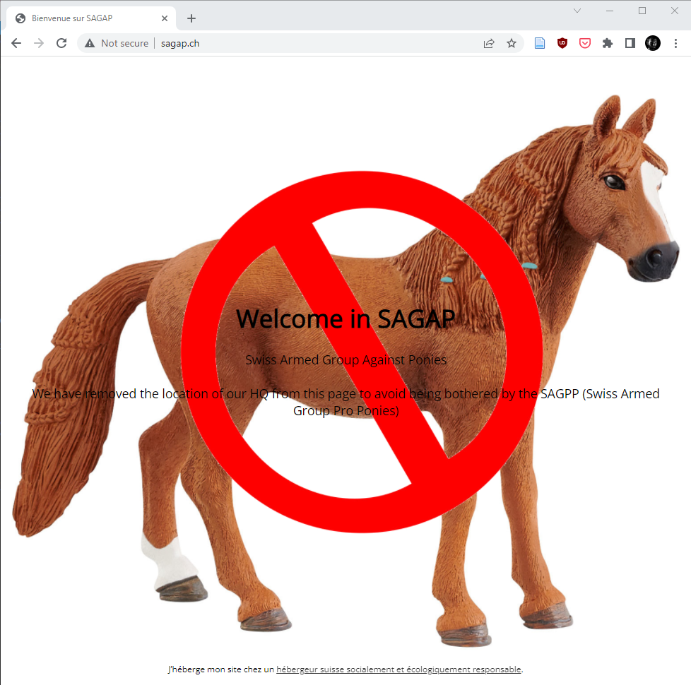
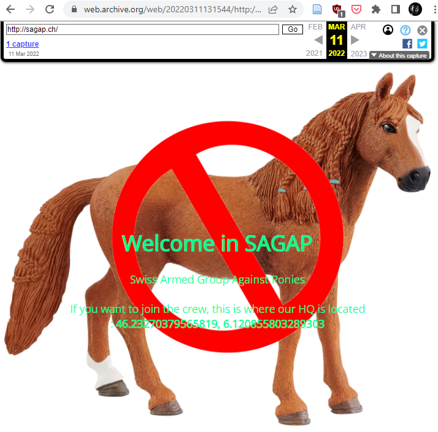

In this challenge, we were informed that a group had hacked a computer and was about to disrupt an event at Palexxpo. We were provided an archive with some of the file of the hacked computer and tasked to find out what the attacker was after and to stop them.

First, we see on the root of the drive a folder named SecretShare containing a plan of Palexxpo, a flyer for the swiss pony show and a copy of a secret email. The secret email shows that the attacker knows the security codes required to bypass security but not much more is to be found there. Looking furthers, the event logs show that a scheduled task was registered to run "c:\Windows\System32\av_agent.exe", this looks suspicious. Let's run the binary in an isolated sandbox and see what it does. The result is that the binary is a malicious metasploit reverse shell and it first tries to resolve the DNS name c2.sagap.ch before connecting to an IP. This is sufficient for us, the domain itself doesn't resolve but there's a website hosted at <http://sagap.ch>:

This tells us that the SAGAP (Swiss Armed Group Against Ponies) has removed the location of their HQ has been removed from the website to prevent the SAGPP (Swiss Armed Group Pro Ponies) from locating them. By chance (or thanks to the organizers), there's a snapshot of the website in the wayback machine that contains this location:

Looking at the coordinates, they are located very close to the conference place (outside in the cold though 😁). We went there and found a hastily written sheet of paper with the name of SAGAP and a wifi icon. On our phones, we saw that there was a wifi network here secured with WPA2-PSK(can't remember the SSID though, something like SAGAP_CREW). After a back and forth to the CTF to fetch a laptop we were back close to the Wifi and able to crack the PSK by following the instructions in this blog post <https://gainanov.pro/eng-blog/sysad/wifi-cracking/> The friend with a macbook was kind enough to type all the commands in the cold, thanks Christian! We used the rockyou wordlist as it is often used to simulate a cracking task that should not be too hard in a CTF. The password was ilovetokill.

Then from here we could connect to the wifi. Scanning the local network, we discovered an open FTP with some files again. There was a readme explaining that the bomb was placed already, an updated plan of Palexxpo with the location of the bomb and a firmware image of the bomb software. So back to the desk of the organizer where the bomb was located we could connect to the bomb (that handily had a network cable attached). A simple telnet was enough to connect to the bomb and reach a dialog asking what we wanted to do (numbered options from 1 to 3).

Here, I don't have the firmware anymore but the analysis in Ghidra was trivial, one had to enter 0xdeadbeef in decimal instead of 1, 2 or 3 to get access to a secret menu. Then you had to enter an additional PIN to defuse the bomb. When doing so, the "door" of the bomb would open and reveal a QR code containing the flag.

Props to the challenge creator for this treasure hunt, we enjoyed it a lot!
